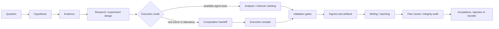
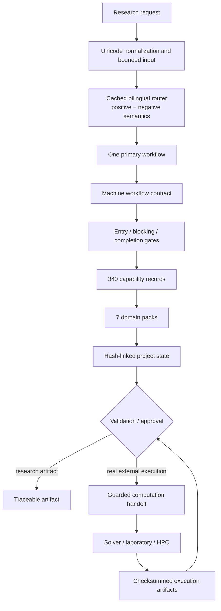

<div align="center">
  
  <h1>TsaoSciResearcher</h1>
  <p><strong>Evidence-first, full-lifecycle, traceable scientific research orchestration</strong></p>
  <p>From research questions and evidence to experimental design, statistics, figures, writing, guarded computation handoffs and project audit.</p>
</div>

<div align="center">

[简体中文](README.zh-CN.md) · [English mirror](README_EN.md) · [Architecture](docs/ARCHITECTURE.md) · [Validation evidence](docs/VALIDATION_EVIDENCE.json) · [Security](SECURITY.md)

[](https://github.com/SUNHAOJUN22/TsaoSciResearcher/actions/workflows/ci.yml)

</div>

> **Release 0.5.1** · Apache-2.0 · Python 3.10–3.13 · Windows, Linux and macOS

## What TsaoSciResearcher is

TsaoSciResearcher is a scientific-method and knowledge-work control layer for research agents. It turns a broad objective into a bounded, reviewable chain:

```text
question → hypothesis → evidence → method → data → checks → validation → conclusion → artifact
```

The project provides deterministic routing, gated workflows, machine-readable capability contracts, project state, evidence/claim validation, scientific-figure contracts, safe installation and reproducible packaging.

It is designed to prevent a common failure mode in AI-assisted science: a fluent output being mistaken for a completed search, experiment, calculation or validated conclusion.

## What it is not

TsaoSciResearcher is not:

- a bundled literature database;
- a molecular-dynamics, DFT, FEM, CFD or process simulator;
- a laboratory-instrument driver;
- a substitute for qualified scientific, legal, medical, safety or integrity review;
- evidence that an external computation or experiment actually ran.

Real execution is delegated through a checksummed `computation-handoff` contract. Completion, checking, validation and acceptance remain separate states.

## Verified release facts

The numbers below are generated from the current source tree and checked by `scripts/build_readme_facts.py`.

| Component | Verified value | Meaning |
|---|---:|---|
| v2 capability records | **340** | Validated machine-readable records |
| Named compatibility capabilities | **158** | Exact research-facing slugs retained from the 322-skill reference catalog |
| Domain capability slots | **164** | Count-aligned contracts across seven computational/engineering domains |
| Runtime/core capabilities | **18** | Native routing, state, audit and release capabilities |
| Gated workflows | **15** | Human-readable policy + machine contract + entry/blocking/completion gates |
| JSON Schemas | **15** | Eight compatibility schemas and seven v2 schemas |
| Domain packs | **7** | Method selection, validation, interpretation and figure guidance |
| Reference files | **22** | Progressive-load methodology references |
| Templates | **13** | Project, evidence, protocol, figure, manuscript and reporting artifacts |

### What “340 capabilities” means

The current catalog is:

```text
340 = 158 exact named research capabilities
    + 164 count-aligned domain capability slots
    + 18 runtime/core capabilities
```

The 164 domain records are validated and searchable, but their current slugs are generic domain-slot identifiers rather than one-to-one replicas of the corresponding 164 names in the uploaded 322-skill workbook. This distinction is documented in [the capability coverage matrix](docs/CAPABILITY_COVERAGE_MATRIX.md).

## Research lifecycle



## Architecture



Runtime modules:

| Module | Responsibility |
|---|---|
| `tsao_researcher/router.py` | Cached deterministic routing, negative intent, bounded input and stable tie-breaking |
| `tsao_researcher/capabilities.py` | Validated 340-record catalog and ranked/filterable search |
| `tsao_researcher/state.py` | Project lifecycle, SHA-256 event chain and acceptance approval |
| `tsao_researcher/handoff.py` | Path-contained, checksummed computation contracts |
| `tsao_researcher/io.py` | Atomic writes, bounded locks, finite JSON/JSONL and streaming hashes |
| `scripts/` | Compatibility commands, validators, audit, installer, tests, performance and release tooling |

Detailed design traceability is available in [README architecture mapping](docs/README_ARCHITECTURE_MAPPING.md).

## Execution boundaries

| Level | TsaoSciResearcher can do | It does not prove |
|---|---|---|
| Native | Route, search capabilities, manage state, validate schemas/evidence/claims, install, audit and package | Scientific correctness of an external result |
| Orchestrated | Use tools exposed by the active agent for retrieval, analysis, plotting and document production | That an unavailable tool or database was accessed |
| Delegated | Specify DFT, MD, FEM, CFD, Aspen/process, laboratory or HPC work through a handoff | That the solver or instrument executed |
| Human-reviewed | Record approval for acceptance, safety, legal/FTO, medical, integrity or high-impact decisions | Replacement of qualified judgment |

## The 15 workflows

| Workflow | Purpose | Principal control |
|---|---|---|
| `research-question` | Form a bounded, answerable and falsifiable question | Clarify object, variables, boundary conditions and falsification criteria |
| `deep-research` | Auditable search, screening, extraction and contradiction synthesis | Evidence provenance and stopping rules |
| `systematic-review` | Protocol-led systematic review and evidence synthesis | Frozen protocol, inclusion/exclusion and bias controls |
| `research-design` | Method matrix, technical-route DAG and stage gates | Feasibility, decision points and validation plan |
| `experiment-design` | Controls, randomization, power, DOE and measurement plan | Experimental unit, replication and QC |
| `data-analysis` | Data quality, statistics, causal methods, UQ and scientific ML | Match method to data-generating process |
| `scientific-figure` | Figure contract before plotting and final-size QA | Scientific claim, data source, units, errors and export contract |
| `scientific-writing` | Claim–evidence-linked manuscript development | No invented results or unsupported certainty |
| `peer-review` | Discipline, method, statistics, figure, citation and reproducibility review | Findings remain review comments, not fabricated corrections |
| `technical-report` | Evidence-led technical, management, client or regulatory reporting | Audience, scope and decision boundary |
| `project-management` | Event state, checkpoints, risks and artifact lineage | No silent status promotion |
| `patent-and-transfer` | Feature decomposition, landscape, FTO risk and invention disclosure | Qualified legal review required |
| `research-integrity` | Read-only checks for citation, data, image, statistics and AI risks | Risk indicators are not misconduct findings |
| `laboratory` | SOP, sample chain, calibration, QC, deviations and CAPA | No claim of instrument control without an adapter |
| `computation-handoff` | Bind question, inputs, methods, convergence, UQ, validation and approvals | Specification is not execution |

Each workflow has:

```text
WORKFLOW.md           human-readable method policy
workflow.yaml.json    machine contract
gates.yaml            entry / blocking / completion gates
```

## Quick start

### Install the Python package

```bash
git clone https://github.com/SUNHAOJUN22/TsaoSciResearcher.git
cd TsaoSciResearcher
python -m pip install -e .
```

### Route a scientific task

```bash
python -m tsao_researcher route \
  "Design a traceable multiscale study linking catalyst sites, chain growth, morphology, reactor behavior and product properties"
```

The router returns the primary and secondary workflows, confidence, triggers, clarification needs, human-approval needs and a minimal loading plan.

### Search capability records

```bash
python -m tsao_researcher search "polymer molecular dynamics" \
  --domain molecular-dynamics-multiscale \
  --limit 10
```

Optional filters:

```bash
python -m tsao_researcher search "uncertainty" --workflow data-analysis --limit 20
```

### Initialize a traceable project

```bash
python -m tsao_researcher init \
  --name "Polyolefin multiscale study" \
  --question "Which mechanisms connect active-site kinetics to reactor and product properties?" \
  --output .
```

Advance and verify state:

```bash
python -m tsao_researcher transition . planned --reason "question and evidence plan approved"
python -m tsao_researcher transition . running --reason "registered work started"
python -m tsao_researcher verify .
```

## Project state and provenance

The managed state directory is:

```text
.tsao-research/
├── project.yaml
├── state/events.jsonl
├── registry/
├── literature/
├── data/
├── computation/
├── artifacts/
├── figures/
├── reports/
└── protocols/
```

Normal lifecycle:

```text
proposed → planned → running → completed → checked → validated → accepted
```

`rejected` and `superseded` are also supported. `accepted` requires an approval record. State changes use a lock, atomic replacement and a SHA-256 event chain; tampering is detected by `verify`.

## Guarded computation handoff

TsaoSciResearcher designs, reviews and interprets computational research. It does not fabricate external execution.

```python
from pathlib import Path

from tsao_researcher import create_handoff, initialize

root = initialize(
    "Polymer process model",
    "Which kinetic and transport parameters control molecular-weight distribution?",
    ".",
)
Path(root / "data/feed.json").write_text('{"ethylene": 1.0}\n', encoding="utf-8")

handoff = create_handoff(
    root,
    "computation/process-handoff.json",
    "Which kinetic and transport parameters control molecular-weight distribution?",
    "molecular-weight distribution",
    "process-kinetics-digital-twin",
    ["population balance", "dynamic reactor model"],
    ["data/feed.json"],
)
```

The handoff records input hashes, methods, boundary conditions, convergence, uncertainty, physical validation, acceptance criteria and approval points. Path escape, symlink inputs, placeholder questions and “ready” handoffs without verified inputs are rejected.

## Installation targets

Inspect without writing:

```bash
python scripts/install.py --agent codex --scope user --dry-run --validate
```

| Agent | User scope | Project scope |
|---|---|---|
| Codex | `~/.codex/skills/TsaoSciResearcher` | `./.codex/skills/TsaoSciResearcher` |
| Claude Code | `~/.claude/skills/TsaoSciResearcher` | `./.claude/skills/TsaoSciResearcher` |
| Open Agent Skills | `~/.agents/skills/TsaoSciResearcher` | `./.agents/skills/TsaoSciResearcher` |

Examples:

```bash
python scripts/install.py --agent codex --scope user
python scripts/install.py --agent claude --scope project
python scripts/install.py --agent open-agent --scope user
python scripts/install.py --target /managed/path/TsaoSciResearcher --validate
python scripts/install.py --agent codex --scope user --force
python scripts/install.py --agent codex --scope user --uninstall
```

The installer stages a copy, writes a management marker, performs atomic replacement, keeps a unique rollback backup and refuses dangerous or unmanaged targets.

## Domain packs

- [Catalysis, polymers and composites](domain-packs/catalysis-polymers-composites/README.md)
- [Computational chemistry and materials](domain-packs/computational-chemistry-materials/README.md)
- [Molecular dynamics and multiscale](domain-packs/molecular-dynamics-multiscale/README.md)
- [FEM and multiphysics](domain-packs/fem-multiphysics/README.md)
- [CFD, particles and processing](domain-packs/cfd-particles-processing/README.md)
- [Process kinetics and digital twins](domain-packs/process-kinetics-digital-twin/README.md)
- [HPC and reproducibility](domain-packs/hpc-reproducibility/README.md)

The uploaded reference workbook lists 32 scientific-computing engines. They are not bundled. Domain packs and handoffs describe selection, input, convergence, provenance and interpretation boundaries.

## Validation evidence

Release evidence is recorded in [docs/VALIDATION_EVIDENCE.json](docs/VALIDATION_EVIDENCE.json).

GitHub Actions release run `29887374398` verified:

- **96 pytest tests**: 0 failures, 0 errors, 0 skipped;
- **15/15 critical mutants killed**;
- Ubuntu with Python 3.10 and 3.13;
- Windows with Python 3.12;
- macOS with Python 3.12;
- repository and cross-contract audit;
- reverse-order and fixed-seed random-order regression;
- Ruff formatting and lint;
- strict Mypy;
- Bandit high-severity security gate;
- bounded performance smoke;
- two byte-identical release builds.

### Measured performance smoke

Reference environment: GitHub Actions Linux, Python 3.12.13. Values are regression evidence, not cross-hardware marketing benchmarks.

| Operation | Workload | Time | Guard |
|---|---:|---:|---:|
| Legacy route | 10,000 | 8.092 s | 20.0 s |
| v2 route | 10,000 | 1.262 s | 8.0 s |
| v2 catalog load | 100 | 0.912 s | 4.0 s |
| v2 capability search | 1,000 | 0.379 s | 4.0 s |
| Legacy capability load | 100 | 0.263 s | 5.0 s |
| Claim–evidence validation | 1,000 + 1,000 records | 0.217 s | 20.0 s |
| All schemas | 15 | 0.125 s | 5.0 s |
| Safe ZIP member checks | 1,000 | 0.011 s | 10.0 s |
| Install + uninstall | one cycle | 0.050 s | 20.0 s |
| Two release builds | two archives | 0.200 s | 30.0 s |

Peak `tracemalloc` use in that smoke run was **146,088 bytes**.

## Development and verification

```bash
python -m pip install -r requirements-dev.txt

python scripts/audit_repository.py
python scripts/validate_structure.py
python scripts/build_readme_facts.py --check
python scripts/generate_checksums.py --check
python scripts/build_capability_index.py --check
python scripts/route_task.py --self-test

python -m pytest -q -p hypothesis.extra.pytestplugin
python -m ruff format --check scripts tsao_researcher tests
python -m ruff check scripts tsao_researcher tests
python -m mypy scripts tsao_researcher
python -m bandit -q -lll -r scripts tsao_researcher
python scripts/run_mutation_smoke.py
python scripts/performance_smoke.py --json-out artifacts/performance.json
```

Deterministic release:

```bash
python scripts/package_release.py --out dist-a
python scripts/package_release.py --out dist-b
cmp dist-a/TsaoSciResearcher-v0.5.1.zip dist-b/TsaoSciResearcher-v0.5.1.zip
python scripts/validate_release.py
```

## Repository layout

```text
TsaoSciResearcher/
├── SKILL.md
├── manifest.json
├── agents/
├── tsao_researcher/          native v2 runtime
├── workflows/                15 policy/contract/gate bundles
├── capabilities/v2/          340 v2 capability records
├── capability-index/         158 named compatibility capabilities
├── schemas/                  15 JSON Schemas
├── domain-packs/             7 computational/engineering guides
├── references/               22 progressive-load references
├── templates/                13 reusable research artifacts
├── scripts/                  validators, audit, install, test and release
├── tests/
├── examples/
└── docs/
```

## Documentation evidence

- [README audit report](docs/README_AUDIT_REPORT.md)
- [Capability coverage matrix](docs/CAPABILITY_COVERAGE_MATRIX.md)
- [Design-to-code architecture mapping](docs/README_ARCHITECTURE_MAPPING.md)
- [Machine-generated README facts](docs/README_FACTS.json)
- [Release validation evidence](docs/VALIDATION_EVIDENCE.json)
- [Architecture](docs/ARCHITECTURE.md)
- [Validation model](docs/VALIDATION.md)
- [Compliance and license boundaries](docs/COMPLIANCE.md)

## Known limitations

1. The 164 computational/engineering domain records are count-aligned generic slots, not one-to-one named implementations of the corresponding workbook skills.
2. External databases, solvers, instruments and HPC schedulers are not installed by this package.
3. Retrieval, plotting and office-document generation depend on tools available to the active host agent.
4. Automated integrity checks identify risks; they do not determine misconduct.
5. Patent/FTO, medical, safety, regulatory and high-impact acceptance decisions require qualified review.
6. A passing software test suite does not scientifically validate a model, experiment or conclusion.

## License and provenance

The project is licensed under [Apache-2.0](LICENSE). It was informed by public scientific-agent, academic-research and scientific-computing projects, but its core routing, contracts, validators and runtime were independently written. See [THIRD_PARTY.md](THIRD_PARTY.md), [NOTICE](NOTICE) and [references/source-map.md](references/source-map.md).

TsaoSciResearcher is not an official fork or replacement for the projects that inspired its design.
