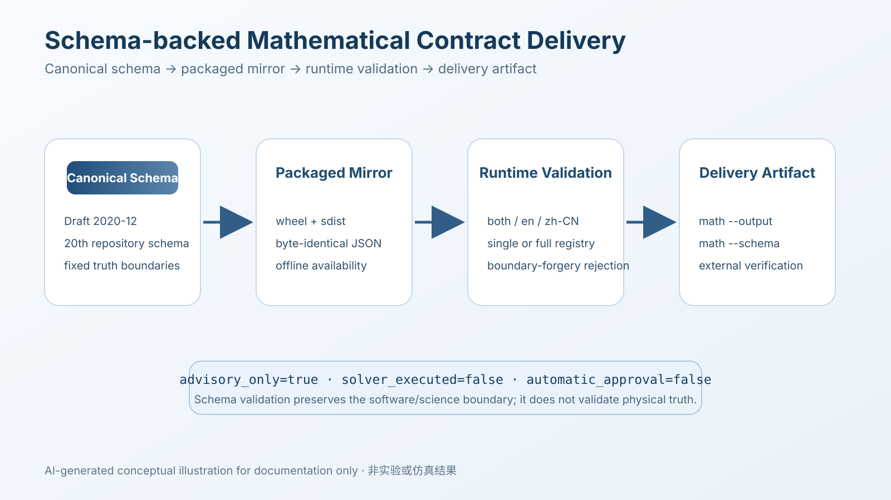

<div align="center">
  
  <h1>TsaoSciResearcher</h1>
  <p><strong>Evidence-first scientific strategy, mathematical contracts, guarded handoff, and validation control layer</strong></p>
  <p>Question → observables → model contract → evidence contract → guarded external execution → receipt → acceptance evidence</p>

[简体中文](README.zh-CN.md) · [Documentation](docs/index.md) · [Architecture](docs/ARCHITECTURE.md) · [Mathematical contracts](docs/MATHEMATICAL_CONTRACTS.md) · [Validation](docs/VALIDATION.md) · [Visual atlas](docs/VISUAL_ATLAS.md)

[](https://github.com/SUNHAOJUN22/TsaoSciResearcher/actions/workflows/ci.yml)
</div>

> **Release 0.7.4 · acceptance-hardened main** · Apache-2.0 · Python 3.10–3.13 · deterministic CLI and Python API

## 1. What this repository is

TsaoSciResearcher is a **scientific research control layer**. It helps turn an under-specified research question into a traceable, falsifiable and reviewable research strategy. The runtime performs deterministic routing, capability retrieval, scientific-quality checks, strategy construction, project-state management, checksum-bound external handoff, execution-receipt verification and reproducibility packaging.

It is **not** a DFT, quantum-chemistry, molecular-dynamics, CFD, FEM, process-simulation, HPC or laboratory solver. A strategy, equation, handoff file, PASS label or AI diagram never proves that a physical calculation or experiment occurred.

The implemented inventory is machine checked:

| Delivery fact | Verified value |
|---|---:|
| Capability contracts | **341** |
| Preserved legacy/general contracts | **158** |
| Preserved workbook names | **322** |
| Domain computation/engineering contracts | **164** |
| Generic domain placeholders | **0** |
| Runtime additions | **19** |
| Primary workflows | **15** |
| JSON Schemas | **20** |
| Domain packs | **7** |
| AI-generated conceptual diagrams | **38** |

Acceptance evidence: [README audit](docs/README_AUDIT_REPORT.md), [capability matrix](docs/CAPABILITY_COVERAGE_MATRIX.md), [architecture mapping](docs/README_ARCHITECTURE_MAPPING.md), [mathematical contracts](docs/MATHEMATICAL_CONTRACTS.md), [mathematical registry schema](schemas/v2/mathematical-contract-registry.schema.json), [validation evidence](docs/VALIDATION_EVIDENCE.json), [HTML dashboard](docs/test-dashboard.html), and [SVG dashboard](docs/test-dashboard.svg).

> Every diagram in this repository is an **AI-generated conceptual illustration for documentation**. It is not experimental data, a measured dataset, a numerical solver result, or proof that an external computation ran.

## 2. Architecture and responsibility boundary

```text
CLI / Python API
      │
      ├── router.py ─────────────────────> deterministic task classification
      ├── capabilities.py ────────────────> validated capability retrieval
      ├── strategy.py ────────────────────> first-principles Scientific Passport
      ├── mathematical_contracts.py ──────> schema-backed equations and interpretation limits
      ├── scientific_quality.py ──────────> quantity, evidence, causality and traceability guards
      ├── state.py ───────────────────────> hash-linked project state
      ├── handoff.py / receipts.py ───────> external execution evidence boundary
      └── capsule.py ─────────────────────> deterministic reproducibility archive
```


A typical research flow is:

```text
scientific question
    ↓
decision-critical observable + unit + acceptance threshold
    ↓
state variables + governing principles + constraints
    ↓
minimum-sufficient falsifiable model
    ↓
evidence / applicability / identifiability / bridge gates
    ↓
qualified human review
    ↓
checksum-bound external handoff
    ↓
execution receipt + independently reviewable evidence
```

## 3. Schema-backed mathematical contracts

The `math` command exposes eight stable bilingual contracts. The payload is now validated against a packaged Draft 2020-12 Schema before it is returned.

```bash
python -m tsao_researcher math
python -m tsao_researcher math --schema
python -m tsao_researcher math --contract decision-readiness --language en
python -m tsao_researcher math --contract quantity-dimension --language zh-CN
python -m tsao_researcher math --contract uncertainty-budget --output contract.json
python scripts/validate_mathematical_contracts.py --check
```

Every contract response fixes the truth boundary:

```json
{
  "schema_version": "1.0",
  "schema_id": "https://sunhaojun22.github.io/TsaoSciResearcher/schemas/v2/mathematical-contract-registry.schema.json",
  "advisory_only": true,
  "solver_executed": false,
  "automatic_approval": false
}
```

The canonical Schema is [`schemas/v2/mathematical-contract-registry.schema.json`](schemas/v2/mathematical-contract-registry.schema.json). A byte-identical package mirror is shipped under `tsao_researcher/data/schemas/` so installed CLI consumers can validate the same contract offline.



### 3.1 Capability-ranking abstraction

\[
S(c\mid q,o,e)=w_qR(q,c)+w_oR(o,c)+w_eM(e,c)-w_xC(c)
\]

- \(c\): candidate capability
- \(q\): scientific question
- \(o\): decision-critical observable
- \(e\): declared evidence context
- \(C(c)\): conflict or exclusion penalty

Use this as a decomposition of deterministic routing logic, not as a fitted statistical model. A method should be relevant to the question, able to produce the requested observable, compatible with the evidence, and not excluded by negative semantics.

### 3.2 Quantity, unit and dimension contract

\[
x=(v,u,d),\qquad d_{\mathrm{left}}=d_{\mathrm{right}}
\]

A quantitative comparison should identify value \(v\), unit \(u\) and physical dimension \(d\). Missing units require review. Incompatible dimensions block the comparison.

### 3.3 Applicability and extrapolation

\[
r_{\mathrm{extra}}=
\frac{d(x,\mathcal A)}{\max(s_{\mathcal A},\varepsilon)}
\]

Here \(x\) is the target condition, \(\mathcal A\) is the declared applicability domain and \(s_{\mathcal A}\) is a characteristic domain scale. The farther the transfer, the stronger the evidence and uncertainty inflation must become. The runtime does not fabricate a numerical distance when data are absent.

### 3.4 Evidence triad and conflict ledger

\[
E=(E_+,E_-,E_0),\qquad
\kappa=\mathbf 1[E_+\neq\varnothing\land E_-\neq\varnothing]
\]

Supporting, challenging and unresolved evidence stay separate. Contradictory evidence is preserved rather than silently averaged into a positive conclusion.

### 3.5 Mechanism and parameter identifiability

\[
D_{ij}(O,C)>\tau
\qquad\text{or}\qquad
\operatorname{rank}(J_\theta)=p
\]

Mechanism selection requires discriminating observables. Unique parameter claims require sufficient sensitivity rank. Numerical Jacobian construction remains an external analysis task.

### 3.6 Decision-observable uncertainty budget

\[
\Sigma_y\approx
J\Sigma_\theta J^{\mathsf T}
+\Sigma_{\mathrm{num}}
+\Sigma_{\mathrm{sample}}
+\Sigma_{\mathrm{model}}
+\Sigma_{\mathrm{transfer}}
\]

Uncertainty must reach the actual acceptance observable. Parameter, numerical, sampling, model-form and scale-transfer uncertainty must remain traceable instead of being collapsed into an undocumented confidence score.

### 3.7 Multiscale bridge error budget

\[
U_{\mathrm{bridge}}^2=
U_{\mathrm{source}}^2+
U_{\mathrm{mapping}}^2+
U_{\mathrm{closure}}^2+
U_{\mathrm{target}}^2
\]

A microscopic result cannot jump directly to an engineering conclusion. Each bridge needs measurable bridge variables, mapping assumptions, closure validation and target-scale acceptance evidence.

### 3.8 Conservative decision readiness

\[
G=\min\left(
 g_{\mathrm{quantity}},
 g_{\mathrm{applicability}},
 g_{\mathrm{evidence}},
 g_{\mathrm{identifiability}},
 g_{\mathrm{bridge}}
\right)
\]

The weakest mandatory gate controls readiness:

```text
BLOCK < REVIEW < PASS
```

A software `PASS` means that no declared software blocker remains. It is not physical proof and cannot bypass qualified human review.


Detailed bilingual interpretation: [docs/MATHEMATICAL_CONTRACTS.md](docs/MATHEMATICAL_CONTRACTS.md).

## 4. Scientific model-reconstruction strategy

TsaoSciResearcher selects methods from the decision physics rather than from a fashionable solver name.

A generic state model is:

\[
\dot{x}=f(x,u,\theta)+\epsilon_{\mathrm{model}},
\qquad
y=h(x,\theta)+\epsilon_{\mathrm{measurement}}
\]

A strategy should declare:

1. state variables \(x\), controls \(u\), and parameters \(\theta\);
2. decision observable \(y\) and acceptance threshold;
3. conserved quantities, reservoirs, boundary and initial conditions;
4. the minimum model able to falsify the candidate mechanism;
5. validation, uncertainty and escalation rules.

For a conserved extensive quantity \(\phi\):

\[
\frac{\mathrm d}{\mathrm dt}\int_{\Omega}\rho\phi\,\mathrm dV
+\int_{\partial\Omega}\mathbf J_\phi\cdot\mathbf n\,\mathrm dA
=\int_{\Omega}s_\phi\,\mathrm dV
\]

This equation does not imply that a mesh, constitutive model or solver run exists. It defines what must be declared before a CFD, FEM, transport or process handoff can be considered scientifically interpretable.

### Minimum-sufficient method ladder

| Problem class | Start with | Escalate when |
|---|---|---|
| electronic structure / defects / interfaces | converged cluster or periodic DFT strategy | functional, finite-size or reference-state sensitivity matters |
| reaction mechanism / selectivity | pathway energetics + microkinetic skeleton | pathways, solvent/dynamics or transport remain unresolved |
| conformation / free energy | ensemble MD/MC strategy + convergence estimator | sampling or force-field evidence is inadequate |
| morphology / phase evolution | scaling / SCFT / CGMD / DPD / phase-field strategy | mapping or closure fails |
| flow / heat / mass transfer | analytical / control-volume / reduced model | geometry, instability or closure requires CFD/multiphysics |
| mechanics / fracture | reduced mechanics or FEM strategy | constitutive non-identifiability or localization dominates |
| reaction engineering | mass/energy balances + kinetics/population model | RTD, mixing or plant-data coupling is decisive |
| mixed multiscale problem | lowest-cost falsifiable model | a validated bridge variable justifies escalation |


## 5. Scientific Passport and integrity gates

A generated strategy carries structured declarations for model assumptions, evidence maturity, uncertainty, applicability and cross-scale transfer.

Useful abstractions include:

\[
\mathcal P=
\{M,E,U,A,I,B,V,F\}
\]

where \(M\) is the model contract, \(E\) evidence, \(U\) uncertainty, \(A\) applicability, \(I\) identifiability, \(B\) bridge contract, \(V\) validation and \(F\) falsification.

The strategy remains advisory even when every software gate is green.


## 6. Acceptance strategy: exact baseline + focused delta

The repository supports three validation scopes:

- `preflight`: current checkout checks only; CI-only gates remain explicit `NOT_RUN`/`PARTIAL`.
- `current-tree`: a fresh externally attested end-to-end CI run bound to the tested commit.
- `composite`: a pinned exact-tree full-repository baseline plus a SHA-256-bound focused current-change regression.

The checked-in acceptance-hardening record uses **composite** evidence. It pins the fully qualified v0.7.4 baseline and separately records the new Schema/CLI regression. It deliberately keeps:

```text
current_end_to_end_ci = NOT_RUN
```

This is stricter than copying the old full-tree checksum onto changed code. In composite mode `SHA256SUMS` explicitly defers a new whole-tree digest until a complete checkout performs the full-repository calculation.

See [validation evidence](docs/VALIDATION_EVIDENCE.json), [baseline record](docs/VALIDATION_BASELINE.json), and [focused regression](docs/CURRENT_CHANGE_REGRESSION.json).


## 7. Core CLI

```bash
python -m pip install --upgrade pip
python -m pip install -r requirements-ci.lock
python -m pip install -e . --no-deps
python -m pip check

python -m tsao_researcher --version
python -m tsao_researcher route "run an actual DFT calculation"
python -m tsao_researcher search "molecular dynamics" --limit 3
python -m tsao_researcher quality examples/scientific-quality-check.json
python -m tsao_researcher strategy \
  "Can two mechanisms be discriminated?" \
  --observable "rate constant 1/s" \
  --condition "350 K" \
  --evidence "independent measurement"
python -m tsao_researcher math --schema
python -m tsao_researcher math --contract decision-readiness --output contract.json
python scripts/validate_mathematical_contracts.py --check
```

## 8. External execution boundary

TsaoSciResearcher prepares and verifies evidence around execution; it does not impersonate the engine.

```text
validated strategy
    ↓
checksum-bound handoff
    ↓
external engine / instrument / laboratory
    ↓
user-supplied receipt + output hashes
    ↓
receipt verification
    ↓
qualified scientific acceptance
```


Example receipt workflow:

```bash
python -m tsao_researcher receipt record . \
  --handoff computation/job.json \
  --engine external-engine \
  --engine-version 1.0 \
  --command engine \
  --command run \
  --exit-code 0 \
  --output computation/result.dat \
  --started-at 2026-08-07T01:00:00Z \
  --finished-at 2026-08-07T01:10:00Z

python -m tsao_researcher receipt verify .
```

## 9. Reproducibility

```bash
python -m tsao_researcher capsule export . --mode metadata --output project-metadata.zip
python -m tsao_researcher capsule export . --mode full --output project-full.zip
python -m tsao_researcher capsule verify project-full.zip
```

A reproducibility capsule preserves software state and evidence relationships. It does not establish physical truth by itself.

## 10. Quality and testing

The permanent quality stack includes:

- four-platform Python compatibility;
- complete regression and line/branch coverage;
- reverse and seeded-random test ordering;
- Ruff format/lint and strict Mypy;
- Bandit and dependency vulnerability audit;
- mutation testing and bounded performance smoke tests;
- Schema validation, deterministic SBOM and documentation build;
- byte-identical source releases and isolated wheel/sdist installation.

The pinned exact-tree baseline records **314 passing tests**, **95.827% line coverage**, **93.438% branch coverage**, and **24/24 critical mutations killed**. The current Schema-delivery delta has a separate focused regression record; the README does not relabel that focused run as a fresh current-tree full CI pass.

## 11. Complete conceptual atlas

The following paths are machine-checked by `scripts/build_readme_facts.py`; every SVG contains `<title>` and `<desc>` accessibility metadata.

<details>
<summary>Show all 38 repository-local conceptual figures</summary>


</details>

## 12. Repository layout

```text
.
├── tsao_researcher/          # deterministic runtime
├── schemas/                  # contract and evidence Schemas
├── capabilities/             # validated capability catalog
├── workflows/                # research workflow contracts
├── domain-packs/             # domain-specific capability packs
├── scripts/                  # validation, packaging and evidence tooling
├── tests/                    # regression and contract tests
├── examples/                 # canonical machine-readable examples
├── docs/                     # architecture, evidence, reports and visual atlas
├── README.md
├── README.zh-CN.md
├── VERSION
└── SHA256SUMS
```

## 13. Scientific and engineering disclaimer

Passing software checks means that the declared software contracts are internally consistent at the stated evidence scope. It does **not** certify a scientific hypothesis, external solver result, instrument measurement, medical conclusion, legal conclusion or safety decision.

External computations and experiments must be independently executed, recorded and reviewed. TsaoSciResearcher keeps the boundary explicit rather than fabricating a run.

## 14. License

Apache-2.0.
