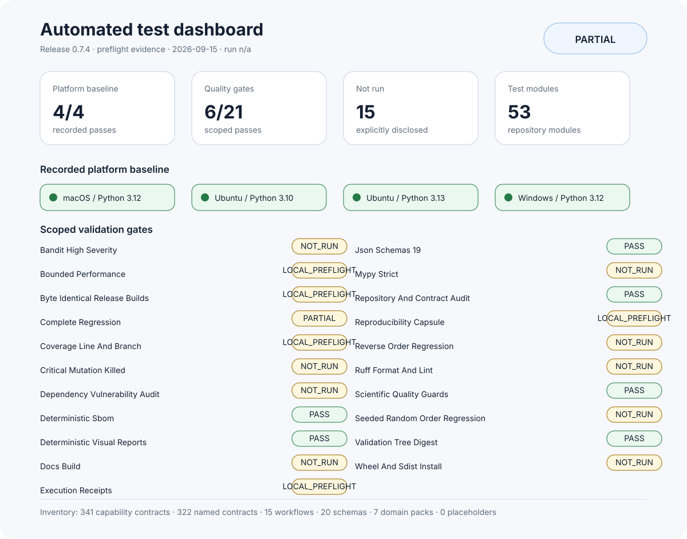

<div align="center">
  
  <h1>TsaoSciResearcher</h1>
  <p><strong>Evidence-first scientific research control layer</strong></p>
  <p>Question → evidence → design → guarded execution → validation → reproducible artifact</p>

[简体中文](README.zh-CN.md) · [Documentation](docs/index.md) · [Architecture](docs/ARCHITECTURE.md) · [Validation](docs/VALIDATION.md) · [Security](SECURITY.md)

[](https://github.com/SUNHAOJUN22/TsaoSciResearcher/actions/workflows/ci.yml)
</div>

> **Release 0.6.0** · Apache-2.0 · Python 3.10–3.13 · Windows, Linux and macOS

## Purpose and truth boundary

TsaoSciResearcher converts a scientific request into bounded, traceable contracts and project state. It does not claim that a search, experiment, solver, instrument or external computation ran unless a checksum-verifiable execution receipt exists. A software PASS does not establish scientific truth or final acceptance.

## Verified repository scope

| Item | Verified value |
|---|---:|
| Capability contracts | **340** |
| Named AI-for-Science catalog contracts | **322** |
| General research contracts | **158** |
| Named computation/engineering contracts | **164** |
| Generic domain placeholders | **0** |
| Native runtime/core contracts | **18** |
| Gated research workflows | **15** |
| JSON Schemas | **18** |
| Domain packs | **7** |
| Test modules | **32** |

```text
340 = 322 named AI-for-Science contracts + 18 runtime/core contracts
322 = 158 general research contracts + 164 named domain contracts
```

A capability contract defines routing, inputs, outputs, gates, validation and delegation. It is not an installed scientific engine or an execution record.

## v0.6.0 architecture

- **Deterministic bilingual routing** — bounded Unicode-normalized input, negative-intent handling and stable tie-breaking.
- **Traceable project state** — atomic writes, bounded locks, explicit lifecycle transitions and a SHA-256 event chain.
- **Scientific-quality guards** — Measurement Boundary, Structure–Property Planner, Causality Guard and Evidence Traceability.
- **Guarded computation handoff** — contained regular-file inputs, checksums, convergence/UQ requirements and approval points.
- **Execution Receipt v2** — binds a real external run to its handoff, engine, argument vector, timestamps, exit status and output hashes.
- **Reproducibility Capsule** — deterministic metadata/full ZIP with per-file hashes, tree digest, safe archive validation and sidecar checksum.
- **Validation Evidence 1.6** — source-tree digest, dependency-lock digest, workflow attempt and external commit attestation without self-referential SHA claims.
- **Supply-chain controls** — pinned Actions, exact direct CI toolchain, resolved-environment `pip-audit`, deterministic direct-dependency CycloneDX 1.6 SBOM, wheel/sdist/source-ZIP validation.
- **Permanent idempotent automation** — push CI, manual audit, weekly health audit and tag-bounded release; validation workflows do not write to the repository.

<!-- TSR-AI-VISUALS:START -->
## Scientific capability visual atlas

The following **AI-generated, repository-specific diagrams** explain the implemented contracts, control flow and delegation boundaries. They are documentation assets—not experimental observations, simulation outputs or proof that an external engine ran.

<table>
<tr>
<td width="50%" valign="top"><br/><strong>1 · Research operating architecture</strong><br/>Bounded intent is routed through orchestration, evidence controls, project state and validation before an artifact is accepted.</td>
<td width="50%" valign="top"><br/><strong>2 · Multi-agent orchestration</strong><br/>Specialized literature, data, simulation, figure and review roles cooperate through explicit contracts rather than an opaque agent swarm.</td>
</tr>
<tr>
<td width="50%" valign="top"><br/><strong>3 · Evidence–claim graph</strong><br/>Source locators, evidence records, claims, conflicts and validation edges preserve traceability from statement back to support.</td>
<td width="50%" valign="top"><br/><strong>4 · Multiscale science pipeline</strong><br/>Quantum, molecular, mesoscale, continuum and process layers are bridged by measurable state variables, uncertainty and conservation constraints.</td>
</tr>
<tr>
<td width="50%" valign="top"><br/><strong>5 · Reproducibility quality gates</strong><br/>Schemas, tests, coverage, mutation, security, performance and deterministic packaging form a closed engineering validation loop.</td>
<td width="50%" valign="top"><br/><strong>6 · Computation handoff boundary</strong><br/>TsaoSciResearcher prepares bounded inputs and verifies receipts; DFT, MD, FEM, CFD, HPC and instruments remain external executors.</td>
</tr>
<tr>
<td width="50%" valign="top"><br/><strong>7 · Traceable project state</strong><br/>Lifecycle transitions, approvals and SHA-256 event chaining prevent silent state jumps and unsupported acceptance claims.</td>
<td width="50%" valign="top"><br/><strong>8 · Capability landscape</strong><br/>The catalog spans evidence, design, computation, analysis, visualization, writing, review, integrity and transfer workflows.</td>
</tr>
</table>
<!-- TSR-AI-VISUALS:END -->

## Native, delegated and human-approved boundaries

| Capability | Status |
|---|---|
| Routing, contracts, state, validation, receipts, capsules and artifact governance | Native |
| Retrieval, plotting and Office production | Uses tools supplied by the host agent |
| DFT, MD, FEM, CFD, process simulation, HPC and laboratory execution | External; requires guarded handoff plus receipt |
| Medical, safety, legal/FTO, integrity and final scientific acceptance | Qualified human approval required |

## Quick start

```bash
git clone https://github.com/SUNHAOJUN22/TsaoSciResearcher.git
cd TsaoSciResearcher
python -m pip install -e .
python -m tsao_researcher --version
python -m tsao_researcher route "Design a traceable multiscale polymer study"
python -m tsao_researcher search "gromacs trajectory analysis" --limit 10
```

Initialize and verify project state:

```bash
python -m tsao_researcher init   --name "Polyolefin multiscale study"   --question "Which mechanisms connect processing history to product properties?"   --research-type mechanistic --output .
python -m tsao_researcher verify .
```

The lifecycle is:

```text
proposed → planned → running → completed → checked → validated → accepted
```

`accepted` requires recorded approval. `rejected` and `superseded` are also supported.

## Execution receipts

The receipt command records user-supplied evidence after an external engine has actually run; it never launches that engine.

```bash
python -m tsao_researcher receipt record .   --handoff computation/job.json   --engine gromacs --engine-version 2026.1   --command gmx --command mdrun --exit-code 0   --output computation/result.dat   --started-at 2026-07-24T01:00:00Z   --finished-at 2026-07-24T01:10:00Z
python -m tsao_researcher receipt verify .
```

A successful receipt requires exit code zero and at least one output. Verification reloads the handoff and recomputes timestamps, byte sizes and SHA-256 hashes. See [Execution Receipts](docs/EXECUTION_RECEIPTS.md).

## Reproducibility capsules

```bash
python -m tsao_researcher capsule export . --mode metadata --output project-metadata.zip
python -m tsao_researcher capsule export . --mode full --output project-full.zip
python -m tsao_researcher capsule verify project-full.zip
```

Metadata mode omits raw data/figure/artifact directories; full mode includes all bounded regular project files. Both modes are deterministic and reject path escape, symbolic links, duplicate members and checksum tampering. See [Reproducibility Capsule](docs/REPRODUCIBILITY_CAPSULE.md).

## Fifteen research workflows

```text
research-question      deep-research          systematic-review
research-design        experiment-design      data-analysis
scientific-figure      scientific-writing     peer-review
technical-report       project-management     patent-and-transfer
research-integrity     laboratory             computation-handoff
```

## Validation and quality baseline

Core repository checks:

```bash
python scripts/sync_version.py --check
python scripts/validate_schemas.py
python scripts/audit_repository.py
python scripts/validate_structure.py
python scripts/build_readme_facts.py --check
python scripts/build_sbom.py --check
python scripts/build_validation_evidence.py --check
python scripts/build_test_dashboard.py --check
python scripts/build_research_quality_dashboard.py --check
python scripts/build_engineering_report.py --check
python scripts/generate_checksums.py --check
```

Full local release gates:

```bash
mkdir -p artifacts
python -m pytest -q -p hypothesis.extra.pytestplugin --junitxml=artifacts/junit.xml
python -m pytest -q -p hypothesis.extra.pytestplugin -p pytest_cov \
  --ignore=tests/test_import_isolation.py --cov=tsao_researcher --cov-branch \
  --cov-report=json:artifacts/coverage.json
python -m pytest -q -p hypothesis.extra.pytestplugin -p tests.reverse_order_plugin
TSR_TEST_ORDER_SEED=20260724 python -m pytest -q -p hypothesis.extra.pytestplugin -p tests.random_order_plugin
python -m ruff format --check scripts tsao_researcher tests
python -m ruff check scripts tsao_researcher tests
python -m mypy scripts tsao_researcher
python -m bandit -q -lll -r scripts tsao_researcher
python -m pip_audit --strict -r requirements-ci.lock
python scripts/run_mutation_smoke.py --json-out artifacts/mutation-results.json
python scripts/performance_smoke.py --json-out artifacts/performance.json
python scripts/check_quality_baseline.py
mkdocs build --strict
python scripts/package_release.py --out dist-a
python -m build --sdist --wheel --outdir dist-python
python scripts/validate_distribution.py dist-python
```

The baseline enforces line and branch coverage, **21/21** critical mutants, bounded performance and zero JUnit failures. Threshold changes require an explicit changelog rationale.

The checked-in validation evidence is deliberately `preflight/PARTIAL`; GitHub Actions creates commit-bound `current-tree/PASS` evidence and an external publication attestation only after all gates finish.

## Automation model

- `ci.yml`: read-only push/PR validation and four-platform compatibility.
- `audit.yml`: read-only, manually dispatched complete audit.
- `nightly.yml`: weekly dependency, coverage, mutation, performance, docs and distribution health check.
- `release.yml`: tag-bounded publication of source ZIP, wheel, sdist, SBOM, validation evidence, PDF, checksums and external attestation.
- `cleanup-branches.yml`: enforces the repository's intentional single-`main` policy.

Validation/audit/nightly workflows are idempotent and never create commits.

## Visual and machine-readable evidence



- [Interactive test dashboard](docs/test-dashboard.html)
- [Scientific-quality dashboard](docs/research-quality-dashboard.html)
- [Scientific-quality SVG](docs/research-quality-dashboard.svg)
- [Scientific-quality examples](docs/SCIENTIFIC_QUALITY_EXAMPLES.json)
- [Engineering audit PDF](docs/engineering-audit-report.pdf)
- [Validation evidence 1.6](docs/VALIDATION_EVIDENCE.json)
- [CycloneDX SBOM](docs/SBOM.cdx.json)
- [Quality baseline](docs/QUALITY_BASELINE.json)
- [Quality history](docs/QUALITY_HISTORY.json)
- [README audit report](docs/README_AUDIT_REPORT.md)
- [Capability coverage matrix](docs/CAPABILITY_COVERAGE_MATRIX.md)
- [Design → code → test mapping](docs/README_ARCHITECTURE_MAPPING.md)

## Documentation

- [Architecture](docs/ARCHITECTURE.md)
- [CLI reference](docs/CLI.md)
- [Validation](docs/VALIDATION.md)
- [Scientific quality](docs/SCIENTIFIC_QUALITY.md)
- [Supply chain](docs/SUPPLY_CHAIN.md)
- [Release process](docs/RELEASE_PROCESS.md)
- [Roadmap](docs/ROADMAP.md)

## Known limitations

- External engines, instruments and databases are not bundled.
- A handoff is not a completed computation; a receipt is evidence of execution, not scientific validity.
- An SBOM is an inventory, not a vulnerability guarantee.
- Coverage and mutation scores measure test strength, not scientific truth.
- Material-specific trends and mechanism conclusions require project evidence, uncertainty and applicability boundaries.

## Security, contribution and license

See [SECURITY.md](SECURITY.md), [CONTRIBUTING.md](CONTRIBUTING.md), [THIRD_PARTY.md](THIRD_PARTY.md) and [references/source-map.md](references/source-map.md). TsaoSciResearcher is an original Apache-2.0 implementation inspired by public scientific-agent and research-tool projects; it is not their official fork or replacement.
