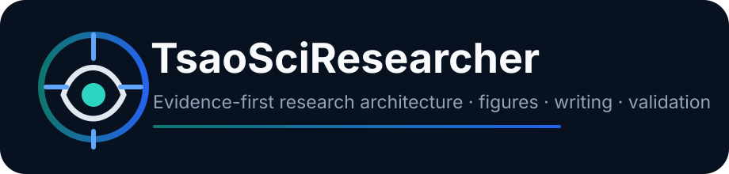

<div align="center">
  
  <h1>TsaoSciResearcher</h1>
  <p><strong>Evidence-first scientific research control layer</strong></p>
  <p>Question → evidence → strategy → guarded execution → validation → reproducible artifact</p>

[简体中文](README.zh-CN.md) · [Documentation](docs/index.md) · [Architecture](docs/ARCHITECTURE.md) · [Validation](docs/VALIDATION.md) · [Visual Atlas](docs/VISUAL_ATLAS.md)

[](https://github.com/SUNHAOJUN22/TsaoSciResearcher/actions/workflows/ci.yml)
</div>

> **Release 0.7.1** · Apache-2.0 · Python 3.10–3.13 · deterministic CLI and Python API

## Executive view

TsaoSciResearcher is a **scientific research router, state machine, evidence contract system, first-principles strategy adviser, guarded computation handoff layer, and reproducibility boundary**. It helps a researcher decide what must be known, what method is minimally sufficient, what evidence can falsify a mechanism, and what must be recorded before a result can be accepted.

It does **not** claim that a database was queried, an instrument was operated, or a DFT/MD/FEM/CFD/process simulation was executed unless checksum-verifiable external execution evidence is supplied.

<table>
<tr>
<td width="50%"><br/><strong>Research operating layer</strong></td>
<td width="50%"><br/><strong>Scale-aware scientific reconstruction</strong></td>
</tr>
<tr>
<td width="50%"><br/><strong>Evidence-to-claim traceability</strong></td>
<td width="50%"><br/><strong>Acceptance through explicit gates</strong></td>
</tr>
</table>

> All repository diagrams are **AI-generated conceptual illustrations for documentation**. They are not experimental observations, measured datasets, numerical solver outputs, or proof that an external computation ran.

## What is implemented

The runtime exposes one deterministic entry point and a machine-readable scientific control model:

| Implemented layer | Verified capability |
|---|---|
| Task routing | bilingual deterministic routing with positive and negative semantics, priorities, confidence and explicit clarification state |
| Capability discovery | **341** capability contracts, including **322** preserved workbook names, **164** domain computation/engineering contracts, **158** legacy/general contracts and **19** runtime additions |
| Contract quality | **0** generic domain placeholders; nested implementation level, lineage, approval and computation-handoff metadata are validated |
| Research state | canonical `.tsao-research/` project state, hash-linked events, controlled transitions and rollback-safe writes |
| Scientific reasoning | first-principles method ladders plus a Scientific Passport, evidence maturity, causal guard, scale-jump guard, falsification and uncertainty contracts |
| External computation | checksum-bound handoffs and execution receipts for external DFT, quantum chemistry, MD, FEM, CFD, process/HPC or instrument runs |
| Reproducibility | deterministic capsules, safe archives, content hashes, SBOM, release validation and isolated distribution checks |
| Quality control | evidence/claim consistency, scientific-quality blockers, figure contracts, citation boundaries and human-approval gates |

The repository currently contains **15** primary workflows, **19** JSON Schemas, **7** domain packs and **25** AI-generated conceptual diagrams.

Read the detailed [original requirements audit](docs/ORIGINAL_REQUIREMENTS_AUDIT.md), [capability coverage matrix](docs/CAPABILITY_COVERAGE_MATRIX.md), [architecture mapping](docs/README_ARCHITECTURE_MAPPING.md), and [README audit report](docs/README_AUDIT_REPORT.md).

## Scientific reasoning model

A method is selected from the physics of the decision—not from a fashionable software name.

```text
scientific question
    ↓
decision-critical observable and admissible evidence
    ↓
degrees of freedom, state variables, reservoirs and constraints
    ↓
conservation laws, symmetry, thermodynamics and statistical mechanics
    ↓
length / time / energy scales and required scale bridges
    ↓
minimum-sufficient falsifiable model
    ↓
validation, uncertainty quantification and escalation criteria
    ↓
approved external handoff → receipt → independent scientific acceptance
```

<table>
<tr>
<td width="50%"><br/><strong>Minimum-sufficient method ladder</strong></td>
<td width="50%"><br/><strong>Problem-to-method decision tree</strong></td>
</tr>
<tr>
<td width="50%"><br/><strong>Validation and uncertainty loop</strong></td>
<td width="50%"><br/><strong>Causality and integrity guard</strong></td>
</tr>
</table>

### Problem class → recommended starting model

| Scientific problem | First reconstruction | Minimum-sufficient starting method | Escalate only when evidence requires it |
|---|---|---|---|
| Electronic structure, defects, traps, interfaces | charge/spin, symmetry, electrostatics, boundary conditions | converged periodic or cluster DFT | hybrid functional, embedding, GW/BSE or higher-level wavefunction method |
| Reaction barriers and selectivity | stoichiometry, candidate network, detailed balance | transition-state/path search plus energetics | enhanced sampling, microkinetics, kinetic Monte Carlo, transport coupling |
| Conformation, solvation and free energy | ensemble, reservoirs, collective variables, correlation time | MD/Monte Carlo with appropriate free-energy estimator | QM/MM, ab-initio MD or validated coarse graining |
| Polymer morphology and crystallisation | chain connectivity, entropy–enthalpy competition, order parameter | scaling/SCFT followed by CGMD, DPD or phase field | chemistry-informed mapping, homogenisation and process coupling |
| Flow, heat and mass transfer | conservation laws, dimensionless groups, constitutive closure | analytical/control-volume/1D reduced model | mesh-converged CFD and coupled multiphysics |
| Mechanics, viscoelasticity and fracture | momentum/energy balance, material symmetry, identifiability | reduced mechanics or FEM | phase field/cohesive fracture and microstructure-informed constitutive law |
| Charge transport and breakdown | electronic/trap states, electrochemical potential, Poisson/charge balance | hopping/kMC or drift–diffusion–Poisson | electrothermal, morphology evolution and stochastic failure coupling |
| Reactor and molecular-weight distribution | mass/energy balance, residence time, population state | CSTR/PFR/network plus population balance | reactor CFD, flowsheet dynamics, Bayesian calibration or digital twin |
| Mixed multiscale question | observable, units, reservoirs, competing mechanisms | lowest-cost falsifiable reduced model | sequential uncertainty-aware scale bridging through measurable variables |

The `strategy` result is always marked advisory and records that no solver has been executed.


### Scientific Passport and machine-readable integrity gates

Every generated strategy now carries a **Scientific Passport** bound to its deterministic `strategy_id`:

| Contract | Machine-readable content | Acceptance boundary |
|---|---|---|
| Model Contract | state variables, governing principles, assumptions, applicability domain and failure conditions | no model is valid outside its declared domain |
| Bridge Contract | source regimes, measurable bridge variables and cross-scale acceptance tests | direct micro-to-industry jumps are blocked or sent to review |
| Evidence Contract | declared evidence items and maturity `E0`–`E4` | the classification is explicitly declared-only, never independent validation |
| Uncertainty Contract | parameter, numerical, sampling, boundary, measurement, model-form and scale-transfer uncertainty | uncertainty must reach the decision observable and threshold |
| Integrity Gates | causal-language guard, scale-jump guard and competing-mechanism requirement | correlation or visual agreement cannot be promoted to causal proof |

```text
E0 hypothesis only → E1 theoretical/literature → E2 computation
                   → E3 independent experiment → E4 pilot/industrial validation
```

A higher lexical maturity level does not certify evidence quality. It records what the caller declared and identifies the minimum next evidence needed for stronger acceptance.

<table>
<tr><td width="50%"><br/><strong>Passport evidence contract</strong></td><td width="50%"><br/><strong>Scale-bridge contract</strong></td></tr>
<tr><td width="50%"><br/><strong>Causal and scale-jump guard</strong></td><td width="50%"><br/><strong>Uncertainty acceptance contract</strong></td></tr>
</table>

## Architecture and data flow

```text
CLI / Python API
      │
      ├── router ──> one primary workflow + bounded secondary workflows
      ├── capability search ──> validated contracts and implementation boundaries
      ├── strategy adviser ──> method ladder, assumptions, validation and UQ
      ├── project state ──> hash-linked events, approvals, risks and artifacts
      ├── handoff / receipt ──> external execution boundary and output hashes
      └── capsule / verification ──> deterministic archive and integrity checks
```

<table>
<tr>
<td width="50%"><br/><strong>Route before loading</strong></td>
<td width="50%"><br/><strong>Separate, hash-linked ledgers</strong></td>
</tr>
<tr>
<td width="50%"><br/><strong>Guarded external execution</strong></td>
<td width="50%"><br/><strong>Truth-preserving state transitions</strong></td>
</tr>
</table>

## Research lifecycle

The 15 workflows cover the complete control path:

```text
research-question      deep-research          systematic-review
research-design        experiment-design      data-analysis
scientific-figure      scientific-writing     peer-review
technical-report       project-management     patent-and-transfer
research-integrity     laboratory             computation-handoff
```

```text
proposed → planned → running → completed → checked → validated → accepted
                                      ↘ rejected / superseded
```

A status word never substitutes for evidence. `completed`, `checked`, `validated`, and `accepted` are distinct states.

<table>
<tr>
<td width="50%"><br/><strong>End-to-end production flow</strong></td>
<td width="50%"><br/><strong>Bounded agent orchestration</strong></td>
</tr>
<tr>
<td width="50%"><br/><strong>Citation and evidence integrity</strong></td>
<td width="50%"><br/><strong>Qualified human acceptance boundary</strong></td>
</tr>
</table>

## Installation

```bash
git clone https://github.com/SUNHAOJUN22/TsaoSciResearcher.git
cd TsaoSciResearcher
python -m pip install -e .
python -m tsao_researcher --version
```

Runtime dependencies are deliberately small: PyYAML and jsonschema. Optional development, documentation, plotting and build dependencies are defined in `pyproject.toml` and locked for CI in `requirements-ci.lock`.

## Quick start

### 1. Route a research task

```bash
python -m tsao_researcher route \
  "Design a traceable multiscale study of trap-controlled charge transport"
```

### 2. Search validated capability contracts

```bash
python -m tsao_researcher search \
  "polymer molecular dynamics" \
  --workflow computation-handoff \
  --limit 10
```

### 3. Derive a first-principles strategy

```bash
python -m tsao_researcher strategy \
  "How do interfacial trap states control charge transport?" \
  --observable "trap energy distribution" \
  --observable "space-charge density" \
  --condition "applied electric field" \
  --evidence "TSDC and PEA measurements"
```

### 4. Initialize and verify a project

```bash
python -m tsao_researcher init \
  --name pp-cable-study \
  --question "Which mechanism suppresses space charge?" \
  --research-type mixed \
  --output work

python -m tsao_researcher verify work/pp-cable-study
```

### 5. Record external execution evidence

```bash
python -m tsao_researcher receipt record work/pp-cable-study \
  --handoff HANDOFF-001 \
  --engine gromacs \
  --engine-version 2026.1 \
  --command "gmx" --command "mdrun" --command "-deffnm" --command "prod" \
  --exit-code 0 \
  --output results/prod.log \
  --started-at 2026-08-05T01:00:00Z \
  --finished-at 2026-08-05T02:00:00Z

python -m tsao_researcher receipt verify work/pp-cable-study
```

### 6. Export and verify a deterministic capsule

```bash
python -m tsao_researcher capsule export work/pp-cable-study \
  --output pp-cable-study.zip \
  --mode full

python -m tsao_researcher capsule verify pp-cable-study.zip
```

## Inputs and outputs

| Input | Output |
|---|---|
| scientific question or task text | primary workflow, secondary workflows, confidence, clarification and approval flags |
| capability search query | ranked validated contracts with domains, workflow, implementation level and handoff boundary |
| observables, conditions, constraints and evidence | scientific regime, model ladder, assumptions, required inputs, validation, falsification and UQ plan |
| project metadata and transition request | canonical project directory and hash-linked event record |
| approved external run metadata | execution receipt bound to handoff and output hashes |
| project state | deterministic metadata/full reproducibility capsule |
| quality request, evidence and claim registries | pass/block result with explicit reasons rather than silent acceptance |

## Performance and efficiency design

The optimized runtime preserves deterministic output while reducing avoidable work:

- routing rules and regular expressions are compiled once and cached;
- literal prefilters avoid regex work when a trigger cannot occur;
- negative trigger scans run only after a positive match;
- default packaged rules avoid repeated path resolution and file-stat calls;
- capability catalogs use cached immutable source records plus bounded defensive copies;
- scientific strategy triggers are normalized and compiled once per regime;
- benchmarks use mixed Chinese/English tasks and mixed capability queries rather than a single cache-hot input;
- performance gates fail on threshold regression instead of merely printing timings.

These optimizations accelerate the **control layer**. They do not change the physical fidelity or runtime of an external DFT, MD, FEM, CFD or process solver.

## Quality assurance

The main quality pipeline includes:

- repository and structure audit;
- 19 JSON Schema validation;
- complete, reverse-order and seeded-random regression;
- line and branch coverage with an 85% minimum gate;
- Ruff formatting and linting;
- strict Mypy type checking;
- Bandit source security checks;
- dependency vulnerability audit that excludes the local editable package and audits the resolved third-party environment;
- deterministic SBOM and checksum verification;
- mutation smoke tests for critical scientific and provenance invariants;
- bounded mixed-input performance benchmarks;
- byte-identical source release builds;
- wheel/sdist build, isolated installation and real CLI acceptance checks.

Machine-readable and visual evidence:

- [Validation evidence](docs/VALIDATION_EVIDENCE.json)
- [Test dashboard HTML](docs/test-dashboard.html)
- [Test dashboard SVG](docs/test-dashboard.svg)
- [Validation protocol](docs/VALIDATION.md)
- [Scientific quality examples](docs/SCIENTIFIC_QUALITY_EXAMPLES.json)
- [SBOM](docs/SBOM.cdx.json)

<table>
<tr>
<td width="50%"><br/><strong>Supply-chain evidence</strong></td>
<td width="50%"><br/><strong>Installation contracts</strong></td>
</tr>
<tr>
<td width="50%"><br/><strong>Laboratory and data quality</strong></td>
<td width="50%"><br/><strong>Figure integrity boundary</strong></td>
</tr>
</table>

## Capability model

| Implementation level | Meaning |
|---|---|
| `native-research` | deterministic behavior implemented inside this repository |
| `computation-delegated` | requires an external scientific engine; the repository provides planning, checksummed handoff and receipt verification |
| `human-review` | requires qualified human approval and cannot be auto-accepted |

The catalog explicitly separates a discoverable capability contract from proof that an external system executed.

<table>
<tr>
<td width="50%"><br/><strong>Capability landscape</strong></td>
<td width="50%"><br/><strong>Implementation levels</strong></td>
</tr>
<tr>
<td width="50%"><br/><strong>Original requirement coverage</strong></td>
<td width="50%"><br/><strong>Writing-to-evidence chain</strong></td>
</tr>
</table>

## Visual atlas

The complete **25-diagram** atlas is embedded below and documented bilingually in [docs/VISUAL_ATLAS.md](docs/VISUAL_ATLAS.md). Every SVG is repository-local, self-contained, and includes accessible `<title>` and `<desc>` metadata.

<table>
<tr><td width="50%"><br/><strong>1 · Research OS architecture</strong></td><td width="50%"><br/><strong>2 · Multi-agent orchestration</strong></td></tr>
<tr><td width="50%"><br/><strong>3 · Evidence–claim graph</strong></td><td width="50%"><br/><strong>4 · Multiscale science pipeline</strong></td></tr>
<tr><td width="50%"><br/><strong>5 · Reproducibility gates</strong></td><td width="50%"><br/><strong>6 · Computation handoff</strong></td></tr>
<tr><td width="50%"><br/><strong>7 · Project state machine</strong></td><td width="50%"><br/><strong>8 · Capability landscape</strong></td></tr>
<tr><td width="50%"><br/><strong>9 · Requirements coverage</strong></td><td width="50%"><br/><strong>10 · Implementation levels</strong></td></tr>
<tr><td width="50%"><br/><strong>11 · Progressive routing</strong></td><td width="50%"><br/><strong>12 · Ledgers and provenance</strong></td></tr>
<tr><td width="50%"><br/><strong>13 · Citation integrity</strong></td><td width="50%"><br/><strong>14 · Research production</strong></td></tr>
<tr><td width="50%"><br/><strong>15 · Installation matrix</strong></td><td width="50%"><br/><strong>16 · Release attestation</strong></td></tr>
<tr><td width="50%"><br/><strong>17 · Strategy ladder</strong></td><td width="50%"><br/><strong>18 · Method decision tree</strong></td></tr>
<tr><td width="50%"><br/><strong>19 · UQ and validation</strong></td><td width="50%"><br/><strong>20 · Integrity guard</strong></td></tr>
<tr><td width="50%"><br/><strong>21 · Laboratory quality</strong></td><td width="50%"><br/><strong>22 · Writing evidence chain</strong></td></tr>
<tr><td width="50%"><br/><strong>23 · Figure edit guard</strong></td><td width="50%"><br/><strong>24 · Human acceptance</strong></td></tr>
<tr><td colspan="2"><br/><strong>25 · Polymer-insulation multiscale case</strong></td></tr>
</table>

## Known limitations and integrity boundary

- Live literature retrieval, proprietary databases and connected-source access depend on the host environment.
- PDF interpretation, plotting and DOCX/PPT/LaTeX rendering are delegated to host tools.
- The repository recommends scientific methods but does not embed every solver, force field, pseudopotential, instrument driver or laboratory protocol.
- External computation is not considered executed until a valid receipt and output hashes exist.
- A passing software gate does not by itself establish physical correctness, clinical validity, patent freedom-to-operate, safety, or scientific acceptance.
- High-impact causal, medical, safety, integrity and patent decisions require qualified human review.

## Repository evidence and provenance

- [README audit](docs/README_AUDIT_REPORT.md)
- [Capability coverage](docs/CAPABILITY_COVERAGE_MATRIX.md)
- [Architecture mapping](docs/README_ARCHITECTURE_MAPPING.md)
- [Machine-readable README facts](docs/README_FACTS.json)
- [Validation evidence](docs/VALIDATION_EVIDENCE.json)
- [Engineering audit report](docs/engineering-audit-report.pdf)
- [Changelog](CHANGELOG.md)
- [Security policy](SECURITY.md)
- [Citation metadata](CITATION.cff)

The code is licensed under Apache-2.0. Capability names identify research tasks and interfaces; they do not imply ownership of, affiliation with, or bundled access to third-party scientific software or services.
