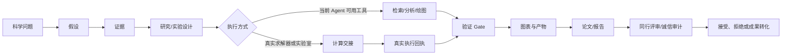
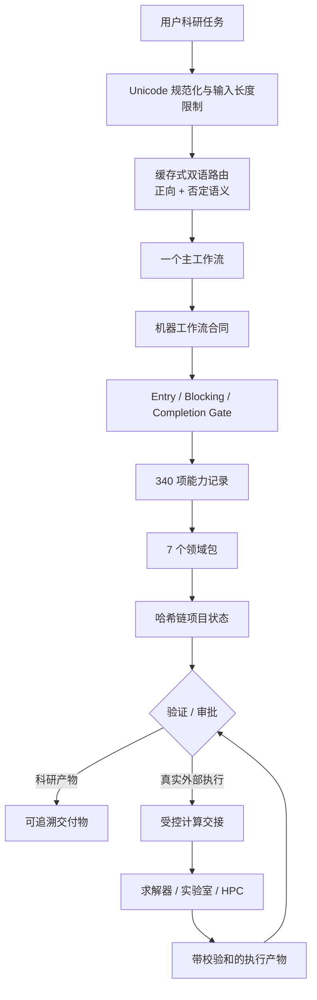

<div align="center">
  
  <h1>TsaoSciResearcher</h1>
  <p><strong>证据优先、全生命周期、可追溯的科研智能体编排平台</strong></p>
  <p>覆盖科学问题、文献证据、实验设计、统计分析、科研绘图、写作出版、受控计算交接与项目审计。</p>
</div>

<div align="center">

[English](README.md) · [English mirror](README_EN.md) · [架构说明](docs/ARCHITECTURE.md) · [验证证据](docs/VALIDATION_EVIDENCE.json) · [安全策略](SECURITY.md)

[](https://github.com/SUNHAOJUN22/TsaoSciResearcher/actions/workflows/ci.yml)

</div>

> **正式版本 0.5.1** · Apache-2.0 · Python 3.10–3.13 · Windows、Linux、macOS

## 项目定位

TsaoSciResearcher 不是一个“自动写论文”的长提示词，也不是把数百个 Skill 名称堆在一个文件里。它是科研方法学、研究状态、证据链和科研产物的控制层，将宽泛目标转化为可检查的完整链条：

```text
科学问题 → 假设 → 证据 → 方法 → 数据 → 检查 → 验证 → 结论 → 交付物
```

它提供确定性路由、带 Gate 的工作流、机器可读能力合同、项目状态、证据/论断检查、Figure Contract、安全安装和可重复发布。

核心目标不是让文字“听起来像科研”，而是避免把未发生的检索、实验、模拟或未经验证的结论包装成已完成事实。

## 明确边界

TsaoSciResearcher 本身不是：

- 文献数据库；
- DFT、MD、FEM、CFD 或流程模拟求解器；
- 实验室仪器驱动；
- 医疗、安全、法律、专利/FTO 或科研诚信专业判断的替代品；
- 外部计算或实验已经真实运行的证明。

真实执行必须通过带校验和的 `computation-handoff` 交给 TsaoSciComputation 或实际求解器、实验室与 HPC 环境。`completed`、`checked`、`validated`、`accepted` 始终是不同状态。

## 当前实现的可核查事实

以下数字由当前源码自动生成，并由 `scripts/build_readme_facts.py` 检查。

| 组件 | 数量 | 准确含义 |
|---|---:|---|
| v2 能力记录 | **340** | 通过 Schema 与一致性检查的机器可读记录 |
| 具名兼容能力 | **158** | 与 322 项参考 Skill 目录保持原 slug 的科研能力 |
| 领域能力槽位 | **164** | 对齐七个计算/工程类别数量的领域合同 |
| 运行时核心能力 | **18** | 路由、状态、审计、基准和发布能力 |
| 主工作流 | **15** | 方法政策 + 机器合同 + entry/blocking/completion Gate |
| JSON Schema | **15** | 8 个兼容 Schema + 7 个 v2 Schema |
| 领域包 | **7** | 方法选择、验证、解释和图形指南 |
| 参考文件 | **22** | 按需加载的方法学资料 |
| 模板 | **13** | 问题、证据、协议、图形、论文与报告产物 |

### “340 项能力”到底表示什么

```text
340 = 158 项具名科研能力
    + 164 个按类别和数量对齐的领域能力槽位
    + 18 项运行时核心能力
```

这里必须保持诚实：164 个领域记录是真实、可验证、可检索的合同，但目前使用通用领域槽位 slug，并没有逐一保留上传的 322 项 Skill 目录中对应 164 项计算类 Skill 的原始名称。完整对照见 [能力覆盖矩阵](docs/CAPABILITY_COVERAGE_MATRIX.md)。

## 科研生命周期



## 系统架构



运行时分工：

| 模块 | 职责 |
|---|---|
| `tsao_researcher/router.py` | 缓存式确定性路由、否定语义、输入上限和稳定冲突裁决 |
| `tsao_researcher/capabilities.py` | 340 项能力加载、排序检索与工作流/领域过滤 |
| `tsao_researcher/state.py` | 项目生命周期、SHA-256 事件链和接受审批 |
| `tsao_researcher/handoff.py` | 路径受限、输入校验和与计算合同 |
| `tsao_researcher/io.py` | 原子写入、有界锁、有限 JSON/JSONL 和流式哈希 |
| `scripts/` | 兼容命令、验证器、审计、安装、测试、性能与发布工具 |

设计要求到代码和测试的对应关系见 [README 架构映射](docs/README_ARCHITECTURE_MAPPING.md)。

## 能力执行层级

| 层级 | 可以做什么 | 不能据此声称什么 |
|---|---|---|
| 原生能力 | 路由、能力搜索、状态管理、Schema/证据/论断验证、安装、审计和打包 | 外部科研结果已经科学正确 |
| 工具编排 | 使用当前 Agent 已提供的工具完成检索、分析、绘图和文档生成 | 未提供的数据库或工具已经被访问 |
| 外部委托 | 通过合同设计 DFT、MD、FEM、CFD、Aspen/流程、实验室或 HPC 任务 | 求解器或仪器已经运行 |
| 人工复核 | 记录接受、安全、法律、FTO、医疗、诚信等审批 | 替代合格专家判断 |

## 15 个主工作流

| 工作流 | 用途 | 核心控制 |
|---|---|---|
| `research-question` | 形成边界明确、可回答、可证伪的科学问题 | 对象、变量、边界条件、评价指标和证伪标准 |
| `deep-research` | 可审计检索、筛选、证据抽取和矛盾综合 | 来源、证据位置和停止规则 |
| `systematic-review` | 协议驱动的系统综述与证据综合 | 协议冻结、纳排标准和偏倚控制 |
| `research-design` | 方法矩阵、技术路线 DAG 和阶段 Gate | 可行性、决策点和验证路线 |
| `experiment-design` | 对照、随机化、功效、DOE 和测量计划 | 实验单位、重复和质量控制 |
| `data-analysis` | 数据质量、统计、因果、UQ 和科研机器学习 | 方法必须匹配数据生成过程 |
| `scientific-figure` | 先建立 Figure Contract，再绘图和终尺寸检查 | 科学结论、数据来源、单位、误差与导出合同 |
| `scientific-writing` | 基于 Claim–Evidence 图完成科研写作 | 不编造结果，不提高证据强度 |
| `peer-review` | 学科、方法、统计、图表、引用和复现性审查 | 审查意见不伪装成已完成修改 |
| `technical-report` | 科研、工程、管理、客户、监管或验收报告 | 明确受众、口径和决策边界 |
| `project-management` | 事件状态、里程碑、风险和产物血缘 | 不静默提升状态 |
| `patent-and-transfer` | 特征拆解、专利地图、FTO 风险和技术交底 | 必须保留法律专业复核 |
| `research-integrity` | 只读检查引用、数据、图像、统计和 AI 风险 | 风险指标不等于不端结论 |
| `laboratory` | SOP、样品链、校准、QC、偏差和 CAPA | 没有适配器时不声称控制仪器 |
| `computation-handoff` | 绑定问题、输入、方法、收敛、UQ、验证与审批 | 合同不是执行结果 |

每个工作流均包含：

```text
WORKFLOW.md           人类可读的方法政策
workflow.yaml.json    机器合同
gates.yaml            entry / blocking / completion Gate
```

## 快速开始

### 安装 Python 包

```bash
git clone https://github.com/SUNHAOJUN22/TsaoSciResearcher.git
cd TsaoSciResearcher
python -m pip install -e .
```

### 路由科研任务

```bash
python -m tsao_researcher route \
  "设计催化活性位—链增长—形貌—反应器—产品性能的可追溯多尺度研究"
```

输出包括主/次工作流、置信度、触发词、是否需要澄清、人工审批需求和最小加载计划。

### 检索能力

```bash
python -m tsao_researcher search "polymer molecular dynamics" \
  --domain molecular-dynamics-multiscale \
  --limit 10
```

也可按工作流过滤：

```bash
python -m tsao_researcher search "uncertainty" \
  --workflow data-analysis \
  --limit 20
```

### 初始化可追溯项目

```bash
python -m tsao_researcher init \
  --name "聚烯烃多尺度研究" \
  --question "哪些机制连接活性位动力学、反应器行为与产品性能？" \
  --output .
```

状态推进与校验：

```bash
python -m tsao_researcher transition . planned --reason "科学问题与证据计划已审批"
python -m tsao_researcher transition . running --reason "登记工作正式启动"
python -m tsao_researcher verify .
```

## 项目状态与溯源

```text
.tsao-research/
├── project.yaml
├── state/events.jsonl
├── registry/
├── literature/
├── data/
├── computation/
├── artifacts/
├── figures/
├── reports/
└── protocols/
```

正常状态链：

```text
proposed → planned → running → completed → checked → validated → accepted
```

也支持 `rejected` 和 `superseded`。进入 `accepted` 必须有审批记录。每次状态变更使用互斥锁、原子替换和 SHA-256 事件链，篡改可由 `verify` 检出。

## 受控计算交接

TsaoSciResearcher 负责计算研究设计、输入审查、方法边界、收敛/UQ/物理验证要求以及结果解释，不伪造真实外部执行。

```python
from pathlib import Path

from tsao_researcher import create_handoff, initialize

root = initialize(
    "聚合过程模型",
    "哪些动力学和传递参数控制分子量分布？",
    ".",
)
Path(root / "data/feed.json").write_text('{"ethylene": 1.0}\n', encoding="utf-8")

handoff = create_handoff(
    root,
    "computation/process-handoff.json",
    "哪些动力学和传递参数控制分子量分布？",
    "molecular-weight distribution",
    "process-kinetics-digital-twin",
    ["population balance", "dynamic reactor model"],
    ["data/feed.json"],
)
```

交接文件记录输入 SHA-256、候选方法、边界条件、收敛性、不确定度、物理验证、接受标准和审批点。路径逃逸、符号链接输入、占位问题以及无验证输入的 ready 任务会被拒绝。

## Skill 安装位置

先只检查，不写入：

```bash
python scripts/install.py --agent codex --scope user --dry-run --validate
```

| Agent | 用户级 | 项目级 |
|---|---|---|
| Codex | `~/.codex/skills/TsaoSciResearcher` | `./.codex/skills/TsaoSciResearcher` |
| Claude Code | `~/.claude/skills/TsaoSciResearcher` | `./.claude/skills/TsaoSciResearcher` |
| Open Agent Skills | `~/.agents/skills/TsaoSciResearcher` | `./.agents/skills/TsaoSciResearcher` |

示例：

```bash
python scripts/install.py --agent codex --scope user
python scripts/install.py --agent claude --scope project
python scripts/install.py --agent open-agent --scope user
python scripts/install.py --target /managed/path/TsaoSciResearcher --validate
python scripts/install.py --agent codex --scope user --force
python scripts/install.py --agent codex --scope user --uninstall
```

安装器先写入暂存目录，写入管理标记，再执行原子替换；使用唯一备份支持回滚，并拒绝危险路径和非本项目管理的目录。

## 七个领域包

- [催化、高分子与复合材料](domain-packs/catalysis-polymers-composites/README.md)
- [计算化学与材料](domain-packs/computational-chemistry-materials/README.md)
- [分子动力学与多尺度](domain-packs/molecular-dynamics-multiscale/README.md)
- [有限元与多物理场](domain-packs/fem-multiphysics/README.md)
- [CFD、颗粒与加工](domain-packs/cfd-particles-processing/README.md)
- [过程动力学与数字孪生](domain-packs/process-kinetics-digital-twin/README.md)
- [HPC 与可重复计算](domain-packs/hpc-reproducibility/README.md)

上传的参考目录还列出了 32 个科学计算引擎。本项目不捆绑这些引擎；领域包与计算交接只负责方法选择、输入、收敛、溯源和解释边界。

## 实际验证结果

完整证据记录在 [docs/VALIDATION_EVIDENCE.json](docs/VALIDATION_EVIDENCE.json)。

GitHub Actions 发布验证 run `29887374398` 已通过：

- **96 项 pytest 测试**：0 failure、0 error、0 skipped；
- **15/15 个关键突变被杀死**；
- Ubuntu + Python 3.10、3.13；
- Windows + Python 3.12；
- macOS + Python 3.12；
- 仓库与交叉合同审计；
- 逆序和固定种子随机顺序回归；
- Ruff 格式与 lint；
- 严格 Mypy；
- Bandit 高等级安全门；
- 有界性能烟雾；
- 两次逐字节一致的发布包构建。

### 实测性能烟雾

参考环境：GitHub Actions Linux，Python 3.12.13。以下数据用于回归保护，不用于跨硬件营销比较。

| 操作 | 工作量 | 实测 | 阈值 |
|---|---:|---:|---:|
| 兼容路由 | 10,000 次 | 8.092 s | 20.0 s |
| v2 路由 | 10,000 次 | 1.262 s | 8.0 s |
| v2 能力目录加载 | 100 次 | 0.912 s | 4.0 s |
| v2 能力搜索 | 1,000 次 | 0.379 s | 4.0 s |
| 兼容能力加载 | 100 次 | 0.263 s | 5.0 s |
| Claim–Evidence 检查 | 1,000 + 1,000 条 | 0.217 s | 20.0 s |
| 全部 Schema | 15 套 | 0.125 s | 5.0 s |
| ZIP 成员安全检查 | 1,000 个 | 0.011 s | 10.0 s |
| 安装 + 卸载 | 1 个周期 | 0.050 s | 20.0 s |
| 两次发布构建 | 2 个包 | 0.200 s | 30.0 s |

该次烟雾测试的 `tracemalloc` 峰值为 **146,088 bytes**。

## 开发与验证命令

```bash
python -m pip install -r requirements-dev.txt

python scripts/audit_repository.py
python scripts/validate_structure.py
python scripts/build_readme_facts.py --check
python scripts/generate_checksums.py --check
python scripts/build_capability_index.py --check
python scripts/route_task.py --self-test

python -m pytest -q -p hypothesis.extra.pytestplugin
python -m ruff format --check scripts tsao_researcher tests
python -m ruff check scripts tsao_researcher tests
python -m mypy scripts tsao_researcher
python -m bandit -q -lll -r scripts tsao_researcher
python scripts/run_mutation_smoke.py
python scripts/performance_smoke.py --json-out artifacts/performance.json
```

确定性发布：

```bash
python scripts/package_release.py --out dist-a
python scripts/package_release.py --out dist-b
cmp dist-a/TsaoSciResearcher-v0.5.1.zip dist-b/TsaoSciResearcher-v0.5.1.zip
python scripts/validate_release.py
```

## 目录结构

```text
TsaoSciResearcher/
├── SKILL.md
├── manifest.json
├── agents/
├── tsao_researcher/          v2 原生运行时
├── workflows/                15 套政策/合同/Gate
├── capabilities/v2/          340 项 v2 能力记录
├── capability-index/         158 项具名兼容能力
├── schemas/                  15 套 JSON Schema
├── domain-packs/             7 个计算与工程领域包
├── references/               22 个按需加载参考文件
├── templates/                13 个科研产物模板
├── scripts/                  验证、审计、安装、测试和发布
├── tests/
├── examples/
└── docs/
```

## 对照与证据文档

- [README 审计报告](docs/README_AUDIT_REPORT.md)
- [能力覆盖矩阵](docs/CAPABILITY_COVERAGE_MATRIX.md)
- [设计—代码—测试—文档映射](docs/README_ARCHITECTURE_MAPPING.md)
- [机器生成的 README 事实](docs/README_FACTS.json)
- [发布验证证据](docs/VALIDATION_EVIDENCE.json)
- [系统架构](docs/ARCHITECTURE.md)
- [验证模型](docs/VALIDATION.md)
- [合规与许可证边界](docs/COMPLIANCE.md)

## 已知限制

1. 164 个计算/工程领域记录是数量对齐的通用槽位，不是对应参考目录 164 项 Skill 的一对一具名实现。
2. 外部数据库、求解器、仪器和 HPC 调度器不随本项目安装。
3. 文献检索、绘图和 Office 文档生成依赖当前宿主 Agent 提供的工具。
4. 科研诚信自动检查只提示风险，不作不端认定。
5. 专利/FTO、医疗、安全、监管及高影响结论接受必须由合格人员复核。
6. 软件测试通过不等于科学模型、实验或结论已经被科学验证。

## 许可证与来源

项目采用 [Apache-2.0](LICENSE)。架构受到多个公开科研 Agent、学术研究与科学计算项目启发，但核心路由、合同、验证器和运行时均为独立实现。详见 [THIRD_PARTY.md](THIRD_PARTY.md)、[NOTICE](NOTICE) 和 [references/source-map.md](references/source-map.md)。

TsaoSciResearcher 不是任何参考项目的官方分支或替代品。
