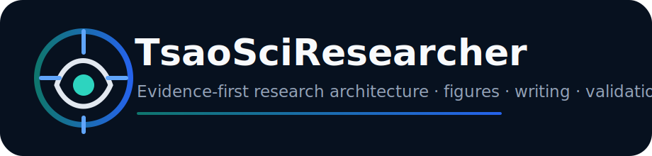
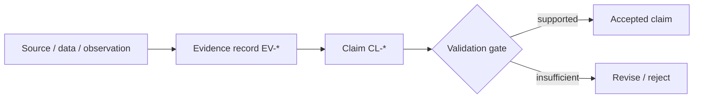

<div align="center">
  

  <p><strong>把科研问题、证据、数据、图表和文字组织成可验证、可追溯、可复现的研究工作流。</strong></p>

  <p>
    <a href="README_EN.md">English</a> ·
    <a href="docs/ARCHITECTURE.md">Architecture</a> ·
    <a href="capability-index/capabilities.md">158 Capabilities</a> ·
    <a href="docs/VALIDATION.md">Validation</a> ·
    <a href="docs/COMPLIANCE.md">Compliance</a> ·
    <a href="docs/AUDIT_REPORT.md">Audit</a>
  </p>

  <p>
    
    
    
    
    
    
  </p>
</div>

---

## 它是什么

**TsaoSciResearcher** 是一个面向自然科学与工程科研的证据优先 Agent Skill。它负责研究问题形成、文献与证据综合、实验设计、数据分析、科研绘图、论文与技术报告、同行评审、项目治理、专利支持和科研诚信，并通过结构化协议把真实量子化学、分子动力学、有限元、CFD 和流程模拟任务交给 **TsaoSciComputation**。

它不是一个“万能提示词”，也不声称自动替代科研人员。当前版本包含：

- **15 个**渐进式工作流；
- **158 项**机器可检索的研究型能力；
- 项目状态、证据、论断、图形合同和计算交接 Schema；
- 确定性路由、校验、安装和发布脚本；
- 中英文文档、示例和自动测试。

### 客观能力边界

| 层级 | 当前实现 | 说明 |
|---|---|---|
| 原生能力 | 路由、能力索引、项目状态、Schema、校验器、模板、安装器 | 仓库内可直接执行 |
| 编排能力 | 文献检索、统计、绘图、文档生成、仪器数据处理 | 依赖当前 Agent 可用工具、数据和环境 |
| 委托能力 | DFT、MD、FEM、CFD、流程模拟 | 生成严格 handoff，交给 TsaoSciComputation 或真实求解器 |
| 人工决策 | 医学、专利/FTO、安全、科研诚信、高影响因果结论 | 必须由合格专家审核 |

> **核心原则：** `completed ≠ checked ≠ validated ≠ accepted`。

### v0.3.0 客观验证状态

| 检查项 | 验证结果 |
|---|---:|
| 能力记录 | 158 条，slug 唯一，必填字段完整 |
| 工作流 | 15 个，根路由和确定性路由器均可到达 |
| Schema | 7 个，均通过 JSON Schema 自检 |
| 路由测试 | 35 类科研意图 |
| 安装测试 | Codex、Claude Code、Open Agent 与自定义目录 |
| 科研绘图 | Figure Contract 示例和导出规格校验通过 |
| 证据模型 | Evidence—Claim 关联示例通过 |
| 仓库审计 | 版本、链接、路径、引用、CI目标和密钥扫描通过 |

完整映射见 [`docs/COMPLIANCE.md`](docs/COMPLIANCE.md)，修复记录见 [`docs/AUDIT_REPORT.md`](docs/AUDIT_REPORT.md)。这些结果证明仓库结构和确定性工具可运行，不代表外部数据库、实验仪器或计算求解器已经安装。

## 为什么不是 158 个独立 Skill

把数百个能力同时加载会造成上下文膨胀、路由冲突和不一致。TsaoSciResearcher 使用“**一个入口 + 15 个工作流 + 按需参考资料 + 确定性校验器**”：


根 `SKILL.md` 只判断意图和科研阶段；工作流再按需加载参考文件、模板和脚本。完整能力目录只在精确检索时读取。

## 工作流

| Workflow | 目标 | Indexed capabilities |
|---|---|---:|
| `research-question` | 从宽泛主题收敛到可回答、可证伪的科学问题。 | 6 |
| `deep-research` | 设计检索、筛选与证据映射，保留来源和冲突。 | 16 |
| `systematic-review` | 执行协议化检索、筛选、质量评价和证据综合。 | 5 |
| `research-design` | 建立研究范式、技术路线、方法矩阵、验证策略和阶段门。 | 10 |
| `experiment-design` | 建立因子、响应、对照、重复、功效、DOE和质量控制方案。 | 3 |
| `data-analysis` | 从数据生成机制出发执行质量、统计、不确定性和模型检查。 | 52 |
| `scientific-figure` | 先定义图的科学结论与证据职责，再绘图、导出和视觉质检。 | 2 |
| `scientific-writing` | 根据证据链写作论文，控制结论强度并维护引用完整性。 | 14 |
| `peer-review` | 从科学问题、方法、统计、图表、引用和复现性审查稿件。 | 3 |
| `technical-report` | 把研究证据转化为技术报告、阶段总结和领导决策材料。 | 3 |
| `project-management` | 管理工作包、状态、依赖、里程碑、风险、决策和交付物。 | 17 |
| `patent-and-transfer` | 支持检索、专利地图、现有技术初筛、交底和TRL评价；不替代法律意见。 | 7 |
| `research-integrity` | 只读检查引用、数据、统计、图表、结论和AI生成风险。 | 8 |
| `laboratory` | 建立SOP、样品编码、仪器数据、QC、ELN和实验室自动化流程。 | 8 |
| `computation-handoff` | 把真实计算需求转换为有输入、边界、验证和审批的标准任务。 | 4 |

## 158 项能力覆盖

| 一级目录 | 数量 |
|---|---:|
| AI与机器学习科研 | 20 |
| 实验室自动化与仪器 | 20 |
| 数据统计与可视化 | 20 |
| 文献与知识工程 | 18 |
| 生物信息与医学科研 | 18 |
| 科研Agent与编排 | 18 |
| 科研写作与出版 | 20 |
| 科研管理、专利与诚信 | 24 |

完整目录：[`capability-index/capabilities.md`](capability-index/capabilities.md) · [`capabilities.json`](capability-index/capabilities.json) · [`capabilities.csv`](capability-index/capabilities.csv)

每条能力均记录：触发条件、输入、输出、推荐工具、风险等级、人工审批要求、TsaoSciComputation 交接要求和参考文件。能力记录是**可路由元数据**，并不意味着所有外部数据库和软件已安装。

## 快速开始

### 1. 克隆并验证

```bash
git clone https://github.com/SUNHAOJUN22/TsaoSciResearcher.git
cd TsaoSciResearcher
python -m pip install -r requirements.txt
python scripts/run_tests.py
```

### 2. 安装到 Codex

用户级：

```bash
python scripts/install.py --agent codex --scope user --validate
```

项目级：

```bash
python scripts/install.py --agent codex --scope project --validate
```

Claude Code：

```bash
python scripts/install.py --agent claude --scope user --validate
```

Windows PowerShell：

```powershell
.\install.ps1 -Agent codex -Scope user -Validate
```

### 3. 初始化科研项目

```bash
python scripts/init_project.py \
  --name "PP conductive shielding" \
  --question "Which formulation and dispersion mechanisms control resistivity stability?" \
  --research-type mechanistic \
  --output .

python scripts/validate_project.py .tsao-research/project.yaml
```

### 4. 路由任务

```bash
python scripts/route_task.py "检索聚丙烯半导体屏蔽料中炭黑选择性分散的文献"
python scripts/capability_search.py "炭黑 分散"
```

## 科研绘图：先写 Figure Contract

绘图不是最后的装饰步骤。先定义结论和证据职责：

```bash
cp templates/figure-contract/figure-contract.json my-figure.json
python scripts/validate_figure.py my-figure.json
```

默认规范：

- Python + Matplotlib；用户指定时可使用 R；
- 450 DPI 栅格预览；适合矢量的图同时输出 SVG/PDF；
- 默认无装饰性网格；
- 显式单位、样本量、不确定性和统计方法；
- 时间轴在有意义时从 0 开始，其他坐标不机械强制从 0 开始；
- 保留原始数据、转换数据、代码和最终导出；
- 不使用截断坐标、面积或颜色夸大效应。

## 证据—论断模型



论断类型包括 observation、calculation、sourced fact、inference、hypothesis、recommendation 和 open question。事实型论断必须绑定证据；推断还必须记录假设。

```bash
python scripts/validate_evidence.py .tsao-research/evidence.jsonl
python scripts/validate_claims.py .tsao-research/claims.jsonl --evidence .tsao-research/evidence.jsonl
python scripts/validate_citations.py .tsao-research/evidence.jsonl
```

## 与 TsaoSciComputation 协作

当任务要求真实 DFT、MD、有限元、CFD 或过程仿真时，本 Skill 不制造“看起来像结果”的文本，而是生成计算契约：

```bash
python scripts/handoff_to_computation.py \
  --project .tsao-research \
  --out .tsao-research/computation-handoff.json \
  --question "How does carbon-black localization affect conductive percolation?" \
  --property "phase preference and percolation descriptors" \
  --scale multiscale \
  --method "molecular dynamics" \
  --expected-output "validated dispersion metrics"
```

交接内容包含方法候选、输入、边界条件、参数来源、收敛检查、不确定性、验收标准和人工审批节点。

## 项目状态目录

```text
.tsao-research/
├── project.yaml
├── questions.json
├── hypotheses.json
├── evidence.jsonl
├── claims.jsonl
├── decisions.jsonl
├── artifacts.jsonl
├── risks.json
├── approvals.jsonl
├── figures/
├── literature/
├── data/
├── protocols/
└── reports/
```

## 测试与发布

```bash
python scripts/audit_repository.py
python scripts/run_tests.py
python scripts/package_release.py
```

CI 检查 Python 3.10-3.12、Schema、158 项能力完整性、35+ 路由意图、项目初始化、Figure Contract、证据—论断链接和安装流程。

## 许可证与来源

项目核心代码和原创文档采用 **Apache-2.0**。仓库没有打包上游提示词、代码、模型或数据。公开项目仅用于架构比较和能力分类，详情见 [`THIRD_PARTY.md`](THIRD_PARTY.md)。这不是任何上游项目的官方分支或替代品。

## 已知限制

- 不自带付费数据库访问权、期刊全文、LLM API 密钥或机构订阅；
- 不保证每个外部统计、绘图、Office 或实验室工具在当前环境可用；
- 不执行真实多尺度仿真；该部分由 TsaoSciComputation 和实际求解器承担；
- 自动科研诚信检查只能提供风险信号，不能独立认定不端行为；
- 医学、法律、专利和安全输出必须人工复核。

## 贡献

新增能力必须给出唯一 slug、路由工作流、输入、输出、风险、证据政策和测试。禁止在许可证不兼容或缺少归属说明的情况下复制其他 Skill 内容。参见 [`CONTRIBUTING.md`](CONTRIBUTING.md)。
