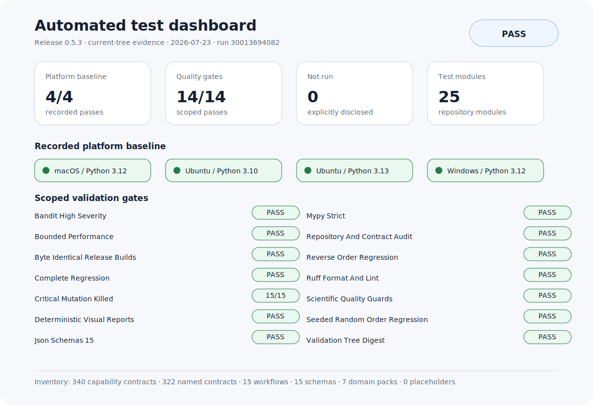

<div align="center">
  
  <h1>TsaoSciResearcher</h1>
  <p><strong>证据优先的科研工作控制层</strong></p>
  <p>科学问题 → 证据 → 设计 → 分析/执行 → 验证 → 交付物</p>

[English](README.md) · [架构](docs/ARCHITECTURE.md) · [验证](docs/VALIDATION.md) · [安全](SECURITY.md)

[](https://github.com/SUNHAOJUN22/TsaoSciResearcher/actions/workflows/ci.yml)
</div>

> **正式版本 0.5.2** · Apache-2.0 · Python 3.10–3.13 · Windows、Linux、macOS

## 一句话定位

TsaoSciResearcher 将科研任务转化为有边界、可追溯、可检查的工作流，并明确管理证据、状态、验证和人工审批。

它不会把没有真实记录的检索、实验、模拟或仪器操作写成“已经完成”。

## 已核实范围

下列数字均从当前代码自动生成并由 CI 检查：

| 项目 | 已核实数量 |
|---|---:|
| 能力合同总数 | **340** |
| AI for Science 目录具名合同 | **322** |
| 通用科研/兼容合同 | **158** |
| 具名计算与工程领域合同 | **164** |
| 通用占位领域合同 | **0** |
| 原生运行时/核心合同 | **18** |
| 带 Gate 工作流 | **15** |
| JSON Schema | **15** |
| 领域包 | **7** |
| 渐进加载参考文件 | **22** |
| 模板 | **13** |

```text
340 = 322 项具名 AI for Science 合同 + 18 项运行时/核心合同
322 = 158 项通用科研合同 + 164 项具名领域合同
```

322 项合同已保留目录中的 Skill Slug 和名称。合同定义路由、输入输出、验证和计算交接，但不代表外部求解器已经安装或运行。

## 已经做到什么

- **单入口、渐进加载**：根 `SKILL.md` 先选择一个主工作流，再加载需要的参考资料。
- **确定性双语路由**：缓存规则、输入长度限制、稳定优先级和否定语义处理。
- **完整科研生命周期**：科学问题、证据、实验/研究设计、统计、绘图、写作、审稿、实验室治理、专利诚信和项目管理。
- **统一项目状态**：原子写入、文件锁、状态转换和 SHA-256 事件链。
- **证据与论断检查**：Schema、双向关联、引用完整性及失败非零退出码。
- **科研绘图门控**：Figure Contract、坐标/单位/统计检查及 PNG、SVG、PDF、TIFF 导出验证。
- **受控计算交接**：输入校验和、收敛与不确定度要求、路径安全和人工审批点。
- **跨平台安装**：支持 Codex、Claude Code、Open Agent Skills，支持用户级/项目级、预演、校验和卸载。
- **可重复工程验证**：仓库审计、静态检查、突变测试、顺序无关测试、性能门和逐字节一致发布。

## 明确边界

| 能力 | 状态 |
|---|---|
| 科研编排、验证和产物管理 | 原生实现 |
| 文献检索、绘图、Word/PPT 等 | 调用宿主 Agent 已提供的工具 |
| DFT、MD、FEM、CFD、流程模拟、HPC 和真实实验 | 通过 `computation-handoff` 交接 |
| 医疗、安全、法律/FTO、科研诚信和最终科学接受 | 必须由合格人员审批 |

上传目录中的 32 个科学计算引擎是生态集成目标，不是本仓库内置求解器。

## 快速开始

### 安装

```bash
git clone https://github.com/SUNHAOJUN22/TsaoSciResearcher.git
cd TsaoSciResearcher
python -m pip install -e .
```

### 路由科研任务

```bash
python -m tsao_researcher route "设计一个可追溯的聚烯烃多尺度研究"
```

### 搜索具名能力

```bash
python -m tsao_researcher search "GROMACS 轨迹分析" --limit 10
python -m tsao_researcher search "非牛顿流" --domain cfd-particles-processing
```

### 初始化统一项目状态

```bash
python -m tsao_researcher init \
  --name "聚烯烃多尺度研究" \
  --question "活性中心动力学如何影响产品结构与性能？" \
  --research-type mechanistic \
  --output .
```

CLI 与 `scripts/init_project.py` 现在生成同一套目录：

```text
.tsao-research/
├── project.yaml
├── questions.json
├── hypotheses.json
├── evidence.jsonl
├── claims.jsonl
├── decisions.jsonl
├── artifacts.jsonl
├── risks.json
├── approvals.jsonl
├── state/events.jsonl
├── registry/
├── literature/
├── data/
├── computation/
├── artifacts/
├── figures/
├── reports/
└── protocols/
```

状态推进与校验：

```bash
python -m tsao_researcher transition . planned --reason "问题与计划已批准"
python -m tsao_researcher transition . running --reason "登记工作已启动"
python -m tsao_researcher verify .
```

状态不可混淆：

```text
proposed → planned → running → completed → checked → validated → accepted
```

另支持 `rejected` 和 `superseded`；进入 `accepted` 必须有审批记录。

### 登记计算交接

```bash
printf "input" > .tsao-research/data/input.dat
python scripts/handoff_to_computation.py \
  --project .tsao-research \
  --out computation/job.json \
  --question "需要计算什么性质？" \
  --property "自由能" \
  --profile MD \
  --scale atomistic \
  --method "增强采样" \
  --boundary-condition "周期性边界" \
  --metric "自由能收敛性" \
  --expected-output "PMF 曲线" \
  --input-file data/input.dat
python -m tsao_researcher verify .
```

v2 交接文件会校验输入哈希、限制路径，并登记到 `project.yaml` 与 `artifacts.jsonl`。它只是外部计算计划，不是“已经执行”的凭据。

## 15 个工作流

```text
research-question      deep-research          systematic-review
research-design        experiment-design      data-analysis
scientific-figure      scientific-writing     peer-review
technical-report       project-management     patent-and-transfer
research-integrity     laboratory             computation-handoff
```

每个工作流均包含方法政策、机器合同及 entry/blocking/completion Gate。

## 自动验证

```bash
python scripts/validate_schemas.py
python scripts/build_readme_facts.py --check
python scripts/build_test_dashboard.py --check
python scripts/audit_repository.py
python scripts/validate_structure.py
python scripts/generate_checksums.py --check
python -m pytest -q -p hypothesis.extra.pytestplugin
python scripts/performance_smoke.py
```

可重复发布：

```bash
VERSION="$(cat VERSION)"
python scripts/package_release.py --out dist-a
python scripts/package_release.py --out dist-b
cmp "dist-a/TsaoSciResearcher-v${VERSION}.zip" \
    "dist-b/TsaoSciResearcher-v${VERSION}.zip"
```

CI 还执行 Ruff、严格 Mypy、Bandit、关键突变测试、逆序与固定随机种子测试，以及 Windows、Linux、macOS 兼容测试。

## 测试可视化



- [打开可交互 HTML 仪表板](docs/test-dashboard.html)
- [查看机器可读验证证据](docs/VALIDATION_EVIDENCE.json)

仪表板由已记录的验证证据自动生成并由 CI 校验。它展示软件门禁结果,不替代科学结论或人工审批。

## 详细对照证据

README 保持简洁，详细检查放在独立文件中：

- [README 审计报告](docs/README_AUDIT_REPORT.md)
- [322 项 Skill 覆盖矩阵](docs/CAPABILITY_COVERAGE_MATRIX.md)
- [设计 → 代码 → 测试映射](docs/README_ARCHITECTURE_MAPPING.md)
- [机器可读 README 事实](docs/README_FACTS.json)
- [最新 CI 证据](docs/VALIDATION_EVIDENCE.json)

## 许可证和上游边界

TsaoSciResearcher 是 Apache-2.0 原创实现。项目受到公开科研 Agent 和科研工具项目启发，但不是其官方分支或替代品，也未打包上游提示词或源代码。详见 [THIRD_PARTY.md](THIRD_PARTY.md) 和 [references/source-map.md](references/source-map.md)。
