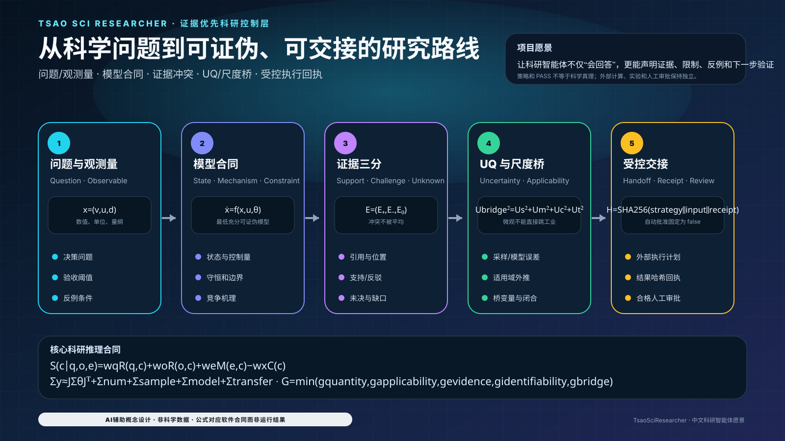

<div align="center">
  
  <h1>TsaoSciResearcher</h1>
  <p><strong>证据优先的科研策略、数理合同、受控交接与验证控制层</strong></p>
  <p>科学问题 → 观测量 → 模型合同 → 证据合同 → 受控外部执行 → 回执 → 验收证据</p>

[English](README.md) · [文档](docs/index.md) · [架构](docs/ARCHITECTURE.md) · [数理合同](docs/MATHEMATICAL_CONTRACTS.md) · [验证](docs/VALIDATION.md) · [视觉图谱](docs/VISUAL_ATLAS.zh-CN.md)

[](https://github.com/SUNHAOJUN22/TsaoSciResearcher/actions/workflows/ci.yml)
</div>

<!-- LOCALIZED_VISION_ZH:START -->
## 中文项目愿景图：从科学问题到可证伪、可交接的研究路线

<p align="center">
  
</p>

> 图中公式映射能力路由、量纲、证据冲突、不确定度、尺度桥和回执验证代码；图不是论文证据、实验结果或自动科学批准。

<!-- LOCALIZED_VISION_ZH:END -->

> **正式版本 0.7.4 · 验收加固 main** · Apache-2.0 · Python 3.10–3.13 · 确定性 CLI 与 Python API

## 1. 这个仓库究竟是什么

TsaoSciResearcher 是一个**科研控制层**。它把定义不足的科研问题转化为可追踪、可证伪、可复核的研究策略，负责确定性问题路由、能力合同检索、科研质量检查、策略生成、项目状态管理、校验和绑定的外部执行交接、执行回执验证和可复现归档。

它**不是** DFT、量子化学、分子动力学、CFD、FEM、流程模拟、HPC 或实验室求解器。一个策略、一条方程、一个 handoff 文件、一个 PASS 标签或一张 AI 图，都不能证明真实计算或实验已经发生。

当前实现规模由机器事实文件约束：

| 交付事实 | 已核验值 |
|---|---:|
| 能力合同 | **341** |
| 保留的旧版/通用合同 | **158** |
| 保留的工作簿命名 | **322** |
| 领域计算/工程合同 | **164** |
| 通用领域占位项 | **0** |
| 运行时新增能力 | **19** |
| 主工作流 | **15** |
| JSON Schema | **20** |
| 领域包 | **7** |
| AI 生成概念示意图 | **38** |

验收证据：[README 审计](docs/README_AUDIT_REPORT.md)、[能力覆盖矩阵](docs/CAPABILITY_COVERAGE_MATRIX.md)、[架构映射](docs/README_ARCHITECTURE_MAPPING.md)、[数理合同](docs/MATHEMATICAL_CONTRACTS.md)、[数理合同 Schema](schemas/v2/mathematical-contract-registry.schema.json)、[验证证据](docs/VALIDATION_EVIDENCE.json)、[HTML 仪表板](docs/test-dashboard.html)与 [SVG 仪表板](docs/test-dashboard.svg)。

> 仓库中的所有图示均为**AI 生成概念示意图**，仅用于说明软件架构和科研控制逻辑；它们不是实验数据、测量结果、求解器输出，也不能证明外部计算已经执行。

## 2. 架构与职责边界

```text
CLI / Python API
      │
      ├── router.py ─────────────────────> 确定性任务分类
      ├── capabilities.py ────────────────> 已验证能力检索
      ├── strategy.py ────────────────────> 第一性原理 Scientific Passport
      ├── mathematical_contracts.py ──────> Schema 约束的方程与解释边界
      ├── scientific_quality.py ──────────> 数量、证据、因果和可追踪性防线
      ├── state.py ───────────────────────> 哈希链接项目状态
      ├── handoff.py / receipts.py ───────> 外部执行证据边界
      └── capsule.py ─────────────────────> 确定性可复现归档
```


典型研究链路：

```text
科学问题
    ↓
决策关键观测量 + 单位 + 验收阈值
    ↓
状态变量 + 控制规律 + 约束
    ↓
最低充分、可证伪模型
    ↓
证据 / 适用域 / 可辨识性 / 尺度桥质量门
    ↓
合格人工评审
    ↓
校验和绑定的外部交接
    ↓
执行回执 + 可独立复核证据
```

## 3. Schema 约束的机器可读数理合同

`math` 命令公开八类稳定的中英文数理合同。当前每个响应在输出前都会通过包内 Draft 2020-12 Schema 校验。

```bash
python -m tsao_researcher math
python -m tsao_researcher math --schema
python -m tsao_researcher math --contract decision-readiness --language en
python -m tsao_researcher math --contract quantity-dimension --language zh-CN
python -m tsao_researcher math --contract uncertainty-budget --output contract.json
python scripts/validate_mathematical_contracts.py --check
```

每个合同响应固定声明科研真实性边界：

```json
{
  "schema_version": "1.0",
  "schema_id": "https://sunhaojun22.github.io/TsaoSciResearcher/schemas/v2/mathematical-contract-registry.schema.json",
  "advisory_only": true,
  "solver_executed": false,
  "automatic_approval": false
}
```

规范 Schema 位于 [`schemas/v2/mathematical-contract-registry.schema.json`](schemas/v2/mathematical-contract-registry.schema.json)，安装包在 `tsao_researcher/data/schemas/` 中携带逐字节一致的镜像，因此安装后的 CLI 也可以离线验证同一个合同。


### 3.1 能力排序抽象

\[
S(c\mid q,o,e)=w_qR(q,c)+w_oR(o,c)+w_eM(e,c)-w_xC(c)
\]

- \(c\)：候选能力
- \(q\)：科研问题
- \(o\)：决策关键观测量
- \(e\)：已声明证据上下文
- \(C(c)\)：冲突或排除惩罚

该式用于解释确定性路由如何分解，而不是一个已经拟合的统计模型。候选方法必须同时满足问题相关、能够产生目标观测量、与现有证据兼容，并且不被负向语义排除。

### 3.2 数量、单位与量纲合同

\[
x=(v,u,d),\qquad d_{\mathrm{left}}=d_{\mathrm{right}}
\]

进行定量比较时应明确数值 \(v\)、单位 \(u\) 与物理量纲 \(d\)。缺失单位进入复核；量纲不相容直接阻断比较。

### 3.3 适用域与外推

\[
r_{\mathrm{extra}}=
\frac{d(x,\mathcal A)}{\max(s_{\mathcal A},\varepsilon)}
\]

其中 \(x\) 是目标条件，\(\mathcal A\) 是声明适用域，\(s_{\mathcal A}\) 是特征尺度。目标离适用域越远，要求的迁移证据和不确定性膨胀越强。运行时不会在没有数据时伪造一个数值距离。

### 3.4 证据三分与冲突账本

\[
E=(E_+,E_-,E_0),\qquad
\kappa=\mathbf 1[E_+\neq\varnothing\land E_-\neq\varnothing]
\]

支持、挑战与未决证据必须保持分离；一个正向结果不能静默抹掉相反证据。

### 3.5 机制与参数可辨识性

\[
D_{ij}(O,C)>\tau
\qquad\text{或}\qquad
\operatorname{rank}(J_\theta)=p
\]

机制选择需要区分性观测量；唯一参数结论需要足够的敏感性秩。真实数值雅可比矩阵仍属于外部分析任务。

### 3.6 决策观测量不确定性预算

\[
\Sigma_y\approx
J\Sigma_\theta J^{\mathsf T}
+\Sigma_{\mathrm{num}}
+\Sigma_{\mathrm{sample}}
+\Sigma_{\mathrm{model}}
+\Sigma_{\mathrm{transfer}}
\]

不确定性必须传播到真正用于接受或拒绝的观测量；参数、数值、采样、模型形式和尺度传递误差不能被压缩成一个来源不明的“置信度”。

### 3.7 多尺度桥接误差预算

\[
U_{\mathrm{bridge}}^2=
U_{\mathrm{source}}^2+
U_{\mathrm{mapping}}^2+
U_{\mathrm{closure}}^2+
U_{\mathrm{target}}^2
\]

微观结果不能直接跳到工程结论。每个尺度桥必须有可测桥接变量、映射假设、闭合验证与目标尺度验收证据。

### 3.8 保守决策就绪度

\[
G=\min\left(
 g_{\mathrm{quantity}},
 g_{\mathrm{applicability}},
 g_{\mathrm{evidence}},
 g_{\mathrm{identifiability}},
 g_{\mathrm{bridge}}
\right)
\]

最弱的强制门控制整体就绪度：

```text
BLOCK < REVIEW < PASS
```

软件 `PASS` 只表示声明范围内没有剩余软件阻断项，不等于物理真实性证明，也不能绕过合格科研人员的人工评审。


详细中英文解释：[docs/MATHEMATICAL_CONTRACTS.md](docs/MATHEMATICAL_CONTRACTS.md)。

## 4. 科学模型还原与方法选择策略

TsaoSciResearcher 从决策问题背后的物理结构选择方法，而不是从流行软件名称倒推方法。

一般状态模型：

\[
\dot{x}=f(x,u,\theta)+\epsilon_{\mathrm{model}},
\qquad
y=h(x,\theta)+\epsilon_{\mathrm{measurement}}
\]

策略至少应声明：

1. 状态变量 \(x\)、控制量 \(u\) 与参数 \(\theta\)；
2. 决策观测量 \(y\) 与验收阈值；
3. 守恒量、储库、边界条件和初始条件；
4. 能够证伪候选机制的最低充分模型；
5. 验证、不确定性和升级规则。

对守恒广延量 \(\phi\)：

\[
\frac{\mathrm d}{\mathrm dt}\int_{\Omega}\rho\phi\,\mathrm dV
+\int_{\partial\Omega}\mathbf J_\phi\cdot\mathbf n\,\mathrm dA
=\int_{\Omega}s_\phi\,\mathrm dV
\]

该方程并不意味着网格、物性模型或求解器已经存在；它定义了外部 CFD、FEM、输运或流程模拟交接前必须明确的守恒和闭合结构。

### 最低充分方法阶梯

| 问题类型 | 起始策略 | 何时升级 |
|---|---|---|
| 电子结构 / 缺陷 / 界面 | 收敛的团簇或周期 DFT 策略 | 泛函、尺寸或参考态敏感性成为决策因素 |
| 反应机理 / 选择性 | 反应路径能量 + 微观动力学骨架 | 缺失路径、溶剂/动力学或输运耦合仍未解决 |
| 构象 / 自由能 | 系综 MD/MC 策略 + 收敛判据 | 采样或力场证据不足 |
| 形貌 / 相演化 | 标度 / SCFT / CGMD / DPD / 相场策略 | 映射或闭合失败 |
| 流动 / 传热 / 传质 | 解析 / 控制体 / 降阶模型 | 几何、失稳或闭合要求 CFD/多物理场 |
| 力学 / 断裂 | 降阶力学或 FEM 策略 | 本构不可辨识或局域化主导 |
| 反应工程 | 质量/能量衡算 + 动力学/群体模型 | RTD、混合或装置数据耦合成为关键 |
| 混合多尺度问题 | 最低成本可证伪模型 | 经验证的桥接变量支持继续升级 |


## 5. Scientific Passport 与科研诚信门

策略护照可以抽象为：

\[
\mathcal P=\{M,E,U,A,I,B,V,F\}
\]

其中 \(M\) 为模型合同，\(E\) 为证据，\(U\) 为不确定性，\(A\) 为适用域，\(I\) 为可辨识性，\(B\) 为尺度桥，\(V\) 为验证，\(F\) 为证伪条件。

即使所有软件门都为绿色，科研结论仍保持建议性，不能自动替代人工科学判断。


## 6. 验收策略：exact baseline + focused delta

仓库支持三种验证范围：

- `preflight`：当前 checkout 的本地预检，CI 专属门保持 `NOT_RUN/PARTIAL`；
- `current-tree`：由外部 CI 对当前树执行端到端验证，并绑定具体 commit；
- `composite`：固定一个 exact-tree 全仓库基线，再叠加 SHA-256 绑定的当前聚焦回归。

当前验收加固记录使用 **composite**。它固定已完整通过的 v0.7.4 基线，并单独记录新增 Schema/CLI 回归，同时明确保留：

```text
current_end_to_end_ci = NOT_RUN
```

这比把旧的全树 checksum 直接复制到已变更代码上更严格。在 composite 模式下，`SHA256SUMS` 会明确延后新的全树摘要，直到完整 checkout 能够重新计算整个仓库。

详见 [验证证据](docs/VALIDATION_EVIDENCE.json)、[基线记录](docs/VALIDATION_BASELINE.json) 和 [当前聚焦回归](docs/CURRENT_CHANGE_REGRESSION.json)。


## 7. 核心 CLI 使用方法

```bash
python -m pip install --upgrade pip
python -m pip install -r requirements-ci.lock
python -m pip install -e . --no-deps
python -m pip check

python -m tsao_researcher --version
python -m tsao_researcher route "run an actual DFT calculation"
python -m tsao_researcher search "molecular dynamics" --limit 3
python -m tsao_researcher quality examples/scientific-quality-check.json
python -m tsao_researcher strategy \
  "Can two mechanisms be discriminated?" \
  --observable "rate constant 1/s" \
  --condition "350 K" \
  --evidence "independent measurement"
python -m tsao_researcher math --schema
python -m tsao_researcher math --contract decision-readiness --output contract.json
python scripts/validate_mathematical_contracts.py --check
```

## 8. 外部执行边界

TsaoSciResearcher 准备并验证执行前后的证据，但不会冒充外部引擎：

```text
已验证策略
    ↓
校验和绑定 handoff
    ↓
外部引擎 / 仪器 / 实验室
    ↓
用户提供的执行回执 + 输出哈希
    ↓
回执验证
    ↓
合格科研人员独立验收
```


示例：

```bash
python -m tsao_researcher receipt record . \
  --handoff computation/job.json \
  --engine external-engine \
  --engine-version 1.0 \
  --command engine \
  --command run \
  --exit-code 0 \
  --output computation/result.dat \
  --started-at 2026-08-07T01:00:00Z \
  --finished-at 2026-08-07T01:10:00Z

python -m tsao_researcher receipt verify .
```

## 9. 可复现归档

```bash
python -m tsao_researcher capsule export . --mode metadata --output project-metadata.zip
python -m tsao_researcher capsule export . --mode full --output project-full.zip
python -m tsao_researcher capsule verify project-full.zip
```

可复现胶囊保存软件状态和证据关系，但它本身不构成物理真实性证明。

## 10. 测试与质量门

永久质量栈包括：

- Ubuntu / Windows / macOS 四平台 Python 兼容；
- 全量回归、行覆盖率与分支覆盖率；
- 逆序与固定随机顺序测试；
- Ruff format/lint 与严格 Mypy；
- Bandit 与依赖漏洞审计；
- 变异测试和有界性能冒烟；
- Schema、确定性 SBOM 与严格文档构建；
- 字节一致的源码发布包与 wheel/sdist 隔离安装。

固定的 exact-tree 基线记录了 **314 项测试通过**、**95.827% 行覆盖率**、**93.438% 分支覆盖率**以及 **24/24 关键变异被杀死**。本轮 Schema 交付增量使用独立聚焦回归记录；README 不会把它改写成一次并未发生的“当前树全 CI PASS”。

## 11. 完整 AI 概念图谱

以下 38 个路径由 `scripts/build_readme_facts.py` 自动检查，每张 SVG 均含 `<title>` 与 `<desc>` 无障碍元数据。

<details>
<summary>展开全部 38 张仓库本地概念图</summary>


</details>

## 12. 仓库结构

```text
.
├── tsao_researcher/          # 确定性运行时
├── schemas/                  # 合同与证据 Schema
├── capabilities/             # 已验证能力目录
├── workflows/                # 科研工作流合同
├── domain-packs/             # 领域能力包
├── scripts/                  # 验证、打包与证据工具
├── tests/                    # 回归与合同测试
├── examples/                 # 规范机器可读示例
├── docs/                     # 架构、证据、报告与图谱
├── README.md
├── README.zh-CN.md
├── VERSION
└── SHA256SUMS
```

## 13. 科研与工程免责声明

软件检查通过只表示在声明的证据范围内，软件合同保持内部一致。它**不证明**科研假设、外部求解器结果、仪器测量、医学结论、法律结论或安全决策成立。

外部计算与实验必须独立执行、留痕和复核。TsaoSciResearcher 的目标是把这一边界写清楚，而不是伪造一次运行。

## 14. 许可证

Apache-2.0。
