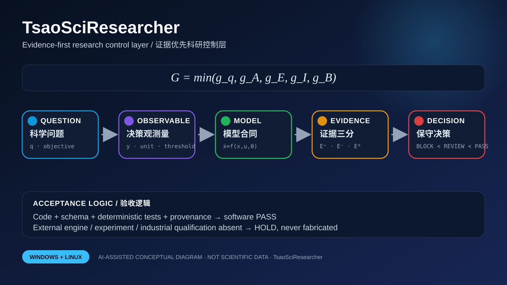

# TsaoSciResearcher — Final Acceptance README / 最终验收说明

> **Status scope / 状态边界：** this document qualifies the repository's software, contracts, documentation and deterministic evidence only. It does not claim that an external solver, licensed commercial program, laboratory experiment or industrial campaign was executed. Boundary marker: `automatic_approval=false`.



## 中文：交付定位

本文件是面向验收的双语补充 README。根目录原 README 继续保留完整功能说明；本文件固定最终交付平台、数理合同、执行策略、证据边界与验收命令。支持平台仅为 **Windows 与 Linux**，macOS 不属于发布资格矩阵。

### 1. 代码—模型—证据链

| 层级 | 合同 | 机器表达 |
|---:|---|---|
| 1 | **QUESTION / 科学问题** | `q · objective` |
| 2 | **OBSERVABLE / 决策观测量** | `y · unit · threshold` |
| 3 | **MODEL / 模型合同** | `ẋ=f(x,u,θ)` |
| 4 | **EVIDENCE / 证据三分** | `E⁺ · E⁻ · E⁰` |
| 5 | **DECISION / 保守决策** | `BLOCK ≺ REVIEW ≺ PASS` |

### 2. 统一数理资格原则

软件输出必须满足有限性、边界、守恒/一致性和证据身份约束：

\[
\mathcal A = C_{schema}\land C_{finite}\land C_{boundary}\land C_{evidence}\land C_{reproducible}.
\]

任一强制门失败时，整体结论采用最保守聚合：

\[
G=\min(g_1,g_2,\ldots,g_m),\qquad \mathrm{BLOCK}<\mathrm{REVIEW}<\mathrm{PASS}.
\]

数值比较采用绝对—相对混合容差：

\[
|x-x_{ref}|\le a_{tol}+r_{tol}|x_{ref}|.
\]

所有交付身份由规范化字节的 SHA-256 固定：

\[
H_{delivery}=\operatorname{SHA256}(H_{code}\Vert H_{config}\Vert H_{evidence}\Vert H_{environment}).
\]

性能声明必须来自重复运行的稳健统计量，并先通过数值等价门：

\[
S=\frac{\operatorname{median}(t_{reference})}{\operatorname{median}(t_{candidate})},
\qquad n_{repeat}\ge3.
\]

不确定度必须传播到真正的决策观测量：

\[
\Sigma_y\approx J\Sigma_\theta J^\mathsf{T}+\Sigma_{num}+\Sigma_{sample}+\Sigma_{model}+\Sigma_{transfer}.
\]

### 3. 使用策略

1. 先运行快速预检，确认平台、关键文件、双语数学说明、示意图和外部资格边界完整。
2. 再运行仓库原有的严格质量门；预检不能替代全量测试、静态分析、依赖审计和构建验证。
3. 所有外部软件、许可证、真实模型、硬件和实验数据必须作为独立证据登记；模板、Mock、图示与 PASS 标签不能替代真实执行。
4. 任何性能优化先保留确定性参考路径，再比较数值等价、失败回退、资源上限和重复计时。
5. 最终交付包应绑定 Git commit/tree、依赖锁、环境摘要、产物哈希、测试报告和适用域。

```bash
python scripts/final_acceptance_preflight.py --root . --json
python scripts/final_acceptance_preflight.py --root . --output final-acceptance.json
```

### 4. 验收判定

- `PASS`：软件交付面完整且预检无阻断项。
- `BLOCK`：平台、文件、数学说明、SVG、证据边界或身份合同缺失。
- `automatic_approval=false`：软件辅助不能替代合格人员对科研结论的最终批准。

---

## English: delivery contract

This bilingual acceptance README fixes the release contract without replacing the detailed root README. The qualified operating-system matrix is **Windows and Linux only**; macOS is intentionally outside release qualification.

### 1. Acceptance invariant

\[
\mathcal A = C_{schema}\land C_{finite}\land C_{boundary}\land C_{evidence}\land C_{reproducible}.
\]

A pass is conservative and conjunctive. A missing mandatory gate cannot be averaged away. Numerical equivalence precedes performance qualification, and external execution evidence remains separate from software evidence.

### 2. Operating strategy

1. Run `final_acceptance_preflight.py` as the fast deterministic entry point.
2. Run the repository's existing complete CI and release commands.
3. Treat generated diagrams as AI-assisted conceptual documentation, never as scientific data.
4. Bind results to immutable source, configuration, environment and artifact identities.
5. Keep `automatic_approval=false`; qualified human review remains mandatory for scientific approval.

### 3. Machine-readable output

The preflight emits schema `tsao.final-acceptance-preflight/v1`, sorted SHA-256 identities, platform classification and explicit non-execution fields:

```json
{
  "solver_or_experiment_executed": false,
  "automatic_scientific_approval": false,
  "delivery_platforms": ["windows", "linux"]
}
```

## AI-image declaration / AI图像声明

`docs/assets/acceptance/final-acceptance-map.svg` is an **AI-assisted conceptual diagram** generated for repository documentation. It is not measured data, solver output, a flowsheet result, an electronic-structure result, or proof of external execution.

## Research-specific mathematical strategy / 科研控制专用数理策略

\[
\dot x=f(x,u,\theta)+\epsilon_{model},\qquad y=h(x,\theta)+\epsilon_{measurement}.
\]

\[
E=(E_+,E_-,E_0),\qquad
\kappa=\mathbf1[E_+\ne\varnothing\land E_-\ne\varnothing].
\]

\[
U_{bridge}^2=U_{source}^2+U_{mapping}^2+U_{closure}^2+U_{target}^2.
\]

Use strategy: define the decision observable, unit and threshold first; preserve supporting, challenging and unresolved evidence separately; require identifiability and scale-bridge evidence; keep `automatic_approval=false` and qualified human review.
