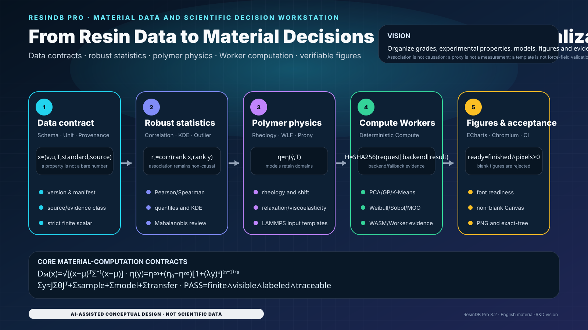

# ResinDB Pro by SunHJ — English Design Edition

[中文设计版](README.zh-CN.md) · [Complete bilingual technical documentation](README.md)


<!-- CLOSURE_STATUS_START -->
## Current qualification and operating boundary

- `CI` is the authoritative full software gate; `contracts-v17` adds cross-platform screening regressions.
- Redundant exact-tree, V19 custom-status, and duplicate full-qualification workflows were removed. The primary CI already emits exact-tree evidence.
- The Spearman correlation matrix uses the shared finite-number parser and complete-case selection; missing, blank, boolean, malformed and non-finite inputs remain unobserved rather than being silently rewritten as physical zeroes.
- Browser AI is restricted to the same-origin `/api/ai/proxy`, stores no provider key, and denies grade/vendor/formulation/free-text egress by default.
- A software pass does not establish proxy deployment, key custody, privacy/legal approval, material release, regulatory compliance, or experimental truth.
<!-- CLOSURE_STATUS_END -->

<!-- LOCALIZED_VISION_EN:START -->
## Project vision: from resin data to material decisions and scientific visualization

<p align="center">
  
</p>

> Every module and equation maps to current data, compute, Worker, ECharts and acceptance code. The figure is not resin test data, grade certification or force-field validation.

<!-- LOCALIZED_VISION_EN:END -->

## Positioning

ResinDB Pro joins resin grades, experimental/reference properties, statistical models, scientific-compute Workers, polymer-physics templates and reproducible acceptance in one evidence chain. It is not a certified LIMS, ERP, material-release system or validated force-field platform.

## Mathematical core

Multivariate anomaly magnitude uses the Mahalanobis distance:

$$
D_M(\mathbf{x})=
\sqrt{(\mathbf{x}-\boldsymbol{\mu})^{\mathsf T}
\boldsymbol{\Sigma}^{-1}
(\mathbf{x}-\boldsymbol{\mu})}.
$$

A non-Newtonian rheology proxy uses the Carreau–Yasuda form:

$$
\eta(\dot\gamma)=
\eta_\infty+
(\eta_0-\eta_\infty)
\left[1+(\lambda\dot\gamma)^a\right]^{(n-1)/a}.
$$

The decision-observable uncertainty budget keeps parameter, sampling, model-form and scale-transfer terms distinct:

$$
\boldsymbol{\Sigma}_y
\approx
\mathbf{J}\boldsymbol{\Sigma}_\theta\mathbf{J}^{\mathsf T}
+
\boldsymbol{\Sigma}_{\mathrm{sample}}
+
\boldsymbol{\Sigma}_{\mathrm{model}}
+
\boldsymbol{\Sigma}_{\mathrm{transfer}}.
$$

A scientific figure is accepted only when values are finite, semantics are labelled, ECharts has completed rendering and the Canvas is non-blank:

$$
C_{\mathrm{figure}}
=
C_{\mathrm{finite}}
\land C_{\mathrm{labeled}}
\land C_{\mathrm{finished}}
\land C_{\mathrm{nonblank}}.
$$

## Operating strategy

1. Validate Schema, units, standards, temperature, provenance and evidence class first.
2. Run statistics, fitting and material screening only on finite, dimensionally compatible data.
3. Keep observations, fits, proxies and scenario projections distinct; association must not be promoted to causation.
4. Polymer/LAMMPS templates require external force-field, equilibration and experimental validation before supporting scientific conclusions.
5. Scientific figures must pass CJK/font readiness where relevant, the ECharts `finished` event, non-blank Canvas and PNG evidence gates.
6. READMEs, SVGs and translations are audited for UTF-8, Unicode controls, CJK fallbacks and local-image integrity.

## Acceptance

```bash
npm ci
npm run validate:docs
npm run validate:i18n-visuals
npm run validate:scientific-ui
npm run typecheck
npm run test:unit
npm run build
npm run test:ui
```

Software acceptance covers data contracts, implemented computations, interface rendering and reproducible evidence. Grade release, experimental truth, force-field applicability and industrial decisions still require independent qualification.

<!-- CURRENT_MAIN_ACCEPTANCE_V2:START -->
## Current `main`: data–compute–figure–evidence loop

<p align="center"></p>

> This figure is generated from current code contracts and is scientific-software conceptual design, not measured resin-database output.

### Core mathematical contracts

$$
C_figure = C_finite ∧ C_labeled ∧ C_finished ∧ C_nonblank
$$

$$
d_M(x, μ) = √((x − μ)ᵀ Σ⁻¹ (x − μ))
$$

$$
u_c² = u_data² + u_model² + u_scale²
$$

### Usage strategy

1. Validate Schema, source type, record status, units and finite values at import.
2. Similarity, regression, clustering and UQ must expose missing-data, scaling and applicability handling.
3. Browser figures are exportable only after ECharts finished, nonblank canvas and complete labels.
4. Chinese and English README, SVG and UI strings are qualified separately; language leakage and mojibake are rejected.

> **Responsibility boundary:** ResinDB Pro is a local-first scientific data and analysis workbench, not a certified LIMS/ERP, commercial force field, industrial grade-release system or automatic scientific approval engine.

Execution prompt: [SIX_REPOSITORY_PARALLEL_6H_ACCEPTANCE_PROMPT_V2.md](docs/SIX_REPOSITORY_PARALLEL_6H_ACCEPTANCE_PROMPT_V2.md)
<!-- CURRENT_MAIN_ACCEPTANCE_V2:END -->
