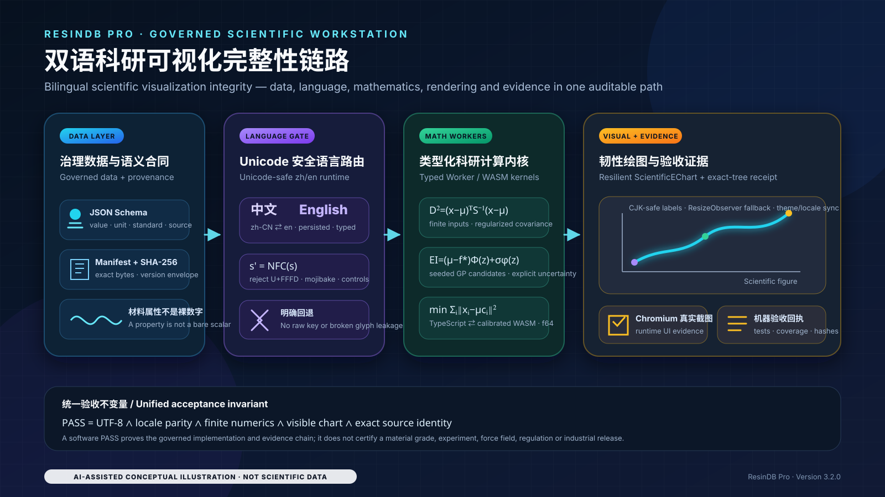
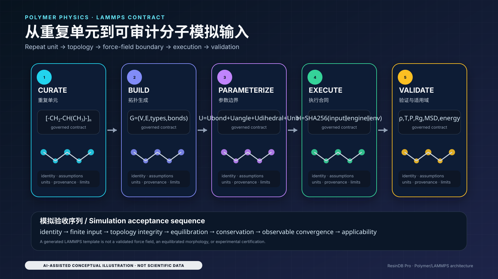
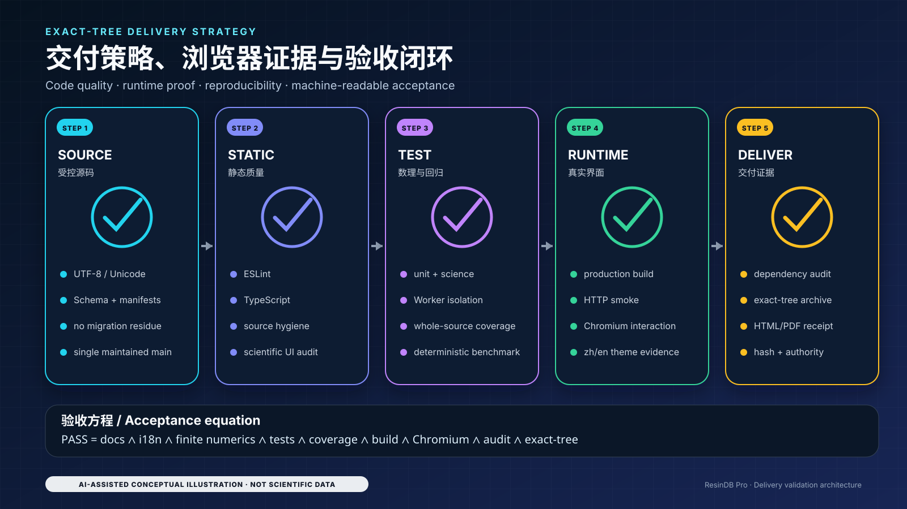
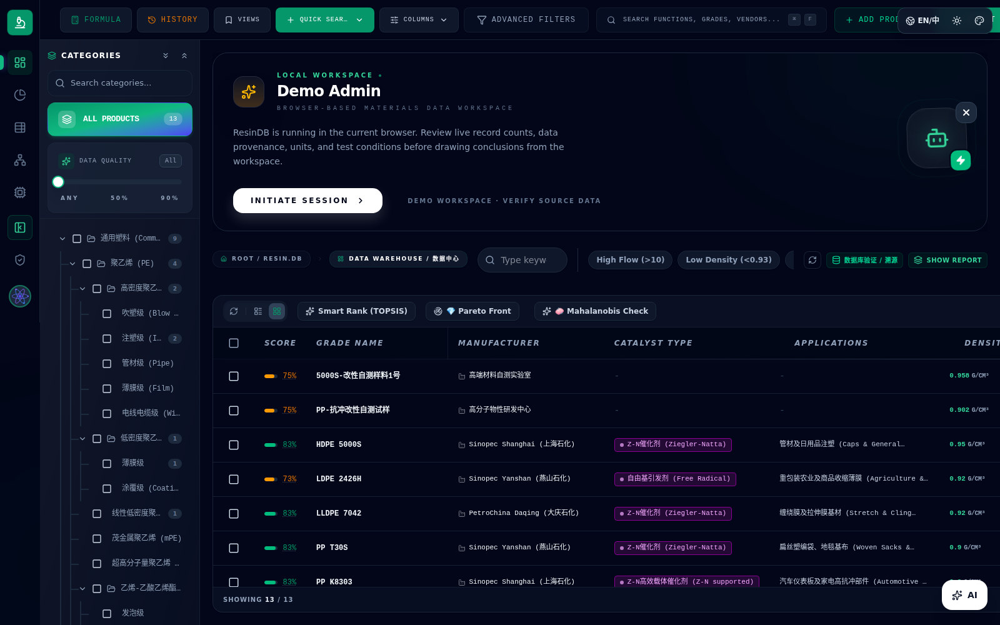
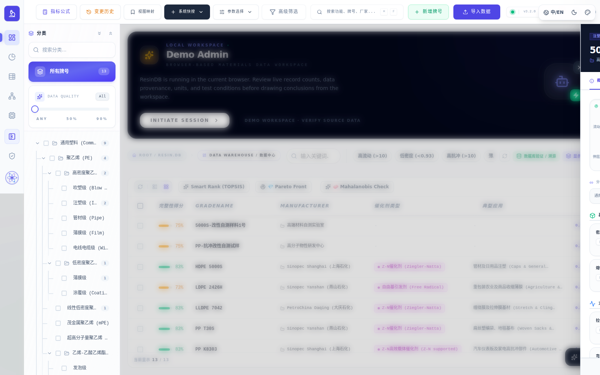
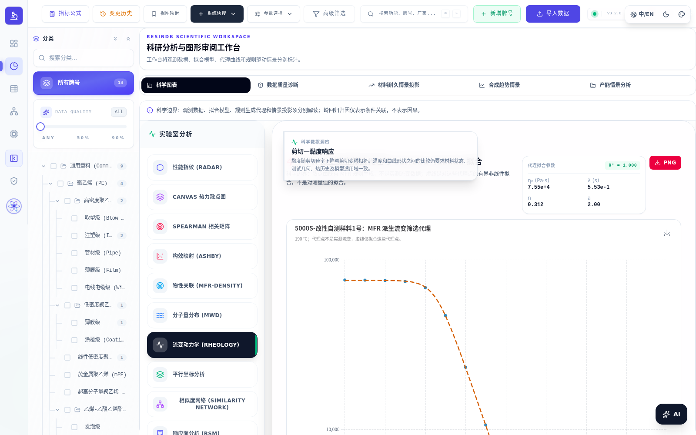
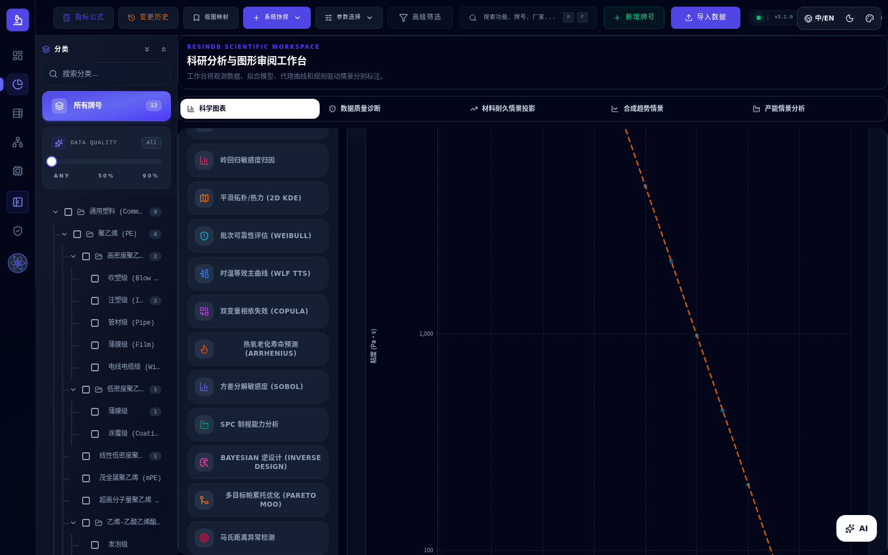
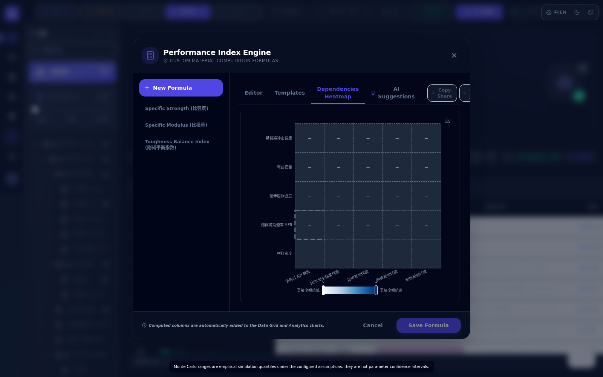
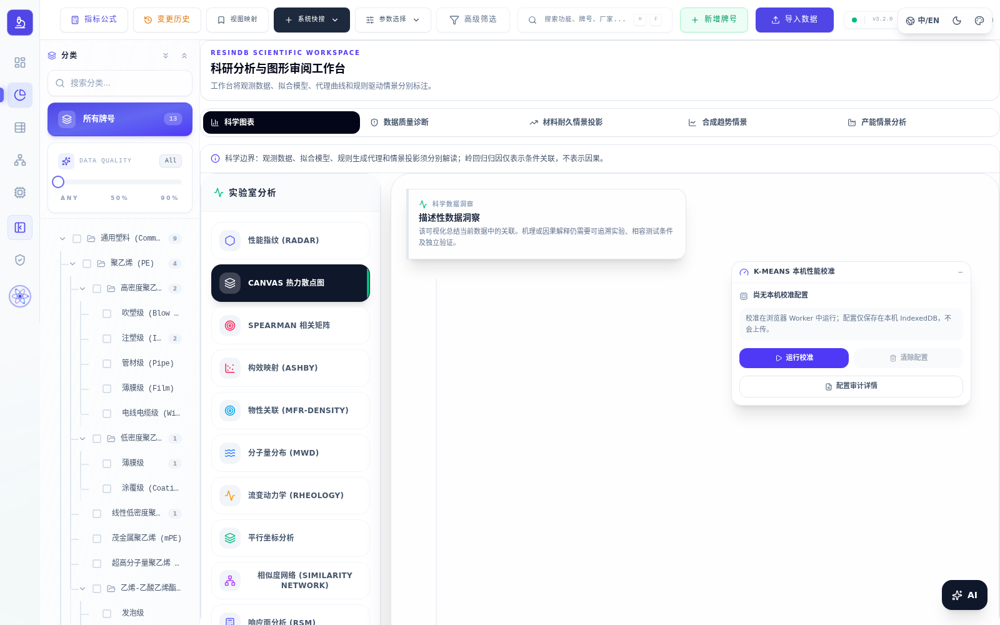

# ResinDB Pro by SunHJ

<!-- LOCALIZED_README_LINKS -->

[中文设计版](README.zh-CN.md) · [English design edition](README.en.md) · [技术参考 / Technical reference](docs/TECHNICAL_REFERENCE.md)

<p align="center">
  <a href="https://github.com/SUNHAOJUN22/ResinDB-Pro-by-SunHJ/actions/workflows/ci.yml"></a>
  
  
  
  
</p>

**version-3.2.0-governed-data-scientific-compute**

ResinDB Pro 是本地优先的树脂与聚合物数据工作台，将结构化属性、数值计算、工程筛选、Worker、科研图形与验证工件连接起来。它不是经认证的 LIMS/ERP、法规判定器、材料放行系统、已验证力场或自动科研批准器。

*ResinDB Pro is a local-first resin and polymer workbench joining governed properties, numerical analysis, screening, Workers, scientific figures and reproducible evidence. It is not a certified LIMS/ERP, regulatory decision engine, material-release system, validated force field or automatic scientific approval engine.*

<!-- CLOSURE_STATUS_START -->
## 1. 使用边界 / Operating boundary

| 合同 / Contract | 行为 / Behavior |
|---|---|
| 缺失值 / Missing values | 缺失、空白、Boolean、畸形字符串和非有限值不是物理零。合法零值必须保留。 / Missing or malformed data are not zero; legitimate zero remains valid. |
| 公式 / Formula | `OK` 携带有限结果；`UNKNOWN`、`INVALID` 携带 `null` 和原因，不用零掩盖失败。 / Failures retain explicit status, null value and reason. |
| 单位 / Units | 运算前检查维度并换算数值；不补造标准、方法、温度或负荷。 / Convert values, not just labels; never invent measurement conditions. |
| 排名与图形 / Ranking and figures | TOPSIS 缺失项默认不合格；雷达图不补零，数据不足报告 `INSUFFICIENT_DATA`。 / Missing candidates are excluded by default and insufficient projections remain explicit. |
| 报告 / Reports | 工作表比较声明属性与阈值，不证明实验室认证、法规合规或材料放行。 / Screening is not certification, compliance or material release. |
| AI / AI | 浏览器只访问同源 `/api/ai/proxy`，不保存 provider key。身份字段和原始材料数据不应默认出站。 / Same-origin proxy only, no browser provider credentials or default identity-bearing egress. |
| 执行与批准 / Execution and approval | 软件测试不证明外部模型、LAMMPS、工业设备或独立科学/工程批准。 / Software evidence does not attest external execution or independent approval. |

AI 请求必须经过有界授权、载荷校验和最小化审计。代理部署、服务器密钥托管、用户身份、隐私、保留策略和法律批准仍由部署方独立验证。

*AI requests require bounded authorization, payload validation and minimized audit metadata. Proxy deployment, server key custody, identity, privacy, retention and legal approval remain deployment responsibilities.*
<!-- CLOSURE_STATUS_END -->

## 2. 安装与使用 / Install and use

Node 版本以 [`.nvmrc`](.nvmrc) 为准，依赖以 `package-lock.json` 为准。

```bash
npm ci
npm ls --all
npm run dev
```

生产构建与本地预览 / Production build and local preview:

```bash
npm run build
npm run preview
```

分析顺序：导入数据并检查 Schema、单位、条件与来源 → 筛选有限且同维的观测 → 执行统计、拟合或工程筛查 → 查看后端与适用域证据 → 导出工作表。不要将相关性、代理模型或情景投影解释为实验因果结论。

*Validate schema, units, conditions and provenance; select finite compatible observations; run analysis; inspect backend/domain evidence; then export a screening worksheet. Associations, proxies and scenarios are not experimental causal conclusions.*

Linux 截图运行环境需要实际 CJK 字体；永久 CI 已配置安装和绘制验证。

```bash
sudo apt-get update
sudo apt-get install -y --no-install-recommends fonts-noto-cjk
fc-cache -f
```

Windows 使用 Microsoft YaHei 等受治理回退字体；Linux 使用 Noto Sans CJK SC/Noto Sans SC。字体文件不由本仓库说明替代或分发。

## 3. 架构 / Architecture

**数据层与代码层分离**：`data/` 中的 JSON、Schema、manifest 与来源信息独立于 React bundle。属性不仅是数值，还需单位、方法、条件、不确定度和来源。

*Data and code have separate identities. A property requires its unit, method, conditions, uncertainty and provenance rather than an unqualified scalar.*

```text
governed JSON / schema / manifest
  → adapters / strict finite-number and quantity validation
  → compute API / lazy Worker pool / typed buffers
  → TypeScript or calibrated WASM backend
  → observations / fits / proxies / scenarios
  → ScientificEChart / worksheet / exact-commit evidence
```

[计算模块目录 / Compute catalog](docs/compute-module-catalog.json) 是功能清单入口。请求后端、实际后端、fallback、精度和设备信息应进入计算证据；没有设备校准证据时，不声称 WASM 或未来 GPU 路径必然更快。

*The compute catalog is the maintained inventory. Evidence distinguishes requested and actual backends, fallback, precision and environment; no unmeasured acceleration claim is implied.*

[技术参考](docs/TECHNICAL_REFERENCE.md) 保留原 README 的完整数据架构、计算证据对象、21 组数理合同及聚合物/LAMMPS 示例，不再在多个“当前验收”段落重复维护。

*The technical reference preserves the detailed data and compute contracts, 21 mathematical sections and polymer/LAMMPS examples formerly embedded here.*

## 4. 数理与科学合同 / Mathematical and scientific contracts

| 功能 / Function | 关键约束 / Constraint |
|---|---|
| 描述统计、Pearson、Spearman / Statistics | 有限观测、明确样本数、并列秩；相关不等于因果。 / Finite observations, declared sample size and tie handling; correlation is not causation. |
| 最小二乘、Carreau–Yasuda、WLF、Arrhenius / Fitting | 参数、适用域、温度单位与数值收敛必须明确。 / Declare parameters, domain, temperature units and convergence. |
| Weibull、Gaussian KDE、Gaussian Copula / Distributions | 区分观测与拟合，保留样本与假设。 / Distinguish observations from fits and retain assumptions. |
| Mahalanobis、Gaussian Process、Expected Improvement | 缩放、协方差、噪声和不确定度不可省略。 / Scaling, covariance, noise and uncertainty remain explicit. |
| Prony、SPC、K-Means、Pareto / Engineering tools | 黏弹、过程能力、聚类与多目标语义各自独立。 / Do not conflate viscoelasticity, capability, clustering and multi-objective evidence. |
| 相似度与雷达 / Similarity and radar | 仅比较共同有效属性，报告覆盖度，不用缺失项创造优势。 / Compare shared valid properties and expose coverage without rewarding missingness. |

详细推导、实现约束和单位条件见 [数理合同](docs/TECHNICAL_REFERENCE.md#5-数理程式--mathematical-contracts)。例如，多变量异常量使用 Mahalanobis 距离：

$$
D_M(\mathbf{x})=\sqrt{(\mathbf{x}-\boldsymbol{\mu})^{\mathsf T}\boldsymbol{\Sigma}^{-1}(\mathbf{x}-\boldsymbol{\mu})}.
$$

科研图形的显示接受条件是：

$$
C_{\mathrm{figure}}=C_{\mathrm{finite}}\land C_{\mathrm{labeled}}\land C_{\mathrm{finished}}\land C_{\mathrm{nonblank}}.
$$

这只是图形显示合同，不是物理模型或材料资格证明。

*These are numerical/display contracts, not proof of physical validity or material qualification.*

PP-like 两相密度、重复单元描述符和 LAMMPS 模板的限制见 [聚合物物理参考](docs/TECHNICAL_REFERENCE.md#6-聚合物物理与-lammps--polymer-physics-and-lammps)。不从单体字符串推断支化、等规度或未声明的共聚组成；模板生成不证明力场有效或真实模拟已执行。

## 5. 验证与证据 / Validation and evidence

完整本地检查 / Complete local checks:

```bash
node --test scripts/tests/validation-receipt-contract.node.mjs
npm run validate:ci
npm run validate:ai-egress
```

`validate:ci` 包含文档、Unicode、source/data/compute/scientific-UI、ESLint、TypeScript、Vitest、构建、HTTP smoke、K-Means smoke、隔离 unit/science、覆盖率、Chromium UI 和完整依赖审计。永久 [CI](.github/workflows/ci.yml) 另负责同次运行的上下文、分支证明、源码固定点、生产依赖审计、回执、HTML/PDF 和工件归档；本地命令成功不自动产生远程 CI 身份。

*The permanent CI adds exact-run identity, branch proof, tracked-source fixed-point checks, production audit, receipt/report generation and artifact upload. A successful local command is not a remote CI receipt.*

回执 Node 测试使用 `.node.mjs`，避免被浏览器 Vitest 收集器误执行；它仍由永久 CI 显式运行，不是跳过测试。覆盖范围包括精确 SHA、分支、上下文、显式整数审计计数、预算、门禁集合，以及缺失、损坏或非对象 JSON 工件的结构化拒绝。

*Receipt tests run explicitly with Node. Malformed or non-object evidence must produce `EVIDENCE_INCOMPLETE` and a nonzero CI exit, not an unhandled exception or a fabricated PASS.*

截图证据必须是具名场景到不同 PNG 文件的映射；七个必需场景不可被任意键或数组替代。仅接受 artifacts 内的非空普通文件，拒绝目录、符号链接、绝对路径和路径穿越；Worker 与目录计数必须是整数，不能由数字字符串隐式转换。文件检查不替代 Chromium 的像素与交互验证。

*Screenshot evidence binds required scene names to distinct, nonempty regular PNG files within artifacts. Arrays, missing scenes, duplicate paths, directories, symlinks and path traversal are rejected. Worker/catalog counts must be integers, not numeric strings. File checks do not replace Chromium pixel and interaction validation.*

回执还将 `runId` 与 `runAttempt` 绑定到当前 GitHub 运行环境，并在输出中保留这两个字段。同一提交的其他运行或重试上下文不能冒充本次运行证据；离线查看历史回执不构成新一次 CI 验证。

*Receipts bind `runId` and `runAttempt` to the current GitHub run and retain them in their output. A different run or retry for the same commit is not evidence for the current attempt; offline inspection of an old receipt is not a new CI qualification.*

### 读取结果 / Reading results

以待部署提交的同次 Actions 工件为依据：

- `ci-context.json`：仓库、SHA、ref、run ID 与 attempt；
- `ci-gates.json`：实际完成的完整门禁集合；
- `test-results.json`、`coverage-summary.json`：完整测试数和实测覆盖率；
- `npm-audit-prod.json`、`npm-audit-all.json`：该次依赖审计；
- `exact-source-tree.tar.gz`、SHA-256 和 `branch-proof.txt`：源码与远端身份；
- `validation-receipt.json`：所有必需检查通过才为 `PASS`；
- UI 截图、HTML 和 PDF：同一生产构建的展示证据。

**不再把旧运行的测试数、旧 lockfile 版本或“零漏洞”声明标成当前结果。** 覆盖率文件全部被插桩不等于行/分支覆盖率达到 100%；无 high/critical 不等于完全没有较低级别安全发现。

*Historical counts, dependency versions and zero-vulnerability statements are not current results. Complete instrumentation is not complete line/branch coverage; no high/critical findings does not mean no lower-severity findings.*

`CI` 是唯一完整软件资格链；`contracts-v17` 补充跨平台合同回归。已删除的 V19 状态和重复资格/导出工作流不再单独维护。`push/main` 与手动运行 `main` 使用同一精确 SHA 分支检查；清理分支必须保留需要的历史提交，不以禁用门禁换取成功。

*CI success is scoped to the checked commit. Neither a narrow contract run nor a prior successful SHA qualifies a newer tree.*

## 6. 图示与真实界面 / Diagrams and runtime UI

### AI conceptual diagrams / AI 概念示意图

以下四图说明架构和工作流，不是实验数据或运行成绩。






### Chromium runtime screenshots / Chromium 真实界面截图

以下八图是保留的运行界面示例；对应新提交的视觉资格仍以其 CI 工件为准。










## 7. 维护入口与退出条件 / Maintenance and exit criteria

[数据架构](docs/DATA_ARCHITECTURE.md) · [计算与显示审计](docs/COMPUTE_AND_DISPLAY_AUDIT.md) · [验证说明](docs/VALIDATION.md) · [技术参考](docs/TECHNICAL_REFERENCE.md) · [实施任务书](docs/PHASE_1_IMPLEMENTATION_TASKBOOK.md)

保留稳定 API 和受治理兼容层；只合并有行为等价证据的重复实现。修改顺序为源码/测试/文档 → 格式与生成物 → check 模式 → 完整测试 → 精确提交证据。一次性运输脚本、缓存、coverage 数据库和构建垃圾不进入生产树。

*Preserve stable APIs and governed compatibility layers. Consolidate equivalent implementations only with regression evidence. Finalize source, tests and documentation before regenerating evidence; then check the fixed point and qualify the exact commit. Temporary transport and runtime artifacts do not belong in the tracked source tree.*

软件交付要求依赖、测试、构建、审计、回执和 README 对应同一代码身份；外部科学/工程/HSE/监管/客户批准与 21,600 秒稳定性试验单独记录，不由本 README 或单元测试自动授予。
