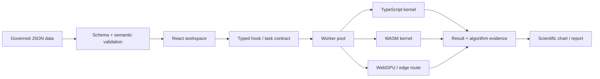

# ResinDB technical reference / 技术参考

[返回主 README / Return to the main README](../README.md)

本文件承接主 README 的数据、计算、数理及聚合物物理合同；章节编号保留以维持历史引用。它不是对材料有效性、实验认证或外部 LAMMPS 执行的批准。

The sections below preserve the detailed technical contracts previously embedded in the root README. Section numbers are retained for historical references; software formulas and templates are not material certification or external execution evidence.

## 3. 数据架构 / Data architecture

### 3.1 数据层与代码层分离 / Separation of data and code

- `data/`：权威数据层 / governed source data;
- `src/`：应用与计算代码 / application and compute source;
- `dist/data/`：构建时复制的运行资产 / build-copied runtime assets;
- `data/manifest.json`：文件字节数与 SHA-256 / byte counts and SHA-256;
- `data/version.json`：数据版本 / data version;
- `data/metadata.json`：数据集语义与来源 / dataset semantics and provenance.

任何数据字节变化都必须重新生成 manifest。`demo`、`reference`、`measured` 和 `imported` 不能被压缩为同一种证据等级。

*Any data-byte change requires a regenerated manifest. Demo, reference, measured, and imported records are distinct evidence classes.*

### 3.2 标准保存格式 / Canonical document envelope

```json
{
  "schemaVersion": "1.0.0",
  "dataKind": "resin-seed-products",
  "sourceType": "curated-demo",
  "recordStatus": "demo",
  "updatedAt": "2026-08-02",
  "data": []
}
```

| 字段 / Field | 合同 / Contract |
|---|---|
| `schemaVersion` | 结构兼容版本 / structural compatibility version |
| `dataKind` | 稳定语义标识 / stable semantic identifier |
| `sourceType` | 来源类型 / source classification |
| `recordStatus` | `demo` / `reference` / `measured` / `imported` |
| `updatedAt` | 真实 ISO 日期 / real ISO date |
| `data` | 数据负载 / payload |

### 3.3 数据目录 / Data directory

```text
data/
├── manifest.json
├── metadata.json
├── version.json
├── schemas/
│   ├── resin-data-document.schema.json
│   └── resin-product.schema.json
└── resins/
    ├── manifest.json
    ├── polymerDatabase.json
    ├── myLabUniverse.json
    ├── openMarketUniverse.json
    ├── resin-taxonomy.json
    ├── resin-category-aliases.json
    ├── resin-property-groups.json
    ├── resin-manufacturers.json
    ├── resin-references.json
    └── resin-network.json
```

详细合同见 [`docs/DATA_ARCHITECTURE.md`](DATA_ARCHITECTURE.md)。

### 3.4 属性不是裸数字 / A property is not a bare number

```json
{
  "value": 23.5,
  "unit": "MPa",
  "standard": "ISO 527",
  "temperature": 23,
  "instrument": "Universal testing machine",
  "referenceId": "ref-001",
  "mean": 23.5,
  "stdDev": 0.4,
  "count": 5
}
```

属性可以同时携带数值、单位、标准、温度、仪器、来源和统计量。Boolean、`NaN`、`Infinity`、错误日期及不支持的单位会被拒绝或形成显式审查项。

*Values, units, standards, temperature, instrument, provenance, and statistics remain coupled. Invalid scalars, dates, and units do not silently enter scientific analysis.*

---

## 4. 计算架构 / Compute architecture



### 4.1 计算证据对象 / Computation evidence object

计算结果不仅包含数值，还可以包含：

- task ID / 任务标识；
- kernel 与算法版本 / kernel and algorithm version；
- requested backend 与 actual backend；
- precision / 精度；
- input shape / 输入形状；
- elapsed time / 耗时；
- fallback 状态；
- 设备能力快照 / capability snapshot；
- 可审计元数据 / auditable metadata。

26 个 Worker/计算模块的输入、输出、公式、显示入口和科学边界见 [`docs/compute-module-catalog.json`](compute-module-catalog.json)。

### 4.2 后端策略 / Backend strategy

| 场景 / Scenario | 推荐策略 / Recommended strategy |
|---|---|
| 小型交互分析 | TypeScript，低启动成本 / TypeScript for low startup overhead |
| 大型 K-Means 分配 | 经当前设备校准后选择 WASM / calibrated WASM route |
| Worker 批处理 | 使用 typed buffers 和 transferable objects |
| 后端不可用 | 显式 fallback 并写入 evidence，不静默伪装 |
| 未来边缘计算 | 通过 capability probe 接入 WebGPU 或原生后端，而不是改写公式 |

---

## 5. 数理程式 / Mathematical contracts

本节列出代码实际使用或明确治理的主要数理合同。公式描述实现语义，不代表对所有材料体系都具有普适物理解释。

*The equations below describe implemented contracts. They do not imply universal physical validity for every material system.*

### 5.1 描述统计与分位数 / Descriptive statistics and quantiles

有限观测集合为 \(x_1,\ldots,x_n\)。均值：

$$
\bar{x}=\frac{1}{n}\sum_{i=1}^{n}x_i
$$

显示统计中的总体方差与标准差：

$$
\sigma^2=\frac{1}{n}\sum_{i=1}^{n}(x_i-\bar{x})^2,
\qquad
\sigma=\sqrt{\sigma^2}
$$

异常值和推断路径需要样本标准差时使用：

$$
s=\sqrt{\frac{1}{n-1}\sum_{i=1}^{n}(x_i-\bar{x})^2}
$$

分位数采用线性插值。令 \(h=(n-1)p\)、\(j=\lfloor h\rfloor\)、\(\delta=h-j\)，则：

$$
Q(p)=x_{(j)}+\delta\left[x_{(j+1)}-x_{(j)}\right]
$$

四分位距与 IQR 异常区间：

$$
IQR=Q_{0.75}-Q_{0.25}
$$

$$
\left[Q_{0.25}-1.5IQR,\;Q_{0.75}+1.5IQR\right]
$$

调整后 Fisher 偏度：

$$
G_1=\frac{n}{(n-1)(n-2)}
\sum_{i=1}^{n}\left(\frac{x_i-\bar{x}}{s}\right)^3
$$

无偏校正的超额峰度：

$$
G_2=
\frac{n(n+1)}{(n-1)(n-2)(n-3)}
\sum_{i=1}^{n}\left(\frac{x_i-\bar{x}}{s}\right)^4
-
\frac{3(n-1)^2}{(n-2)(n-3)}
$$

### 5.2 中心化在线回归 / Centered online regression

代码使用中心化累积量，避免大偏置坐标下的两个巨量原始和式相减：

$$
S_{xx}=\sum_{i=1}^{n}(x_i-\bar{x})^2,
\qquad
S_{yy}=\sum_{i=1}^{n}(y_i-\bar{y})^2
$$

$$
S_{xy}=\sum_{i=1}^{n}(x_i-\bar{x})(y_i-\bar{y})
$$

线性回归斜率与截距：

$$
\hat\beta_1=\frac{S_{xy}}{S_{xx}},
\qquad
\hat\beta_0=\bar{y}-\hat\beta_1\bar{x}
$$

Pearson 相关和决定系数：

$$
r=\frac{S_{xy}}{\sqrt{S_{xx}S_{yy}}},
\qquad
R^2=r^2
$$

### 5.3 Pearson 显著性与置信区间 / Pearson significance and confidence interval

零相关假设下：

$$
t=r\sqrt{\frac{n-2}{1-r^2}},
\qquad
\nu=n-2
$$

双侧概率通过正则化不完全 Beta 计算：

$$
p=I_{\nu/(\nu+t^2)}\left(\frac{\nu}{2},\frac{1}{2}\right)
$$

残差标准误与斜率标准误：

$$
s_e=\sqrt{\frac{\sum_i\left[y_i-(\hat\beta_0+\hat\beta_1x_i)\right]^2}{n-2}}
$$

$$
\operatorname{SE}(\hat\beta_1)=\frac{s_e}{\sqrt{S_{xx}}}
$$

斜率 95% 置信区间：

$$
\hat\beta_1\pm t_{0.975,\,n-2}\operatorname{SE}(\hat\beta_1)
$$

实现不再使用标准正态近似，也不再固定取 \(t=2.0\)。

*The implementation uses Student-t/Beta inference and the actual degrees of freedom rather than a normal approximation or a fixed critical value.*

### 5.4 Spearman 并列秩 / Spearman with ties

对并列观测使用平均秩，然后对秩变量计算 Pearson 相关：

$$
\rho_s=\operatorname{corr}(R_x,R_y)
$$

若值 \(v\) 在有序数组中占据索引 \(l,\ldots,u-1\)，其中间秩为：

$$
R(v)=\frac{l+u-1}{2}
$$

### 5.5 雷达百分位显示合同 / Radar percentile display contract

排序后的参考数组仅建立一次，并以二分查找获得中位秩。显示尺度为：

$$
P_{display}=20+80\frac{R}{n-1}
$$

最终截断到显示范围：

$$
P_{radar}=\min\left(100,\max(5,P_{display})\right)
$$

该值是描述性显示坐标，不是材料性能的物理百分比。

*The radar coordinate is a descriptive display scale, not a physical performance percentage.*

### 5.6 坐标轴边界 / Axis bounds

线性轴：

$$
\Delta=0.15(x_{max}-x_{min}),
\qquad
[x_{min}-\Delta,\;x_{max}+\Delta]
$$

### 5.6.1 有限值单遍聚合 / Finite one-pass aggregation

大规模筛选、图表边界与 Worker 初始化统一使用 `summarizeFinite()`，避免把完整数组展开为 `Math.min(...array)` / `Math.max(...array)` 的函数实参。对输入序列 \(x_i\)，仅保留有限值：

$$
I_i=\mathbf{1}[x_i\in\mathbb{R},\ |x_i|<\infty],
\qquad
n_f=\sum_i I_i
$$

单遍更新边界：

$$
x_{\min}^{(k)}=\min(x_{\min}^{(k-1)},x_k),
\qquad
x_{\max}^{(k)}=\max(x_{\max}^{(k-1)},x_k)
$$

求和使用 Neumaier 补偿项 \(c\)，最终均值为：

$$
\bar{x}=\frac{S+c}{n_f}
$$

该实现将边界与统计聚合的额外空间保持为 \(O(1)\)，并消除超大数组参数展开导致的 `RangeError`。当前合同用于牌号比较、Pivot 聚合、Arrhenius/Weibull 图边界、Kissinger Worker、Prony Worker、低剪切黏度筛选与归一化雷达轮廓。

*Large comparison, pivot, chart-bound, and worker paths use a finite one-pass reducer instead of variadic array extrema. The reducer ignores non-finite observations, maintains O(1) aggregation state, and uses Neumaier compensation for the sum.*

对数轴在对数域扩展：

$$
a=\log_{10}x_{min},\quad b=\log_{10}x_{max},\quad
\Delta_{log}=0.15(b-a)
$$

$$
\left[10^{a-\Delta_{log}},\;10^{b+\Delta_{log}}\right]
$$

实现采用单遍有限值扫描；只有对数轴排除非正值，线性轴保留合法负值。

### 5.7 分子量分布矩 / Molecular-weight distribution moments

对相对数强度 \(N_i\) 和分子量 \(M_i\)：

$$
M_n=\frac{\sum_iN_iM_i}{\sum_iN_i}
$$

$$
M_w=\frac{\sum_iN_iM_i^2}{\sum_iN_iM_i}
$$

$$
M_z=\frac{\sum_iN_iM_i^3}{\sum_iN_iM_i^2}
$$

$$
PDI=\frac{M_w}{M_n}
$$

代码先对质量轴和强度轴缩放再求和，降低极端数值溢出风险；输出明确标记为 `relative-number-intensity`。

### 5.8 线性与非线性最小二乘 / Linear and nonlinear least squares

线性最小二乘：

$$
\min_{\boldsymbol{x}}\|\mathbf{A}\boldsymbol{x}-\boldsymbol{b}\|_2^2
$$

系统使用 Householder QR；秩亏或病态情况下通过 Jacobi-SVD 伪逆回退，并报告秩、条件数、奇异值和残差。

有界非线性最小二乘：

$$
\min_{\boldsymbol{\theta}}\frac{1}{2}
\|\boldsymbol{r}(\boldsymbol{\theta})\|_2^2
$$

阻尼更新：

$$
(\mathbf{J}^{\mathsf T}\mathbf{J}+\lambda\mathbf{I})
\Delta\boldsymbol{\theta}
=-\mathbf{J}^{\mathsf T}\boldsymbol{r}
$$

### 5.9 Carreau–Yasuda 流变模型 / Rheology

$$
\eta(\dot\gamma)=\eta_0
\left[1+(\lambda\dot\gamma)^a\right]^{(n-1)/a}
$$

用于剪切变稀拟合。当前合同要求至少 5 个正有限观测值，并区分观测数据、拟合曲线和越域外推。

### 5.10 WLF 时温等效 / WLF time-temperature superposition

$$
\log_{10}a_T=-\frac{C_1(T-T_r)}{C_2+(T-T_r)}
$$

当前实现是水平移动合同，不把未建模的垂直移动解释为已拟合参数。

### 5.11 Arrhenius 与 Kissinger / Thermal kinetics

Arrhenius：

$$
k=A\exp\left(-\frac{E_a}{RT}\right)
$$

寿命线性化：

$$
\ln t=C+\frac{E_a}{RT}
$$

Kissinger：

$$
\ln\left(\frac{\beta}{T_p^2}\right)
=C-\frac{E_a}{RT_p}
$$

这些结果只在相应机理与温区假设下成立，不自动等同于实际服役寿命。

### 5.12 Weibull 可靠性 / Weibull reliability

$$
F(x)=1-\exp\left[-\left(\frac{x}{\eta}\right)^\beta\right]
$$

当前采用 Bernard 中位秩和二参数线性化，不把结果标成最大似然 MLE。

### 5.13 Gaussian KDE

一维直接估计：

$$
\hat f(x)=\frac{1}{nh\sqrt{2\pi}}
\sum_{i=1}^{n}
\exp\left[-\frac{(x-x_i)^2}{2h^2}\right]
$$

二维产品核：

$$
\hat f(x,y)=\frac{1}{nh_xh_y}
\sum_{i=1}^{n}
K\left(\frac{x-x_i}{h_x}\right)
K\left(\frac{y-y_i}{h_y}\right)
$$

### 5.14 Gaussian Copula

$$
u_i=\frac{R_i-0.5}{n},
\qquad
z_i=\Phi^{-1}(u_i)
$$

$$
c(u,v;\rho)=\frac{1}{\sqrt{1-\rho^2}}
\exp\left[
-\frac{\rho^2(z_u^2+z_v^2)-2\rho z_uz_v}
{2(1-\rho^2)}
\right]
$$

Copula 表达相依结构，不提供因果机理证明。

### 5.15 Mahalanobis 距离 / Mahalanobis distance

$$
D_M^2=(\boldsymbol{x}-\boldsymbol{\mu})^{\mathsf T}
\mathbf{S}^{-1}
(\boldsymbol{x}-\boldsymbol{\mu})
$$

实现使用正则化协方差与 Cholesky 求解，不为每个样本显式求逆。

### 5.16 Gaussian Process 与 Expected Improvement

$$
f(\boldsymbol{x})\sim\mathcal{GP}
\left(m(\boldsymbol{x}),k(\boldsymbol{x},\boldsymbol{x}')\right)
$$

RBF 核：

$$
k(\boldsymbol{x},\boldsymbol{x}')=
\exp\left(-\frac{\|\boldsymbol{x}-\boldsymbol{x}'\|^2}{2\ell^2}\right)
$$

Expected Improvement：

$$
EI(\boldsymbol{x})=(\mu-f^*)\Phi(z)+\sigma\phi(z),
\qquad
z=\frac{\mu-f^*}{\sigma}
$$

输出是待实验或高保真计算验证的候选，不是新材料事实。

### 5.17 Pareto 多目标优化 / Multi-objective optimization

非支配条件：

$$
\nexists\boldsymbol{x}' :
 f_i(\boldsymbol{x}')\preceq f_i(\boldsymbol{x})\;\forall i,
\quad
\exists j:f_j(\boldsymbol{x}')\prec f_j(\boldsymbol{x})
$$

### 5.18 Prony 黏弹性级数 / Prony viscoelastic series

$$
E(t)=E_\infty+
\sum_{i=1}^{N}E_i\exp\left(-\frac{t}{\tau_i}\right)
$$

采用非负/正则化求解并输出松弛时间、系数和残差诊断。

### 5.19 SPC 过程能力 / Statistical process control

$$
C_p=\frac{USL-LSL}{6\sigma}
$$

$$
C_{pk}=\min\left(
\frac{USL-\mu}{3\sigma},
\frac{\mu-LSL}{3\sigma}
\right)
$$

### 5.20 K-Means 与后端证据 / K-Means and backend evidence

$$
\min_{\{c_i\},\{\boldsymbol{\mu}_k\}}
\sum_{i=1}^{n}
\|\boldsymbol{x}_i-\boldsymbol{\mu}_{c_i}\|_2^2
$$

平台记录 TypeScript/WASM 后端选择、当前设备校准、等价性检查和实际运行证据。

### 5.21 相似度与直接牌号推荐 / Similarity and direct grade recommendation

共同有效属性上的归一化 RMS 距离：

$$
d_{ab}=\sqrt{\frac{1}{|F_a\cap F_b|}
\sum_{j\in F_a\cap F_b}
(\tilde{x}_{aj}-\tilde{x}_{bj})^2}
$$

覆盖率约束评分：

$$
S_{ab}=100\max(0,1-d_{ab})
\frac{|F_a\cap F_b|}{|F_a|}
$$

简单显示向量之间的归一化欧氏相似度：

$$
S=\max\left(0,\min\left[1,
1-\frac{\|\boldsymbol{x}-\boldsymbol{y}\|_2}{100\sqrt{d}}
\right]\right)
$$

这些分数用于候选排序，不证明化学等价、加工可互换或法规等效。

---

## 6. 聚合物物理与 LAMMPS / Polymer physics and LAMMPS

### 6.1 策展重复单元 / Curated repeat-unit descriptors

当前重复单元库只识别显式支持的输入模式。系统遵循以下保守规则：

- 不把乙烷 `CC` 当作聚乙烯重复单元；
- 不由乙烯单体自动推断 HDPE、LLDPE 或 LDPE 支化；
- 不由丙烯单体自动推断等规度；
- 未给出乙烯/丙烯/二烯组成时，不把 EPDM 压缩为伪单一重复单元；
- 不支持的输入返回明确 `unsupported`，而不是生成看似精确的描述符。

*The descriptor library is intentionally curated. Unsupported or composition-ambiguous inputs remain unsupported rather than receiving fabricated structural detail.*

### 6.2 PP-like 两相密度筛选 / Two-phase-density screening

$$
X_c=\frac{\rho_c(\rho-\rho_a)}{\rho(\rho_c-\rho_a)}
$$

其中 \(\rho\) 为输入密度，\(\rho_a\) 和 \(\rho_c\) 为该经验筛选合同中的非晶与晶相参考密度。结果被截断到 \([0,100]\%\)，并标记为 `two-phase-density-weight-fraction`。

*The result is an empirical PP-like screening proxy, not a measured crystallinity value or a universal QSPR.*

### 6.3 LAMMPS 拉伸与冷却模板 / LAMMPS tensile and cooling template

初始盒长在变形前冻结：

$$
L_0=L_x(t_0)
$$

工程应变：

$$
\varepsilon_x=\frac{L_x-L_0}{L_0}
$$

`real` 单位制中的压力从 atm 转为 MPa，并按拉伸应力正号约定取负：

$$
\sigma_x\,[\mathrm{MPa}]
=-p_{xx}\,[\mathrm{atm}]\times0.101325
$$

冷却速率的记录量：

$$
q=\frac{T_{start}-T_{end}}
{N_{steps}\Delta t\times10^{-15}}
\quad [\mathrm{K/s}]
$$

生成前必须验证：

- `coolingStartK` 与平衡温度一致；
- `coolingEndK < coolingStartK`；
- `coolingSteps` 为有效正整数；
- `timestepFs` 为有效正数；
- `msdGroup` 是已存在的单 token LAMMPS group；
- 拉伸使用显式 `fix deform ... remap x`。

模板不会创建拓扑、键反应、交联或力场参数；MSD 单独不能确定玻璃化转变温度。

### 6.4 ASTM/ISO 工程筛查 / ASTM/ISO engineering audit

`auditASTMStandards()` 对密度、MFR、拉伸和弯曲字段执行：

1. 严格数值解析；
2. 显式单位识别；
3. PP/HDPE 宽区间筛查；
4. 标准引用记录；
5. `PASSED → WARNING → CRITICAL` 单向严重度升级；
6. 同一记录中的错误字段不会被其他有效字段掩盖。

这是一层数据质量与工程合理性筛查，不是 ASTM/ISO 实验室认证。

---
