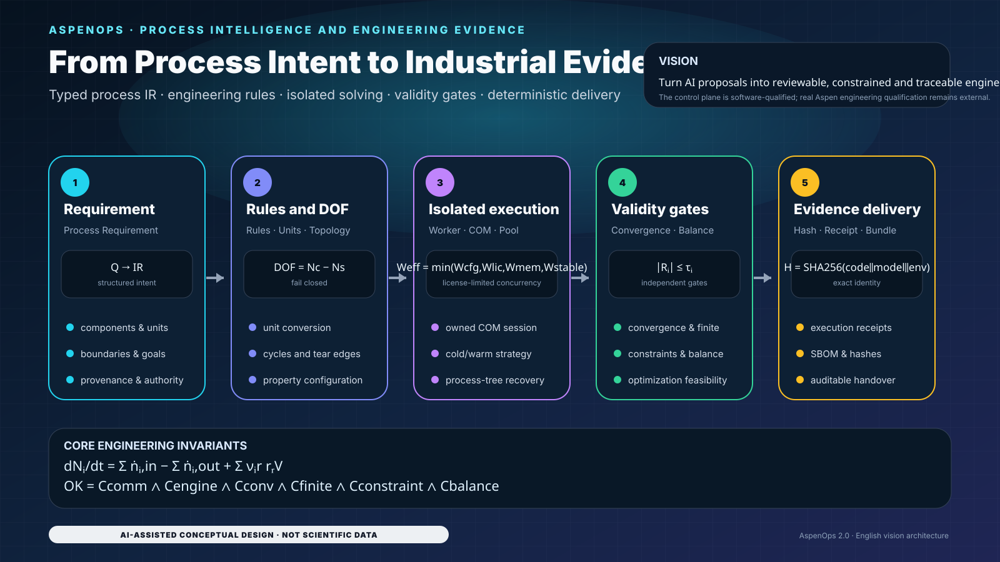

<div align="center">

# AspenOps 2.0

## Deterministic engineering control plane for Aspen Plus, Aspen HYSYS, and AI agents

**Governed requirement → typed process intent → engineering rules → verified compilation → isolated execution → engineering gates → auditable evidence → deterministic delivery**

[中文](README.md) · [Final Acceptance](README_ACCEPTANCE.md) · [Architecture](docs/architecture.md) · [Delivery Acceptance](docs/delivery-acceptance.md) · [Delivery Bundle](docs/delivery-bundle.md) · [Windows Setup](docs/windows-setup.md) · [Certification](docs/certification.md) · [Quality Report](docs/quality-report.md)


</div>

<!-- CLOSURE_STATUS_START -->
## Current code qualification and engineering boundary

- Multi-objective scalarization requires explicit units, physical dimensions, reference values and positive reference scales; changing kW/W representation cannot change the physical ranking.
- Canonical JSON/SHA-256 is implemented once by `aspenops_nexus.hashing.canonical_hash` and reused by requirements, compilation plans, topology, adapters and licensed-link evidence.
- Mock/offline qualification validates control-plane software only. Without an authorized commercial solver, licence, fixed model and signed engineering review, real execution remains `PENDING_REAL_ASPEN_CERTIFICATION`.
- README diagrams and equations document software contracts; they are not Aspen Plus/HYSYS results or plant-performance guarantees.
<!-- CLOSURE_STATUS_END -->

<!-- LOCALIZED_VISION_EN:START -->
## Project vision: from process intent to industrial evidence closure

<p align="center">
  
</p>

> The modules and equations map to current software contracts. This is a control-plane vision, not Aspen Plus/HYSYS output, plant data or engineering certification.

<!-- LOCALIZED_VISION_EN:END -->


> **Qualification boundary:** `aspenops-nexus 2.0.0` qualifies the software control plane, process intent, isolated execution, cache, scheduler, optimization, evidence chain, and deterministic delivery. Without a real commercial solver, license, fixed model, Golden Case, hardware fingerprint, engineering tolerance, and signed review, it cannot self-certify Aspen engineering performance. Status remains `PENDING_REAL_ASPEN_CERTIFICATION`.

## Acceptance status

| Item | Contract |
|---|---|
| Authoritative long-lived branch | `main` |
| Qualified platforms | Linux and Windows; real Aspen COM remains licensed-Windows only |
| Python | Python 3.11, 3.12 and 3.13 across six Linux/Windows combinations |
| Archived qualification | `1224 passed`, zero failures, 95.03% branch coverage |
| Current regression | 1258+ tests and 95.03% branch coverage; latest `main` CI is authoritative |
| Toolchain | `uv 0.11.16`; `mcp>=1.9,<2` |
| External qualification | `PENDING_REAL_ASPEN_CERTIFICATION` |

This is an **archived validated baseline**, not an automatic claim for arbitrary later commits. A historical PASS cannot override a failure in a changed source tree.

## AI-assisted visual system

The following twenty-three repository-owned SVGs explain implemented software contracts. They are not flowsheet output, Golden Cases, experimental data, or proof of commercial-solver execution.

| Architecture and intent | Execution and safety | Evidence and engineering |
|---|---|---|
|  |  |  |
|  |  |  |
|  |  |  |
|  |  |  |
|  |  |  |
|  |  |  |
|  |  |  |
|  |  |  |

Additional delivery, mathematics, isolation, and trajectory visuals:


## System position

```text
Human / Agent
  → ProcessRequirementDocument
  → ProcessDesignIR / aspenops.flowsheet/v1
  → engineering rules + units + DOF
  → capability profile + compilation plan
  → CasePool / scheduler / optimizer
  → isolated Windows Worker + owned COM session
  → Aspen Plus / HYSYS / Mock
  → readback + convergence + constraints + balances
  → evidence bundle + deterministic handover
```

DWSIM and IDAES remain `planned`; there is currently **no adapter** for either engine. Unknown or unavailable capabilities are reported explicitly rather than promoted from product awareness to executable support.

## Mathematical and engineering contracts

### 1. Material and energy conservation

\[
\frac{dN_i}{dt}=\sum_{in}\dot n_i-\sum_{out}\dot n_i+\sum_r\nu_{ir}r_rV,
\qquad |R_i|\le\tau_i.
\]

\[
\frac{dU}{dt}=\dot Q-\dot W+
\sum_{in}\dot n_s\hat h_s-
\sum_{out}\dot n_s\hat h_s.
\]

A non-finite balance uses `balance_non_finite`; a finite residual outside tolerance uses `balance_failed`.

### 2. Independent validity gates

\[
OK=C_{comm}\land C_{engine}\land C_{conv}\land C_{finite}
\land C_{constraint}\land C_{balance}.
\]

\[
V(x)=\sum_j\max(0,g_j(x)-\varepsilon_j)+
\sum_k\max(0,|h_k(x)|-\varepsilon_k).
\]

A non-finite constraint uses `constraint_non_finite`; evidence JSON is written with `allow_nan=False`.

### 3. Units, topology, and degrees of freedom

\[
x_t=(x_s+a_s)\frac{m_s}{m_t}-a_t,
\qquad T_K>0.
\]

\[
\forall C\in cycles(G),\quad C\cap T\neq\varnothing,
\qquad DOF=N_c-N_s.
\]

Tear edges must belong to real cycles. Under- and over-specification both fail closed.

### 4. Cache and trajectory identity

\[
K=SHA256(schema\Vert version\Vert backend\Vert runtime
\Vert model\Vert registry\Vert request_{physical}).
\]

\[
x_{k+1}=F(x_k,u_k),\qquad y_k=G(x_k).
\]

A warm-start trajectory is pinned to one Worker and runs serially. It does not use persistent cache, same-batch deduplication, or `inflight_singleflight`.

### 5. Optimization and license-limited concurrency

\[
\min_xJ(x)=\sum_mw_mf_m(x),
\qquad J_p(x)=J(x)+\lambda V(x).
\]

\[
W_{effective}=\min(W_{configured},W_{license},W_{memory},W_{stable}).
\]

\[
T_{pool}\approx W(T_{start}+T_{open})+
\frac{N_{unique}}{W_{effective}}(T_{solve}+T_{verify})+T_{IPC}.
\]

## Configuration boundaries

Permanent quality jobs use `ubuntu-24.04`; Windows control-plane and real-COM preflight use `windows-2025`. Python 3.11, 3.12 and 3.13 form six Linux and Windows software combinations.

```bash
git clone https://github.com/SUNHAOJUN22/AspenOps-Agent.git
cd AspenOps-Agent
uv lock --check
uv sync --frozen --extra dev --extra agent --extra signing
```

## Configuration and path safety

`.env.example` defaults to Mock. Real model, registry, state, and output paths remain inside allowed roots. Durable requests pin `paths_pinned` and `submission_cwd`; duplicate JSON keys, non-finite values, path escape, and unbalanced configuration fail closed.

## Native adapter conformance gate

A native adapter must pass manifest, input/output Schema, unit, failure-isolation, and deterministic-reference checks.

```bash
uv run aspenops doctor --probe
uv run python scripts/validate_process_ir.py examples/process-intent.example.json
```

`process-ir-dashboard.html` is a contract visualization, not simulation output.

## Quick start

```bash
uv run aspenops demo
uv run aspenops dry-run examples/request.example.json
uv run aspenops run-batch examples/request.example.json --output var/results.json --bundle var/run-bundle.zip
uv run aspenops verify-bundle var/run-bundle.zip
```

## Independent validity gates

Each point records communication, engine, convergence, finite, constraint, and balance status independently. No solver success string or aggregate score can override a failed gate.

## Common workflows

```bash
uv run aspenops submit examples/request.example.json
JOB_ID=$(uv run aspenops submit examples/request.example.json | python -c "import json,sys; print(json.load(sys.stdin)['job_id'])")
uv run aspenops job "$JOB_ID"
uv run aspenops cancel "$JOB_ID" --grace-s 2
uv run aspenops scheduler
uv run aspenops optimize examples/optimization-request.example.json
```

## MCP compatibility and server lifecycle

```bash
uv run aspenops mcp
```

The MCP lifespan owns scheduler startup, shutdown, and exception cleanup. It does not expose licensed Aspen certification or bypass explicit execution authorization.

## Constrained optimization lifecycle

The optimizer preserves evaluation budgets, atomic checkpoints, Deb-style feasibility ordering, and a Pareto archive. Solver failure and non-finite objectives cannot be hidden by a favorable score.

## Scheduling and recovery

Durable states include `retry_wait` and `dead_letter`. Leases, heartbeats, cancellation deadlines, worker crashes, idempotent commits, and recovery have transaction boundaries.

## Cache, batch deduplication and singleflight

Identical immutable requests may use same-batch deduplication, persistent cache, and `inflight_singleflight`. Failures are not cached by default and returned objects remain deeply isolated.

## Worker ownership and recycling

Each Windows Worker owns one COM session, private model snapshot, and job scope. Point budget, age, timeout, protocol error, taint, or cancellation deadline triggers verified recycling.

## Native failure isolation

Native and commercial backends isolate process, COM apartment, temporary model, Windows Job Object, and logs. A timeout, protocol error, or crash in one Worker cannot contaminate another Worker. Recovery terminates the owned process tree, records the violation and generation, and creates a replacement instead of continuing on an unknown COM state.

## Performance engineering and evidence

```bash
uv run python scripts/measure_cli_startup.py --output var/ci/cli-startup.json
uv run python scripts/measure_operation_counts.py --output var/ci/operation-counts.json
uv run python scripts/measure_job_store_queries.py --output var/ci/job-store-query-plan.json
uv run python scripts/render_test_dashboard.py --input-dir var/ci --output-html var/ci/test-dashboard-quality.html --output-svg var/ci/test-dashboard-quality.svg
```

Governed artifacts include `cli-startup.json`, `operation-counts.json`, `job-store-query-plan.json`, `test-dashboard-quality.html`, and the Python/Windows/licensed dashboards. Interpretation rules are documented in Performance Audit V2. Current-run evidence is isolated under `RUNNER_TEMP`/`${{ runner.temp }}`; artifact names include `github.run_id` and `github.run_attempt`.

## Industrial use cases

The software supports batch parameter scans, constrained optimization, grade transitions, failure replay, and governed digital-twin handoff. It does not replace process engineering, HAZOP/LOPA/SIL, customer-model approval, or plant authorization.

## Delivery acceptance

`scripts/verify_delivery.py` validates version, README, workflows, AI visuals, archived qualification, and the real-Aspen boundary. A software PASS means the delivery tree satisfies its declared contract; external status remains `PENDING_REAL_ASPEN_CERTIFICATION`.

```bash
uv run python scripts/verify_delivery.py --root . --output var/ci/delivery-acceptance.json
```

## Deterministic delivery bundle

`scripts/build_delivery_bundle.py` creates the following from a clean Git tree:

```text
aspenops-source-<sha12>.zip
aspenops-handover-<sha12>.zip
aspenops-sbom-<sha12>.spdx.json
SHA256SUMS
```

The SBOM uses `SPDX-2.3`. Members are sorted, timestamps normalized, and every artifact receives SHA-256. `<sha12>` denotes the first 12 commit characters; it is not a runtime command placeholder.

```bash
uv run python scripts/build_delivery_bundle.py --root . --output-dir var/delivery --source-sha 0123456789abcdef0123456789abcdef01234567
```

## Evidence bundle integrity and authenticity

Permanent workflows are `ci.yml`, `windows-control-plane.yml`, `generate-performance-evidence.yml`, and `licensed-aspen-certification.yml`. Manual evidence accepts only `refs/heads/main`; the dispatch guard runs before `actions/checkout` and **fails explicitly with exit code 2** rather than producing an all-skipped false green. Candidate and baseline revisions are validated in `detached` worktrees.

The licensed environment requires `expected_head_sha == GITHUB_SHA` and records `GITHUB_RUN_ID`, `GITHUB_RUN_ATTEMPT`, `LICENSED_EVIDENCE_DIR`, `run-metadata.txt`, `job_status`, and `aspenops-licensed-artifact`. Uploads use `if-no-files-found: error`, live under `runner.temp`, and real Aspen tasks remain serial.

## Repository structure

- `src/aspenops_nexus/`: control plane, Process IR, scheduler, cache, optimizer, evidence, and adapters;
- `tests/`: numerical, concurrency, file-safety, documentation, artifact, and workflow contracts;
- `scripts/`: audits, performance probes, dashboards, Process IR, and delivery bundles;
- `.github/workflows/`: four permanent workflows;
- `docs/assets/readme/`: twenty-three deterministic SVGs.

## Troubleshooting

Run `uv run aspenops doctor --probe`, then inspect allowed roots, registry SHA, model identity, license, worker generation, state database, and evidence bundle. Never disable tests, relax tolerances, or reinterpret non-convergence as success.

## Final acceptance commands

```bash
python scripts/final_acceptance_preflight.py --root . --json
uv lock --check
uv sync --frozen --extra dev --extra agent --extra signing
uv run ruff check .
uv run ruff format --check .
uv run mypy src
uv run python -m compileall -q src scripts
uv run python scripts/audit_source_tree.py
uv run pytest -W error::ResourceWarning --cov=aspenops_nexus --cov-branch --cov-fail-under=95.0
uv build
```

## License

Apache-2.0 covers this repository only. Aspen Plus, Aspen HYSYS, Windows, license services, customer models, and process data remain subject to their own licenses, confidentiality, and safety controls.


### Exact current-tree acceptance

Final delivery binds tests, coverage, and Git identity to the current source tree. A historical PASS never substitutes for current-tree qualification.

```bash
uv run python scripts/verify_delivery.py \
  --root . \
  --require-current-qualification \
  --output var/ci/delivery-acceptance-current.json
```

Acceptance dashboards include `test-dashboard-quality.html`, `test-dashboard-windows.html`, `test-dashboard-licensed.html`, `test-dashboard-licensed-mock.html`, and the per-Python dashboards. Each dashboard summarizes only its own job evidence and is not real-Aspen engineering certification.

<!-- CURRENT_MAIN_ACCEPTANCE_V2:START -->
## Current `main`: code–mathematics–evidence loop

<p align="center"></p>

> This section is generated from current repository contracts; the visual is conceptual documentation, not simulation or experimental output.

### Core mathematical contracts

$$
OK = C_comm ∧ C_engine ∧ C_conv ∧ C_finite ∧ C_constraint ∧ C_balance
$$

$$
dN_i/dt = Σ_in ṅ_i − Σ_out ṅ_i + V Σ_r ν_ir r_r
$$

$$
W_eff = min(W_config, W_license, W_memory, W_stable)
$$

### Usage strategy

1. Run permanent CI before exact-tree current-main qualification.
2. Reject Boolean, NaN and Infinity at scientific scalar boundaries.
3. Any new commit invalidates six-hour evidence bound to an older SHA.
4. Licensed Aspen qualification requires an authorized environment and accountable engineer.

> **Responsibility boundary：** Software gates are not licensed Aspen Plus/HYSYS engineering certification; the external state remains PENDING_REAL_ASPEN_CERTIFICATION.

Execution prompt：[`SIX_REPOSITORY_PARALLEL_6H_ACCEPTANCE_PROMPT_V2.md`](docs/SIX_REPOSITORY_PARALLEL_6H_ACCEPTANCE_PROMPT_V2.md)
<!-- CURRENT_MAIN_ACCEPTANCE_V2:END -->
