<div align="center">

# AspenOps 2.0

## 面向 Aspen Plus / Aspen HYSYS 与 AI Agent 的确定性工程控制平面

**受控需求 → 强类型过程意图 → 工程规则 → 可验证编译 → 隔离执行 → 工程判定 → 可审计证据 → 确定性交付**

[English](README.en.md) · [最终验收](README_ACCEPTANCE.md) · [Architecture](docs/architecture.md) · [Delivery Acceptance](docs/delivery-acceptance.md) · [Delivery Bundle](docs/delivery-bundle.md) · [Windows Setup](docs/windows-setup.md) · [Certification](docs/certification.md) · [Quality Report](docs/quality-report.md)


</div>

<!-- CLOSURE_STATUS_START -->
## 当前代码资格与工程边界

- 多目标优化在标量化前使用显式单位、物理维度、参考值与正参考尺度；改变 kW/W 等表示不会改变物理解排序。
- 规范 JSON/SHA-256 只由 `aspenops_nexus.hashing.canonical_hash` 实现，过程需求、编译计划、拓扑、适配器与许可链接共用同一摘要合同。
- Mock/离线资格只验证控制面软件；没有已授权商业求解器、许可证、固定模型与签名工程审查时，真实执行状态保持 `PENDING_REAL_ASPEN_CERTIFICATION`。
- README 中的流程图和公式是代码合同说明，不是 Aspen Plus/HYSYS 求解结果或装置性能保证。
<!-- CLOSURE_STATUS_END -->

<!-- LOCALIZED_VISION_ZH:START -->
## 中文项目愿景图：从过程意图到工业装置证据闭环

<p align="center">
  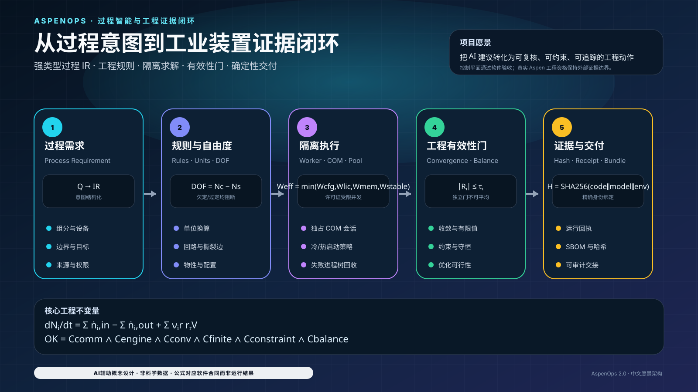
</p>

> 图中公式和模块来自当前代码合同；它展示的是控制平面愿景，不是 Aspen Plus/HYSYS 求解结果、装置数据或工程认证。

<!-- LOCALIZED_VISION_ZH:END -->

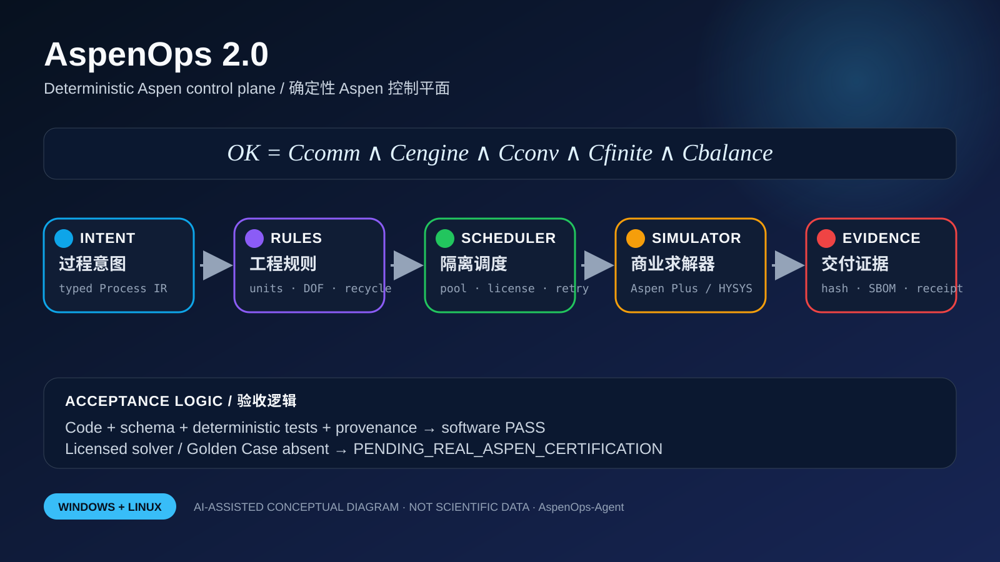

> **资格边界：** `aspenops-nexus 2.0.0` 对控制面、过程意图、隔离执行、缓存、调度、优化、证据链和确定性交付进行软件资格验证。没有真实商业求解器、许可证、固定模型、Golden Case、硬件指纹、工程容差和签名审查时，不得自授 Aspen 工程资格；状态保持 `PENDING_REAL_ASPEN_CERTIFICATION`。

## 验收状态

| 项目 | 当前合同 |
|---|---|
| 权威长期分支 | `main` |
| 支持平台 | Linux 与 Windows；真实 Aspen COM 仅限许可 Windows 主机 |
| Python | Python 3.11、3.12、3.13；六种 Linux/Windows 软件组合 |
| 归档资格 | `1224 passed`，0 failed，95.03% branch coverage |
| 当前回归 | 1258+ tests，95.03% branch coverage；最新 `main` CI 为准 |
| 工具链 | `uv 0.11.16`；`mcp>=1.9,<2` |
| 外部资格 | `PENDING_REAL_ASPEN_CERTIFICATION` |

这是**已验证归档基线**，不是对任意后续提交的自动声明。历史 PASS 不能覆盖新代码失败。

## AI 辅助视觉系统

以下二十三幅仓库内 SVG 解释真实软件合同，不是流程模拟、Golden Case、实验数据或商业软件执行证据。

| 架构与意图 | 执行与安全 | 证据与工程 |
|---|---|---|
| 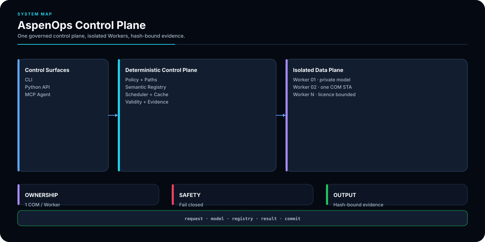 | 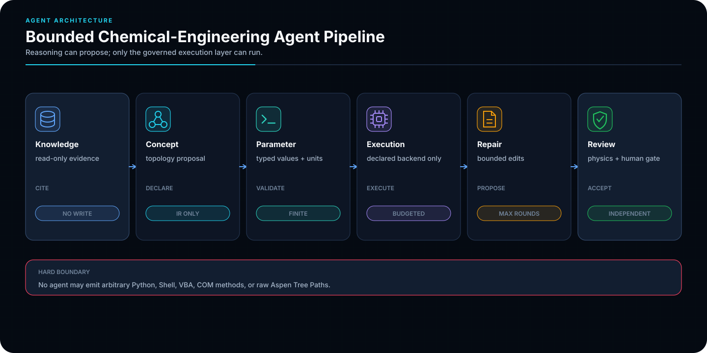 | 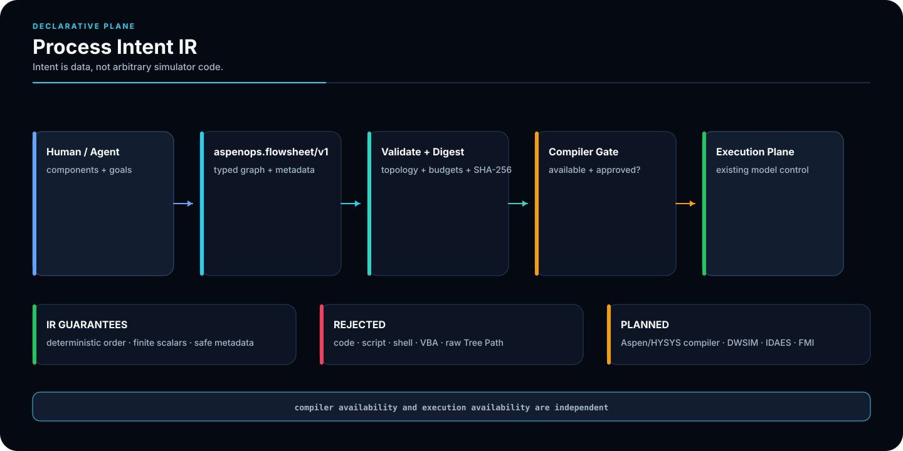 |
| 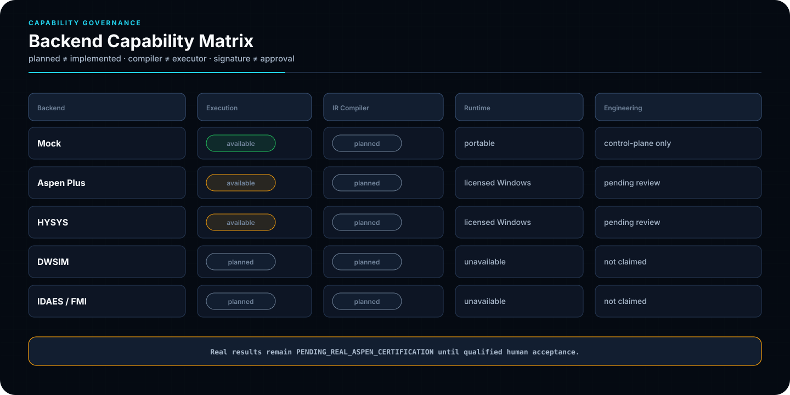 | 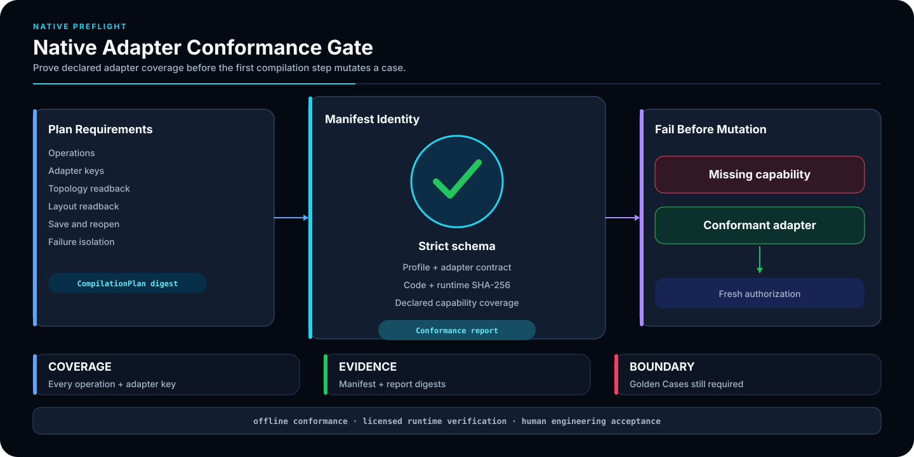 | 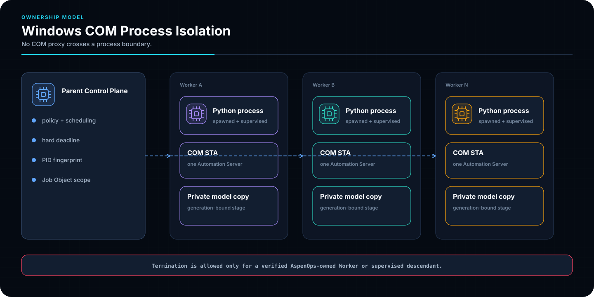 |
|  | 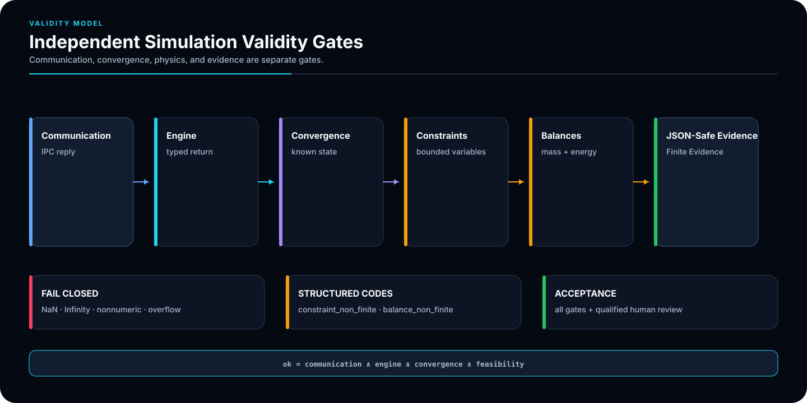 |  |
|  | 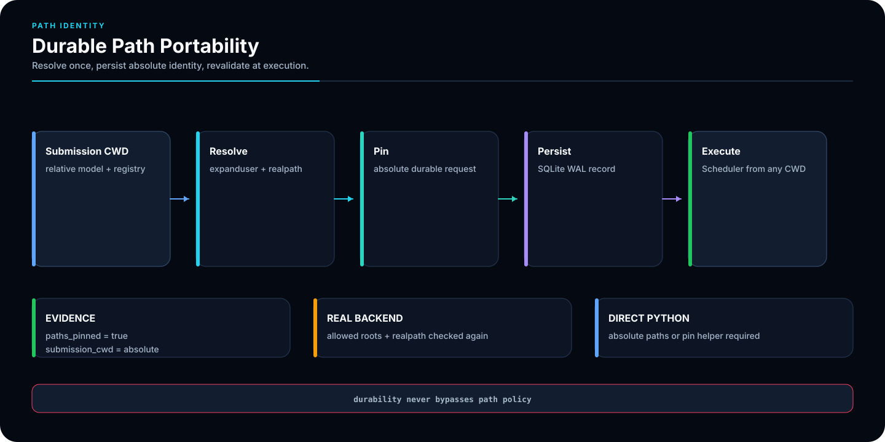 | 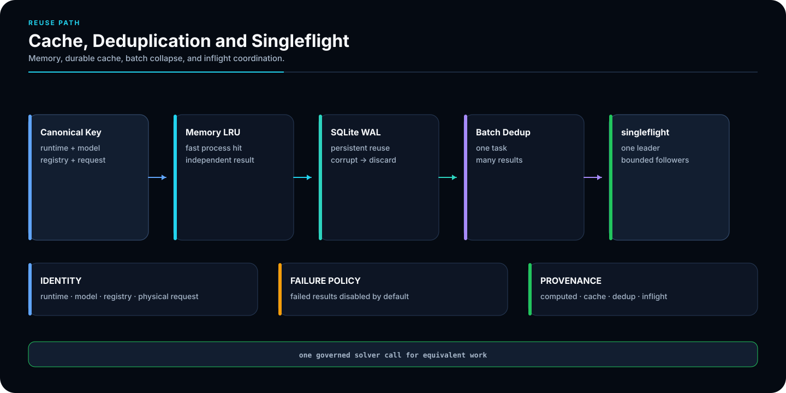 |
| 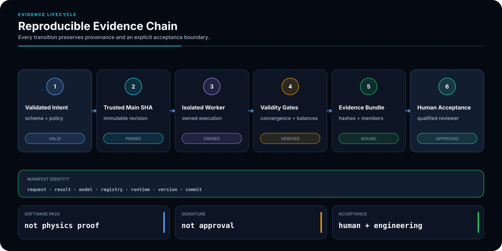 |  | 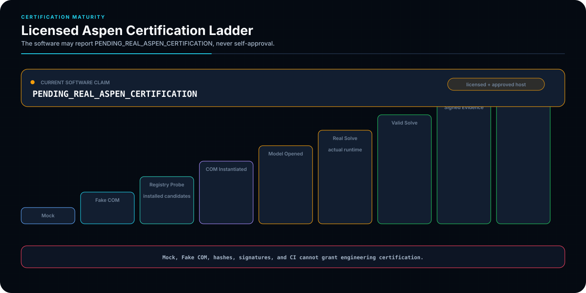 |
|  | 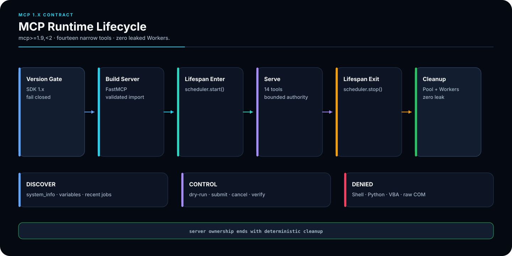 | 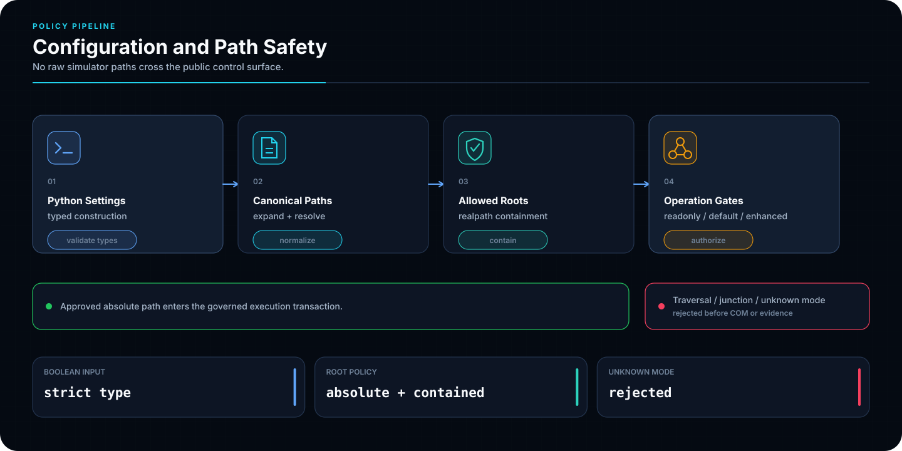 |
|  | 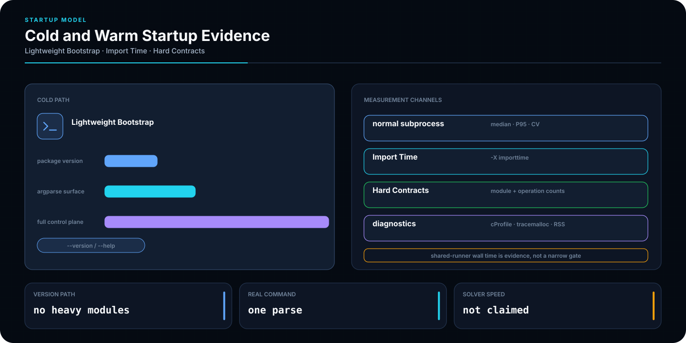 | 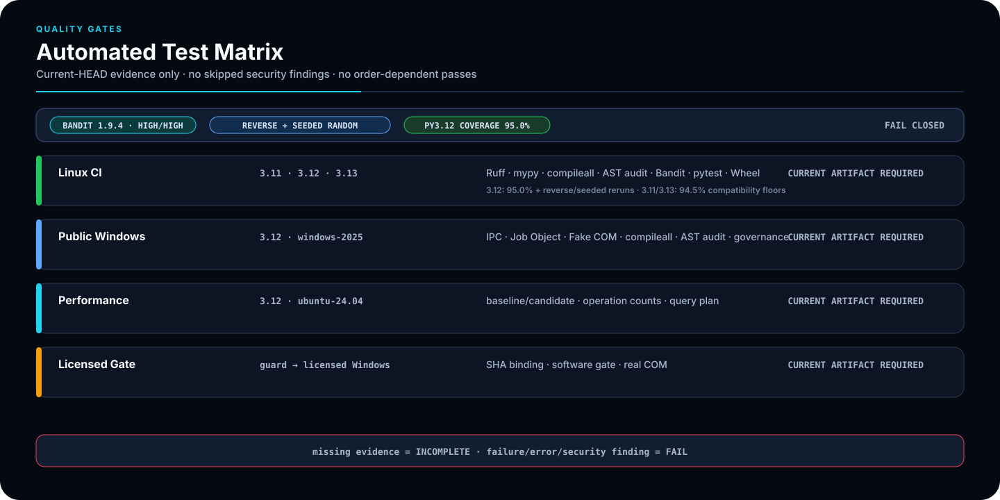 |
| 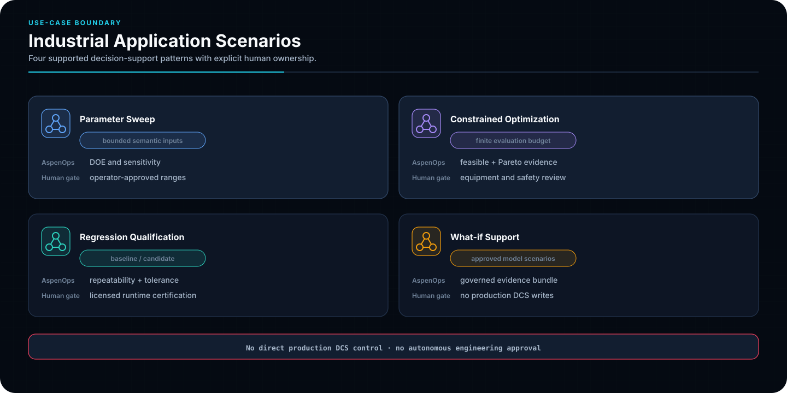 | 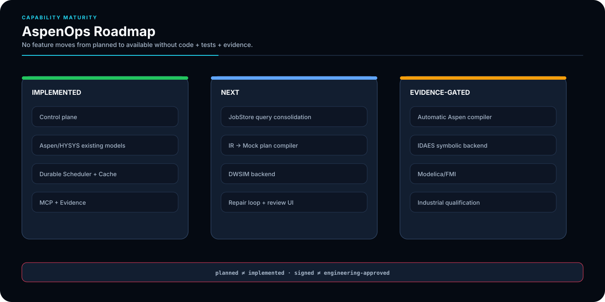 |  |

交付、数学、原生隔离和 warm-start 的补充视觉：

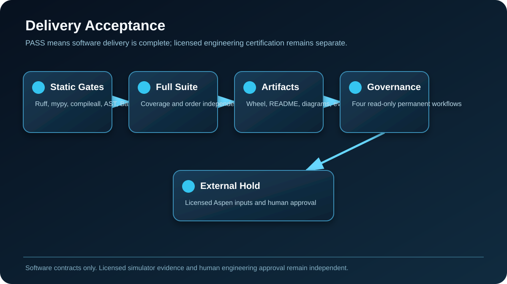


## 系统定位

```text
Human / Agent
  → ProcessRequirementDocument
  → ProcessDesignIR / aspenops.flowsheet/v1
  → engineering rules + units + DOF
  → capability profile + compilation plan
  → CasePool / scheduler / optimizer
  → isolated Windows Worker + owned COM session
  → Aspen Plus / HYSYS / Mock
  → readback + convergence + constraints + balances
  → evidence bundle + deterministic handover
```

DWSIM 与 IDAES 处于 `planned` 路线，当前**未实现**生产 adapter。能力未知或无 adapter 时必须显式报告，不能把“知道软件名称”伪装成可执行能力。

## 数学与工程合同

### 1. 物料与能量守恒

\[
\frac{dN_i}{dt}=\sum_{in}\dot n_i-\sum_{out}\dot n_i+\sum_r\nu_{ir}r_rV,
\qquad |R_i|\le\tau_i.
\]

\[
\frac{dU}{dt}=\dot Q-\dot W+
\sum_{in}\dot n_s\hat h_s-
\sum_{out}\dot n_s\hat h_s.
\]

非有限衡算使用 `balance_non_finite`；有限但超差使用 `balance_failed`。

### 2. 独立有效性门

\[
OK=C_{comm}\land C_{engine}\land C_{conv}\land C_{finite}
\land C_{constraint}\land C_{balance}.
\]

\[
V(x)=\sum_j\max(0,g_j(x)-\varepsilon_j)+
\sum_k\max(0,|h_k(x)|-\varepsilon_k).
\]

非有限约束使用 `constraint_non_finite`；证据 JSON 固定 `allow_nan=False`。

### 3. 单位、拓扑与自由度

\[
x_t=(x_s+a_s)\frac{m_s}{m_t}-a_t,
\qquad T_K>0.
\]

\[
\forall C\in cycles(G),\quad C\cap T\neq\varnothing,
\qquad DOF=N_c-N_s.
\]

撕裂边必须属于真实循环；欠规定和过度规定都 fail closed。

### 4. 缓存与轨迹身份

\[
K=SHA256(schema\Vert version\Vert backend\Vert runtime
\Vert model\Vert registry\Vert request_{physical}).
\]

\[
x_{k+1}=F(x_k,u_k),\qquad y_k=G(x_k).
\]

Warm-start 轨迹固定到一个 Worker 串行执行，不使用 persistent cache、same-batch dedup 或 `inflight_singleflight`。

### 5. 优化与许可证并发

\[
\min_xJ(x)=\sum_mw_mf_m(x),
\qquad J_p(x)=J(x)+\lambda V(x).
\]

\[
W_{effective}=\min(W_{configured},W_{license},W_{memory},W_{stable}).
\]

\[
T_{pool}\approx W(T_{start}+T_{open})+
\frac{N_{unique}}{W_{effective}}(T_{solve}+T_{verify})+T_{IPC}.
\]

## 配置边界

永久质量工作流使用 `ubuntu-24.04`，Windows 控制面与真实 COM 预检使用 `windows-2025`。Python 3.11、3.12、3.13 在 Linux 与 Windows 形成六种组合。

```bash
git clone https://github.com/SUNHAOJUN22/AspenOps-Agent.git
cd AspenOps-Agent
uv lock --check
uv sync --frozen --extra dev --extra agent --extra signing
```

## 配置与路径安全策略

`.env.example` 默认 Mock。真实 model、registry、state 与 output 必须位于 allowed roots。持久请求固定 `paths_pinned` 和 `submission_cwd`；重复 JSON key、非有限数值、越界路径和不平衡配置 fail closed。

## 原生适配器一致性门

原生 adapter 必须通过 manifest、输入/输出 Schema、单位、failure isolation 与确定性对照。

```bash
uv run aspenops doctor --probe
uv run python scripts/validate_process_ir.py examples/process-intent.example.json
```

`process-ir-dashboard.html` 是合同图，不是模拟结果。

## 快速开始

```bash
uv run aspenops demo
uv run aspenops dry-run examples/request.example.json
uv run aspenops run-batch examples/request.example.json --output var/results.json --bundle var/run-bundle.zip
uv run aspenops verify-bundle var/run-bundle.zip
```

## 独立有效性门

每个点分别记录 communication、engine、convergence、finite、constraint 和 balance 状态。任何门失败都不能被求解器“成功”或平均分数覆盖。

## 典型工作流

```bash
uv run aspenops submit examples/request.example.json
JOB_ID=$(uv run aspenops submit examples/request.example.json | python -c "import json,sys; print(json.load(sys.stdin)['job_id'])")
uv run aspenops job "$JOB_ID"
uv run aspenops cancel "$JOB_ID" --grace-s 2
uv run aspenops scheduler
uv run aspenops optimize examples/optimization-request.example.json
```

## MCP 兼容性与服务生命周期

```bash
uv run aspenops mcp
```

MCP lifespan 拥有 scheduler 启停和异常回收，不公开真实 Aspen 认证，也不绕过显式执行权限。

## 约束优化闭环

优化器保存 evaluation budget、原子 checkpoint、Deb-style feasibility 排序与 Pareto archive；求解失败和非有限目标不能被最佳分数覆盖。

## 调度与恢复

持久状态包括 `retry_wait` 与 `dead_letter`。租约、心跳、取消截止、worker crash、幂等提交和恢复均有事务边界。

## 缓存、批内去重与单航班

相同不可变请求可使用 same-batch dedup、持久缓存和 `inflight_singleflight`。失败默认不缓存，返回对象保持深度隔离。

## Worker 所有权与回收

每个 Windows Worker 独占 COM session、私有模型副本与 job scope。point budget、age、timeout、protocol error、tainted state 或 cancellation deadline 触发回收。

## 原生失败隔离

原生/商业 backend 的进程、COM apartment、临时模型、Windows Job Object 和日志边界必须隔离；一个 Worker 的 timeout、protocol error 或 crash 不得污染其他 Worker。失败后先终止所属进程树、记录 violation 与 generation，再创建替代 Worker；禁止在未知状态的同一 COM 实例上继续计算。

## 性能工程与证据

```bash
uv run python scripts/measure_cli_startup.py --output var/ci/cli-startup.json
uv run python scripts/measure_operation_counts.py --output var/ci/operation-counts.json
uv run python scripts/measure_job_store_queries.py --output var/ci/job-store-query-plan.json
uv run python scripts/render_test_dashboard.py --input-dir var/ci --output-html var/ci/test-dashboard-quality.html --output-svg var/ci/test-dashboard-quality.svg
```

治理工件包括 `cli-startup.json`、`operation-counts.json`、`job-store-query-plan.json`、`test-dashboard-quality.html` 与 Python/Windows/licensed dashboard；解释规则见 Performance Audit V2。当前运行证据仅写入 `RUNNER_TEMP`/`${{ runner.temp }}`，artifact 名包含 `github.run_id` 与 `github.run_attempt`。

## 工业应用场景

支持批量参数扫描、受约束优化、牌号切换、故障复算和受控数字孪生交接；不替代流程工程师、HAZOP/LOPA/SIL、客户模型批准或现场授权。

## 交付验收

`scripts/verify_delivery.py` 验证版本、README、工作流、AI 图、归档基线和真实 Aspen 边界。软件 PASS 只表示交付树满足声明合同；外部状态保持 `PENDING_REAL_ASPEN_CERTIFICATION`。

```bash
uv run python scripts/verify_delivery.py --root . --output var/ci/delivery-acceptance.json
```

## 确定性交付包

`scripts/build_delivery_bundle.py` 从干净 Git tree 生成：

```text
aspenops-source-<sha12>.zip
aspenops-handover-<sha12>.zip
aspenops-sbom-<sha12>.spdx.json
SHA256SUMS
```

SBOM 使用 `SPDX-2.3`；所有工件具有规范时间戳、排序成员和 SHA-256。`<sha12>` 是 commit 前 12 位，不是运行时占位输入。

```bash
uv run python scripts/build_delivery_bundle.py --root . --output-dir var/delivery --source-sha 0123456789abcdef0123456789abcdef01234567
```

## 证据包完整性与真实性

永久工作流为 `ci.yml`、`windows-control-plane.yml`、`generate-performance-evidence.yml`、`licensed-aspen-certification.yml`。手动证据仅接受 `refs/heads/main`；dispatch guard 在 `actions/checkout` 前检查 ref，不满足时**显式失败**并返回 status 2，而不是 all-skipped 假绿。候选和基线在 `detached` worktree 中验证。

许可环境要求 `expected_head_sha == GITHUB_SHA`，记录 `GITHUB_RUN_ID`、`GITHUB_RUN_ATTEMPT`、`LICENSED_EVIDENCE_DIR`、`run-metadata.txt`、`job_status` 和 `aspenops-licensed-artifact`。上传使用 `if-no-files-found: error`，路径位于 `runner.temp`，真实 Aspen 任务串行。

## 项目结构

- `src/aspenops_nexus/`：控制面、Process IR、scheduler、cache、optimizer、evidence、adapter；
- `tests/`：数值、并发、文件安全、文档、artifact 与 workflow 合同；
- `scripts/`：审计、性能、dashboard、Process IR 和 delivery bundle；
- `.github/workflows/`：四个永久工作流；
- `docs/assets/readme/`：二十三幅确定性 SVG。

## 故障排查

先运行 `uv run aspenops doctor --probe`，再检查 allowed roots、registry SHA、model identity、license、worker generation、state database 与 evidence bundle。禁止关闭测试、降低容差或把非收敛重解释为成功。

## 最终验收命令

```bash
python scripts/final_acceptance_preflight.py --root . --json
uv lock --check
uv sync --frozen --extra dev --extra agent --extra signing
uv run ruff check .
uv run ruff format --check .
uv run mypy src
uv run python -m compileall -q src scripts
uv run python scripts/audit_source_tree.py
uv run pytest -W error::ResourceWarning --cov=aspenops_nexus --cov-branch --cov-fail-under=95.0
uv build
```

## License

Apache-2.0 仅覆盖本仓库。Aspen Plus、Aspen HYSYS、Windows、许可证服务、客户模型和工艺数据受各自许可、保密与安全制度约束。


### 当前交付树强制验收

最终交付必须把测试结果、覆盖率与 Git 身份绑定到当前树；历史 PASS 不能代替当前源码资格。

```bash
uv run python scripts/verify_delivery.py \
  --root . \
  --require-current-qualification \
  --output var/ci/delivery-acceptance-current.json
```

验收面板包括 `test-dashboard-quality.html`、`test-dashboard-windows.html`、`test-dashboard-licensed.html`、`test-dashboard-licensed-mock.html` 与各 Python 版本面板。面板只汇总对应作业证据，不构成真实 Aspen 工程认证。

<!-- CURRENT_MAIN_ACCEPTANCE_V2:START -->
## 当前 `main`：代码—数学—证据闭环

<p align="center"></p>

> 本节由仓库脚本根据当前代码合同生成；图像是文档概念设计，不是仿真或实验结果。

### 核心数理合同

$$
OK = C_comm ∧ C_engine ∧ C_conv ∧ C_finite ∧ C_constraint ∧ C_balance
$$

$$
dN_i/dt = Σ_in ṅ_i − Σ_out ṅ_i + V Σ_r ν_ir r_r
$$

$$
W_eff = min(W_config, W_license, W_memory, W_stable)
$$

### 使用策略

1. 先运行永久 CI，再运行 current-main 精确树验收。
2. 所有数值入口拒绝 Boolean、NaN 与 Infinity。
3. 任何新提交都会使旧 SHA 的六小时证据失效。
4. 外部 Aspen 工程资格必须由授权环境和责任工程师完成。

> **责任边界：** 软件门禁不等于真实 Aspen Plus/HYSYS 工程认证；外部状态保持 PENDING_REAL_ASPEN_CERTIFICATION。

执行提示词：[`SIX_REPOSITORY_PARALLEL_6H_ACCEPTANCE_PROMPT_V2.md`](docs/SIX_REPOSITORY_PARALLEL_6H_ACCEPTANCE_PROMPT_V2.md)
<!-- CURRENT_MAIN_ACCEPTANCE_V2:END -->
