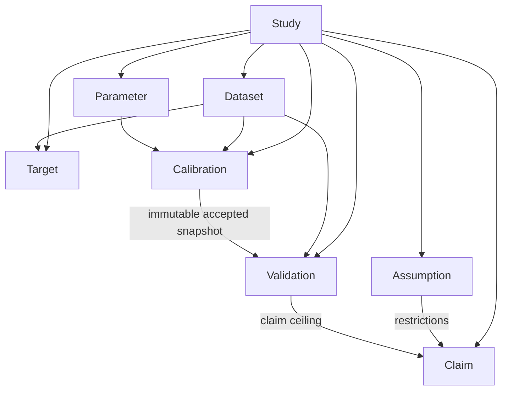

# AspenOps Research Study Layer — P0 Scientific Governance

AspenOps Research Study Layer is the schema-only scientific-governance layer above the existing
execution control plane. P0 defines immutable research manifests, validates their evidence graph, and
computes model-qualification limits. It does not open Aspen, compile runtime requests, estimate
parameters, run dynamic studies, or train machine-learning models.

## P0 status

```text
P0_GOVERNANCE_ONLY
RUNTIME_CORE_LOCKED
NO_ASPEN_EXECUTION
NO_PARAMETER_ESTIMATION
NO_DYNAMIC_MODELING
NO_MACHINE_LEARNING
```

The canonical document schema marker is `aspenops.research-study/v1`.

## Object relationship diagram



The eight first-class objects are:

1. `Study` — scientific question, model/Registry snapshots, backend policy, lifecycle, and claim ceiling.
2. `Dataset` — immutable data artifact, record identity, role, uncertainty, and split proof.
3. `Target` — semantic observable, dataset binding, uncertainty, stage, and acceptance rule.
4. `Parameter` — semantic write binding, source, bounds, sharing scope, and identifiability status.
5. `Assumption` — rationale, evidence, risk, falsification test, affected objects, and claim restrictions.
6. `Calibration` — governance record for a declared calibration plan and accepted immutable snapshot.
7. `Validation` — held-out/stress evidence bound to exact model, Registry, and parameter snapshots.
8. `Claim` — publishable statement constrained by evidence, assumptions, validation, and maturity.

## Source Contradiction Register

Source contradictions are represented by `Assumption` entries with
`category = "source_contradiction"` and a non-empty `contradiction_group`. Contradictions are never
silently repaired. Their competing interpretation, risk, resolution state, affected objects, and claim
restrictions remain machine readable.

## Model qualification state machine

```text
STRUCTURE_ONLY
        ↓
SOURCE_CASE_REPRODUCED
        ↓
CALIBRATED_IN_DOMAIN
        ↓
VALIDATED_HELD_OUT
        ↓
ROBUSTNESS_TESTED
        ↓
LICENSED_ENGINEERING_REVIEWED
```

Advancement is evidence driven. A source-reproduction Study cannot support an independent-validation
Claim. A critical unresolved Assumption caps linked Claims at `STRUCTURE_ONLY`. Mock or Fake COM
evidence can validate governance and mathematical contracts but cannot support
`LICENSED_ENGINEERING_REVIEWED`.

## Scientific invariants

The validator fails closed when any of these boundaries are violated:

1. Calibration and Validation reuse the same Dataset, immutable data artifact, split group, or record
   set digest.
2. Calibration consumes a Dataset whose role is not `calibration`.
3. Validation consumes a Dataset whose role is not `validation` or `stress_test`.
4. Validation does not bind the exact immutable parameter snapshot produced by an accepted
   Calibration.
5. Validation model or Registry snapshots drift from the Study snapshots.
6. A Claim exceeds the Study, linked Validation, or source-reproduction maturity ceiling.
7. A Claim omits restrictions inherited from its Assumptions.
8. A critical unresolved Assumption is linked to a Claim above `STRUCTURE_ONLY`.
9. A licensed engineering Claim lacks a passed, engineer-approved, real-simulator Validation.
10. Research metadata contains raw simulator paths, executable-code fields, Shell, VBA, Python, or
    unrestricted commands.
11. Study lifecycle state advances without the required accepted Calibration, passed Validation, or
    supported Claim.

## Strict schemas

Nine Draft 2020-12 JSON Schemas are shipped under
`src/aspenops_nexus/data/research-*.schema.json`:

- common definitions;
- Study;
- Dataset;
- Target;
- Parameter;
- Assumption;
- Calibration;
- Validation;
- Claim.

The Python graph validator remains authoritative for cross-object rules that JSON Schema cannot prove.

## Complete examples

- `examples/research-study.example.json` — synthetic EPM calibration/held-out governance graph. It
  demonstrates object linkage only and performs no parameter estimation in P0.
- `examples/research-epdm-structure-only.example.json` — EPDM source-contradiction example whose
  maximum maturity is `STRUCTURE_ONLY`; it contains no Parameters, Calibrations, or Validations.

## Library usage

```python
from aspenops_nexus.research import ResearchStudyDocument

study = ResearchStudyDocument.load("examples/research-study.example.json")
report = study.validate()
if not report.ok:
    raise RuntimeError(report.to_dict())
```

The validator is pure Python and has no dependency on Aspen, COM, or the execution control plane.

## P0 qualification artifacts

A passing P0 qualification writes:

- `docs/research-layer-p0-test-report.md`;
- `docs/research-layer-p0-coverage-summary.md`;
- `docs/CLOSED_LOOP_VALIDATION_RESEARCH_P0.json`;
- `docs/CLOSED_LOOP_VALIDATION_RESEARCH_P0.md`;
- `docs/P0_PHASE_RESULT.json`;
- `docs/research-layer-p0-evidence.json`.

Missing evidence is not a pass.

## Deliberate non-capabilities

P0 does not provide a CLI, MCP tool, Aspen Data Fit adapter, Design Specification adapter,
Sensitivity runner, GPC deconvolution engine, dynamic grade-transition runner, surrogate model, UQ
engine, OOD detector, or research execution bundle. Later phases must reuse the existing AspenOps
semantic Registry, `EvaluationRequest`, process isolation, constraints, balances, provenance, and
certification boundary.
