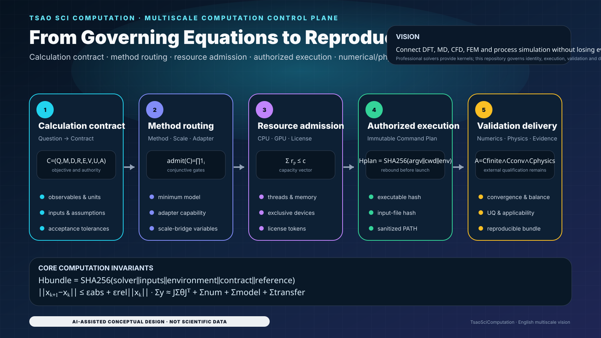
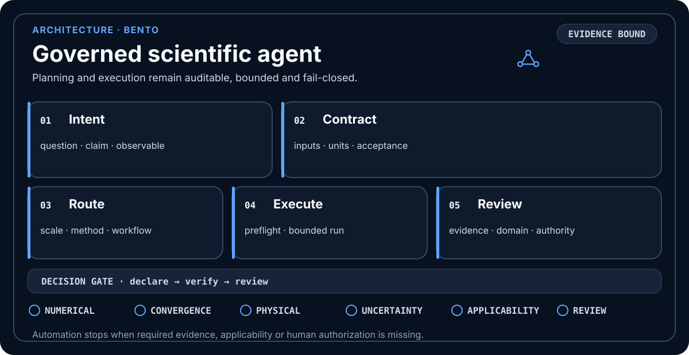
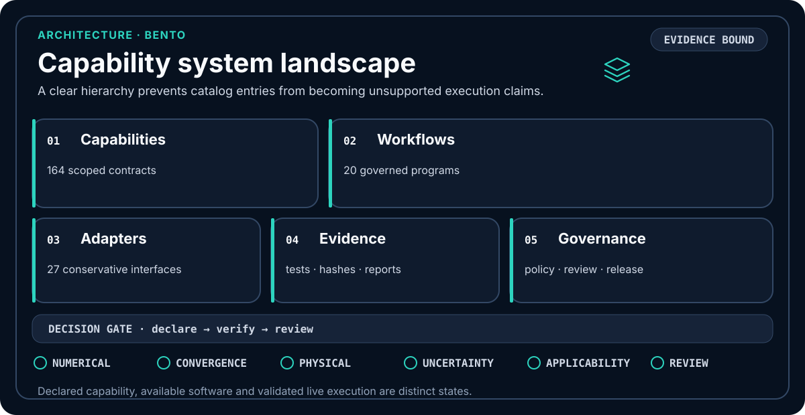
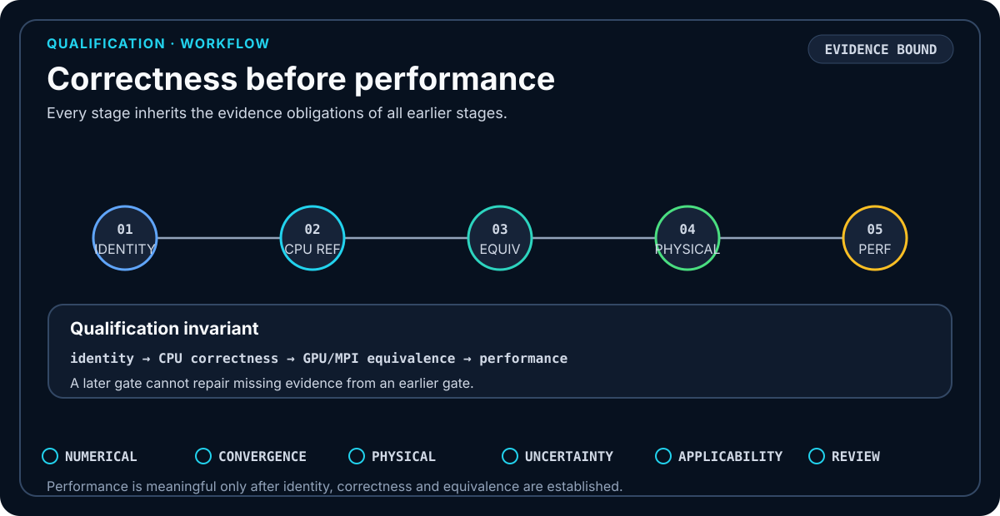
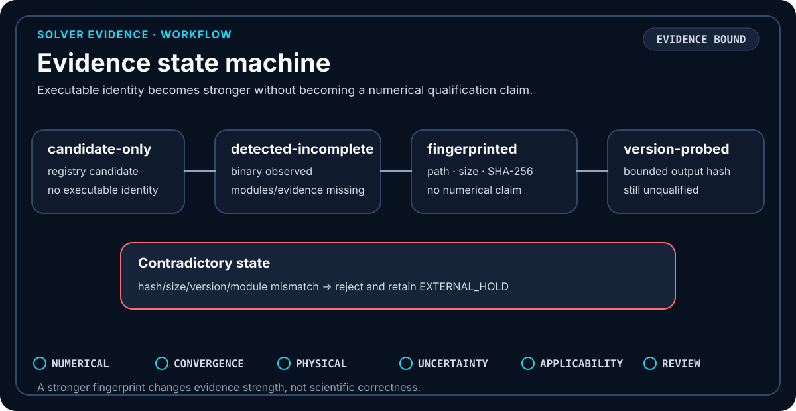
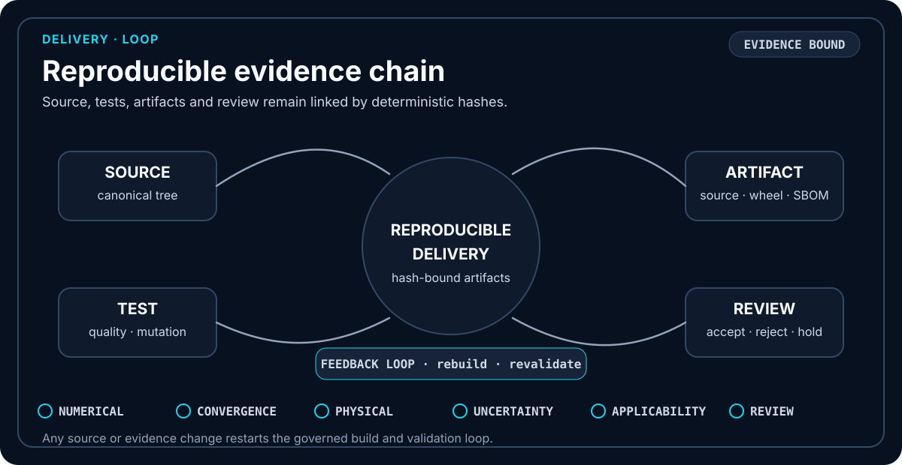
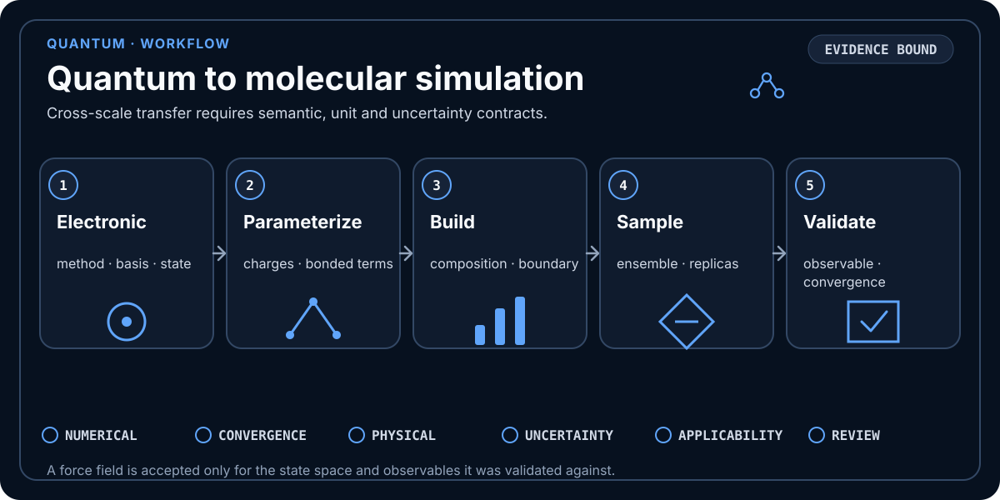
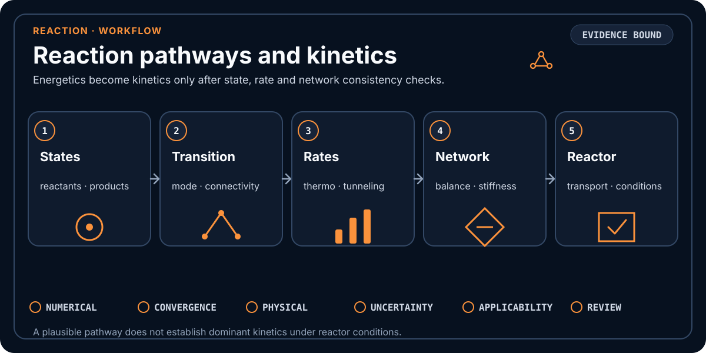
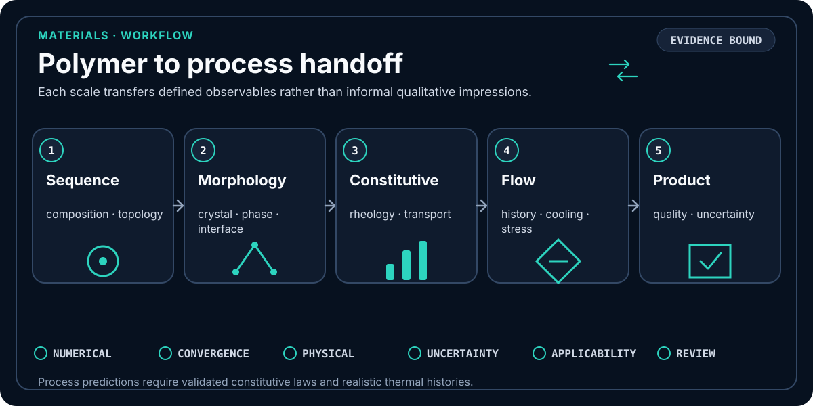
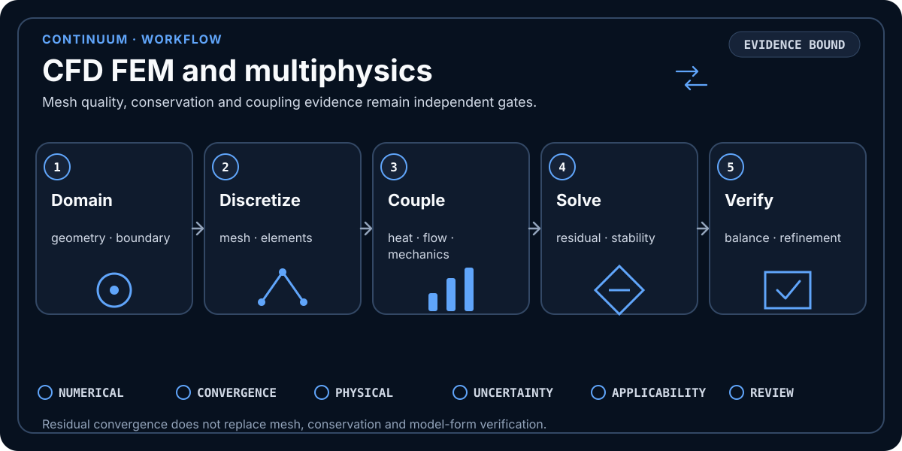

<div align="center">


# TsaoSciComputation

**Evidence-governed scientific-computation orchestration from equations and solver identity to reproducible delivery.**

     

[中文说明](README.zh-CN.md) · [Root Skill](SKILL.md) · [Capabilities](capability-index/README.md) · [Visual atlas](assets/visuals/README.md) · [Validation](docs/scientific-validation.md) · [Architecture](docs/architecture.md) · [Delivery prompt](docs/autonomous-software-hardening-prompt.md)

</div>

<!-- LOCALIZED_VISION_EN:START -->
## Project vision: from governing equations to reproducible computation

<p align="center">
  
</p>

> The equations map to contract, execution-identity, convergence, uncertainty and acceptance modules. The figure does not claim that VASP, Gaussian, GROMACS, OpenFOAM or Aspen has run.

<!-- LOCALIZED_VISION_EN:END -->

## Delivery status

TsaoSciComputation is a deliverable software control plane with an explicit boundary between **repository qualification** and **external scientific execution**.

- **164 capabilities**, **27 external adapters**, **20 machine-readable workflows**, **23 methods**, **13 acceleration strategies** and **7 trusted local functions**;
- test counts and measured coverage are taken from the complete CI run for the exact commit being reviewed; the enforced total-coverage floor is **95.00%**;
- Ruff, Mypy, Bandit, repository security scanning, controlled mutation, Schema, Manifest, reproducible source/Wheel, isolated installation, SBOM and native C ABI checks remain the release gates;
- `main` is the sole authoritative branch;
- real third-party solver correctness remains **`EXTERNAL_HOLD`** until binaries, licenses, fixed inputs, hardware fingerprints, reference values and scientific tolerances are supplied.

No exit code, version string, GPU visibility variable or benchmark microsecond is promoted into a scientific claim by itself.

## What the repository is

TsaoSciComputation turns a scientific question into a governed calculation program:

```text
question → contract → method/scale route → preflight → bounded execution
         → parse → convergence → numerical/physical validation
         → uncertainty/applicability → accept, reject or hold
```

It is a **control plane and qualification framework**, not a bundled DFT, MD, CFD, FEM or process simulator. Python owns contracts, routing, policy, provenance and acceptance. A source-only C++20/OpenMP layer exposes a versioned C ABI for measured software hotspots. External engines remain separately installed, licensed and qualified.

### Claim boundary

The repository does **not** claim:

- fabricated VASP, Quantum ESPRESSO, Gaussian, GROMACS, OpenFOAM, Aspen or commercial-solver execution;
- GPU/MPI numerical equivalence without a trusted CPU reference;
- production speedup from orchestration-only benchmarks;
- convergence or physical validity from process completion;
- a boolean value as a valid scientific real scalar.

## Quick start

```bash
git clone https://github.com/SUNHAOJUN22/TsaoSciComputation.git
cd TsaoSciComputation
python -m pip install -e '.[validation,quality,security]'

python -m tsao_computation route \
  "Plan a DFT-to-MD interface study with explicit uncertainty gates"
python -m tsao_computation validate-contract \
  templates/calculation-contract.json --strict
python -m tsao_computation probe

python scripts/verify_all.py --profile all
python scripts/verify_native_core.py
```

External execution is intentionally separate:

```bash
python -m tsao_computation probe-solver gromacs \
  --output .tsao-computation/gromacs-capability-evidence.json

python -m tsao_computation plan-acceleration gromacs \
  --solver-evidence .tsao-computation/gromacs-capability-evidence.json \
  --require-solver-evidence
```

A complete fingerprint can reach `version-probed-unqualified`; it still does not prove numerical correctness, convergence, license availability or accelerator equivalence.

<!-- SUPER_SKILL_ORCHESTRATION:START -->
## Capability and execution model

The repository exposes **164 capabilities**, **23 computation methods**, **9 invocation types**, **7 trusted local functions**, **27 external adapters**, **20 workflows**, **13 acceleration strategies** and a **9-stage orchestration plan**.

| Invocation mode | Default behavior |
|---|---|
| Registered trusted local function | Validate payload, execute a bounded implementation, and hash request/result evidence |
| External solver or adapter | Probe identity and build a command plan; execution requires separate authorization |
| Python module, CLI, API, container, scheduler or Skill | Produce a declarative handoff until runtime, identity and evidence conditions are satisfied |

Execution is fail-closed. Relative executables and inputs resolve from normalized `CommandPlan.cwd`. Bare command names resolve once against a sanitized immutable `PATH`, become absolute paths, are hashed, and are rebound immediately before launch. The authorized normalized working directory is the directory passed to the process runner.

Scalar-sensitive trusted callables are also fail-closed: booleans never acquire scientific meaning through Python's `bool ⊂ int` implementation detail, and non-finite failure sentinels are converted to JSON-safe structured evidence before hashing.
<!-- SUPER_SKILL_ORCHESTRATION:END -->

## Architecture at a glance

<table>
<tr>
<td width="50%"></td>
<td width="50%"></td>
</tr>
<tr>
<td align="center"><strong>Governed scientific agent</strong></td>
<td align="center"><strong>Contract-based capability system</strong></td>
</tr>
</table>

| Layer | Responsibility | Acceptance boundary |
|---|---|---|
| Python control plane | contracts, routing, evidence, provenance, policy, parsers, UQ and decisions | deterministic repository qualification |
| Native interoperability plane | C++20/OpenMP discovery and measured kernels through a versioned C ABI | ABI, build, CTest and equivalence gates |
| External solver plane | DFT/MD/CFD/FEM/process execution | real installation, license, fixed input, reference and tolerance evidence |

## Mathematical operating model

The equations below describe implemented control logic; they do not replace a solver's governing equations.

### 1. Calculation contract

$$
\mathcal C=(Q,M,D,R,E,V,U,A),
$$

where $Q$ is the scientific question, $M$ the method, $D$ declared data, $R$ resources, $E$ execution evidence, $V$ validation, $U$ uncertainty and $A$ acceptance authority.

$$
\operatorname{admit}(\mathcal C)=
\mathbf 1_{\mathrm{schema}}
\mathbf 1_{\mathrm{identity}}
\mathbf 1_{\mathrm{inputs}}
\mathbf 1_{\mathrm{resources}}
\mathbf 1_{\mathrm{policy}}.
$$

Any false predicate yields zero admission.

### 2. Reproducible identity binding

$$
H_{\mathrm{bundle}}=
\operatorname{SHA256}(B_{\mathrm{solver}}\parallel B_{\mathrm{inputs}}
\parallel B_{\mathrm{env}}\parallel B_{\mathrm{contract}}
\parallel B_{\mathrm{reference}}).
$$

Changing executable bytes, canonical inputs, environment, contract or reference evidence changes the identity and invalidates the old authorization.

### 3. Strict scientific scalar domain

Python permits `True == 1`, but scientific validation must not. The implemented admissibility predicate is

$$
\chi_{\mathbb R_f}(x)=
\mathbf 1_{\neg\operatorname{Bool}(x)}
\mathbf 1_{\operatorname{convertible}(x)}
\mathbf 1_{\operatorname{isfinite}(\operatorname{float}(x))}.
$$

For non-negative tolerances and uncertainty components,

$$
\chi_{\mathbb R_f^+}(x)=\chi_{\mathbb R_f}(x)\mathbf 1_{x\ge 0}.
$$

Thus `True`, `False`, NaN, infinity and nonnumeric objects cannot silently enter convergence or uncertainty calculations.

### 4. Convergence and stopping rules

$$
\lVert x_{k+1}-x_k\rVert
\leq \varepsilon_{\mathrm{abs}}
+\varepsilon_{\mathrm{rel}}\lVert x_k\rVert.
$$

```text
completed ≠ parsed ≠ converged ≠ validated ≠ accepted
```

Invalid or insufficient convergence data returns structured failure. To preserve strict JSON evidence,

$$
\Phi(\Delta)=
\begin{cases}
\Delta, & \Delta\in\mathbb R_f,\\
\texttt{null}, & \text{otherwise},
\end{cases}
$$

with an explicit reason code rather than a non-standard `Infinity` token.

### 5. Numerical equivalence

$$
\delta_{\mathrm{rel}}=
\frac{|y_{\mathrm{candidate}}-y_{\mathrm{reference}}|}
{\max(|y_{\mathrm{reference}}|,\epsilon)},
\qquad
\max_j\delta_{\mathrm{rel},j}\leq\tau_{\mathrm{eq}}.
$$

Qualification order is fixed:

$$
\text{Identity}\rightarrow
\text{CPU correctness}\rightarrow
\text{GPU/MPI equivalence}\rightarrow
\text{performance qualification}.
$$

### 6. Conservation and physical residuals

$$
R_{\mathrm{cons}}=
\left|\sum_iF_i^{\mathrm{in}}-\sum_jF_j^{\mathrm{out}}+S\right|,
\qquad
R_{\mathrm{cons}}\leq\tau_{\mathrm{cons}}.
$$

### 7. Uncertainty propagation and applicability

For independent components,

$$
u_c=\sqrt{\sum_i u_i^2},\qquad u_i\in\mathbb R_f^+.
$$

For $y=f(x_1,\ldots,x_n)$,

$$
u_y^2\approx\sum_i\left(\frac{\partial f}{\partial x_i}\right)^2u_{x_i}^2.
$$

Applicability remains separate:

$$
A_{\mathrm{domain}}=
\mathbf 1(x\in\Omega_{\mathrm{validated}})
\mathbf 1(\text{model assumptions hold}).
$$

### 8. Resource broker admission

$$
A_{\mathrm{resource}}=
\mathbf 1(L)\mathbf 1(B)\mathbf 1(H)\mathbf 1(I)\mathbf 1(P),
$$

and concurrent claims must satisfy

$$
\sum_{p\in\mathcal P_{\mathrm{active}}}r_p\preceq c.
$$

The broker rejects CPU oversubscription, exclusive-GPU collisions, inconsistent CUDA/HIP/ROCR visibility and license-token over-allocation.

### 9. Claim contract

Every acceptance statement is represented as

$$
\operatorname{claim}=(\text{observable},\text{reference},\text{tolerance},
\text{evidence},\text{authority}).
$$

Missing any component downgrades the claim or retains a hold.

### Canonical evidence digests

Structured evidence, execution bindings, accelerator plans, and performance profiles now share `tsao_computation.hashing`. Canonical JSON uses sorted keys, compact separators, UTF-8 bytes, and rejects NaN/Infinity; file digests stream bounded chunks. This removes subsystem-specific SHA-256 encoders and prevents digest drift without changing public evidence schemas.

## Qualification and delivery diagrams

The following AI-assisted information designs are deterministic repository-owned SVG sources. They explain code and qualification logic; they are not fabricated solver output.






<!-- V13_VISUAL_SYSTEM:START -->
The repository contains **43 self-contained SVGs** using **Scientific Research Console V13**. The root READMEs showcase **12 representative diagrams**; the complete inventory is in [`assets/visuals/README.md`](assets/visuals/README.md), with design and trust rules in [`assets/visuals/DESIGN_SYSTEM.md`](assets/visuals/DESIGN_SYSTEM.md).
<!-- V13_VISUAL_SYSTEM:END -->

## Usage strategies

### Strategy A — planning without solver access

Use routing, contract validation and capability inspection to produce a defensible calculation plan. Keep it plan-only or `EXTERNAL_HOLD`; do not invent runtime evidence.

### Strategy B — strict scalar ingestion

Validate every observation, tolerance and uncertainty component before calculation. Reject booleans, NaN and infinity. Preserve failure as JSON-safe structured evidence so request/result hashes remain deterministic.

### Strategy C — external solver onboarding

```text
qualification-bundle/
├── solver-identity.json        # path, size, SHA-256, bounded version output
├── environment.json            # OS, runtime, libraries, scheduler, devices
├── inputs/                     # fixed canonical inputs
├── references/                 # trusted CPU or analytical references
├── tolerances.json             # observable-specific limits
├── license-evidence.json       # availability and authorization boundary
└── provenance.json             # bundle hash and review authority
```

Qualify identity, CPU correctness, GPU/MPI equivalence and performance in that order.

### Strategy D — edge deployment

Pre-package registries and Schemas; default to CPU-only unless the accelerator is fingerprinted; cap workers and memory; transfer only hash-bound evidence bundles to larger solver hosts.

### Strategy E — shared HPC deployment

Map immutable claims to scheduler CPU/GPU/license requests; separate scratch, checkpoint and evidence directories; bind scheduler metadata to provenance; retry only classified transient failures.

### Strategy F — acceleration engineering

1. inventory and profile a real workload;
2. distinguish orchestration from numerical-kernel cost;
3. prefer solver-native parallelism and mature libraries;
4. establish a trusted CPU reference;
5. prove GPU/MPI equivalence with declared observables and tolerances;
6. measure same-problem performance with uncertainty.

### Strategy G — acceptance and audit

Require a reference, tolerance, evidence identity and approving authority for every claim. A successful process without those items remains unaccepted.

## Multiscale scientific visual map






## Acceleration and native interoperability

Python remains the control plane. A hotspot crosses into C++/OpenMP/CUDA only after profiling demonstrates material value and equivalence can be tested independently.


```bash
python scripts/build_acceleration_audits.py
python -m tsao_computation audit-acceleration \
  --root . --scope production --limit 50 --min-score 40 \
  --output reports/ACCELERATION_OPPORTUNITIES_PRODUCTION_V4.json
python -m tsao_computation profile-performance \
  --workload routing-hot --workload acceleration-plan \
  --repeats 7 --warmups 1 \
  --output .tsao-computation/performance-profile.json
```

<!-- ACCELERATION_AUDIT_SUMMARY:START -->
The [production audit](reports/ACCELERATION_OPPORTUNITIES_PRODUCTION_V4.json) and [full-tree audit](reports/ACCELERATION_OPPORTUNITIES_FULL_TREE_V4.json) contain the generated source counts and hashes. Unprofiled code is not evidence of external-solver or GPU speedup.
<!-- ACCELERATION_AUDIT_SUMMARY:END -->

Architecture, CUDA-X selection rules and C++ migration gates: [`docs/accelerated-native-backend.md`](docs/accelerated-native-backend.md). Native verification: `python scripts/verify_native_core.py`.

## Verification

```bash
python -m pip install -e '.[validation,quality,security]'
python scripts/verify_all.py --profile all
python scripts/verify_native_core.py
python scripts/verify_all.py --profile benchmark
```

`all` covers linting, formatting, typing, security, pytest, coverage, mutation, analytical fixtures, Schema/registry checks, generated-file consistency, reproducible source/Wheel builds, isolated installation, SBOMs, checksums and release manifests. `benchmark` is orchestration telemetry, not external-solver performance evidence.

<!-- CURRENT_MAIN_VERIFICATION:START -->
### Exact-commit qualification

| Metadata | Value |
|---|---|
| Version | 3.0.4 |

Use the permanent [CI workflow](.github/workflows/ci.yml) and its run artifacts for the SHA being deployed. Historical reports under `reports/` are snapshots, not certificates for a newer commit. Full pytest, the 95% coverage floor, critical-module coverage, generated-file checks, Ruff, mypy, Bandit, mutation probes, source/Wheel reproducibility, native C ABI and platform matrices remain mandatory. No narrow contract run or previous successful commit substitutes for this chain.
<!-- CURRENT_MAIN_VERIFICATION:END -->

### External approval contract

`software_ready` aggregates the declared completion, parsing, convergence, physical-validation, uncertainty, applicability and evidence flags. It is not independently issued scientific approval.

`accepted` additionally requires a valid artifact SHA-256 and at least one time-valid HMAC-SHA256 attestation verified with a trusted key supplied outside the record. The acceptance gate requires scope `scientific-result-acceptance` and role `independent-domain-reviewer`; approver and requester identifiers must differ. Deployments must provision trusted keys and resolve those identities independently.

Malformed JSON payloads, non-finite values, circular references and serializer failures return structured rejection reasons. Invalid signatures or unrelated scopes/roles cannot reserve a nonce and suppress a later valid approval. Duplicate valid approvals count once **within one decision**. This is not a persistent cross-request replay database, key-revocation service, or proof of institutional identity; integrations requiring those controls must supply them externally. Verification is intentionally repeatable for an unchanged artifact during its approval window.

Focused regression command:

```bash
python -m pytest -q tests/test_approval_attestation_boundaries.py tests/test_validation_fail_closed.py
```


## Trust states

| State | Meaning |
|---|---|
| `candidate-only` | registry candidate; no executable detected |
| `detected-incomplete` | executable detected but required evidence is incomplete |
| `fingerprinted-unqualified` | exact binary identity recorded; no numerical qualification |
| `version-probed-unqualified` | bounded version output recorded; still scientifically unqualified |
| `evidence-bound-unqualified` | evidence is bound into a plan; correctness/equivalence still pending |
| `EXTERNAL_HOLD` | a required external fact or artifact is missing |

## Platform and repository policy

- Windows is a core supported workflow; Linux is CI-validated.
- `main` is the sole authoritative remote branch.
- No external solver, commercial license or private dataset is bundled.
- Releases include reproducible artifacts, SPDX/CycloneDX SBOMs, SHA-256 checksums and provenance.

## License and citation

MIT licensed. Citation metadata is in [`CITATION.cff`](CITATION.cff); third-party boundaries are documented in [`THIRD_PARTY.md`](THIRD_PARTY.md).

<!-- CURRENT_MAIN_ACCEPTANCE_V2:START -->
## Current `main`: code–mathematics–evidence loop

<p align="center"></p>

> This section is generated from current code contracts; the visual is conceptual documentation, not solver or experimental output.

### Core mathematical contracts

$$
admit(C) = 1_schema · 1_identity · 1_inputs · 1_resources · 1_policy
$$

$$
H_bundle = SHA256(B_solver ∥ B_inputs ∥ B_env ∥ B_contract ∥ B_reference)
$$

$$
δ_rel = |y − y_ref| / max(|y_ref|, ε) ≤ τ_eq
$$

### Usage strategy

1. Run permanent CI before exact-tree current-main qualification.
2. Scientific values, tolerances and uncertainties must be finite reals; Boolean is not 0/1 evidence.
3. Execution identity, inputs, environment, references and contracts enter the evidence hash.
4. Any new commit invalidates six-hour evidence bound to an older SHA.

> **Responsibility boundary：** The repository is a computation control plane and qualification framework; third-party DFT, MD, CFD, FEM and process solvers remain EXTERNAL_HOLD.

Execution prompt：[SIX_REPOSITORY_PARALLEL_6H_ACCEPTANCE_PROMPT_V2.md](docs/SIX_REPOSITORY_PARALLEL_6H_ACCEPTANCE_PROMPT_V2.md)
<!-- CURRENT_MAIN_ACCEPTANCE_V2:END -->
