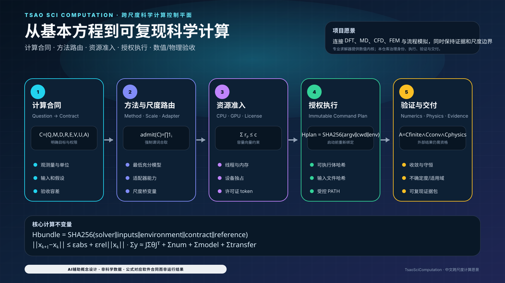

<div align="center">


# TsaoSciComputation

**从方程、求解器身份到可重复交付的证据治理型科学计算编排系统。**

     

[English](README.md) · [根 Skill](SKILL.md) · [能力索引](capability-index/README.md) · [视觉图谱](assets/visuals/README.md) · [科学验证](docs/scientific-validation.md) · [系统架构](docs/architecture.md) · [本轮交付 Prompt](docs/autonomous-software-hardening-prompt.md)

</div>

<!-- LOCALIZED_VISION_ZH:START -->
## 中文项目愿景图：从基本方程到可复现科学计算

<p align="center">
  
</p>

> 图中方程对应合同、执行身份、收敛、不确定度和验收模块；图不代表 VASP、Gaussian、GROMACS、OpenFOAM 或 Aspen 已经运行。

<!-- LOCALIZED_VISION_ZH:END -->

## 当前交付状态

当前软件基线已经达到仓库级验收与交付条件：

- **164 项能力**、**27 个外部适配器**、**20 套机器可读工作流**；
- 测试数量和实测覆盖率以待部署精确提交的完整 CI 工件为准；总覆盖率门槛保持 **95.00%**；
- Ruff、Mypy、Bandit、仓库安全扫描、受控变异、Schema、Manifest、可重复源码/Wheel、隔离安装、SBOM 与原生 C ABI 验证全部通过；
- 远端仅保留唯一权威分支 **`main`**；
- 第三方求解器真实执行仍保持 **`EXTERNAL_HOLD`**，直至提供真实二进制、许可证、固定输入、硬件指纹、参考结果与科学容差。

这一区分是刻意设计的：**软件交付已经完成，外部科学执行必须继续服从证据。**

## 仓库的真实定位

TsaoSciComputation 将科学问题转化为受治理的计算程序：

```text
问题 → 计算合同 → 方法/尺度路由 → 环境预检 → 有边界执行
     → 结果解析 → 收敛 → 数值/物理验证
     → 不确定度/适用域 → 接受、拒绝或保持待证
```

它是**控制平面与资格框架**，不是内置的 DFT、MD、CFD、FEM 或流程模拟器。Python 负责合同、路由、策略、溯源和验收；外部数值引擎必须独立安装、许可和科学资格验证。经真实剖析确认的软件热点，可通过版本化 C ABI 迁移到 C++20/OpenMP 或求解器原生加速路径。

### 明确不作出的声明

- 不伪造 VASP、Quantum ESPRESSO、Gaussian、GROMACS、OpenFOAM、Aspen 或商业软件运行结果；
- 没有可信 CPU 参考时，不声明 GPU/MPI 数值等价；
- 不把仓库本地编排 benchmark 冒充生产求解器加速比；
- 不把进程返回码等同于科学验收。

## 快速开始

```bash
git clone https://github.com/SUNHAOJUN22/TsaoSciComputation.git
cd TsaoSciComputation
python -m pip install -e '.[validation,quality,security]'

python -m tsao_computation route \
  "规划一个带显式不确定度门禁的 DFT 到 MD 界面研究"

python -m tsao_computation validate-contract \
  templates/calculation-contract.json --strict

python -m tsao_computation probe
python scripts/verify_all.py --profile all
python scripts/verify_native_core.py
```

外部执行独立进行：

```bash
python -m tsao_computation probe-solver gromacs \
  --output .tsao-computation/gromacs-capability-evidence.json

python -m tsao_computation plan-acceleration gromacs \
  --solver-evidence .tsao-computation/gromacs-capability-evidence.json \
  --require-solver-evidence
```

完整指纹最多自动达到 `version-probed-unqualified`，仍不能证明数值正确、收敛、许可证可用或加速器等价。

<!-- SUPER_SKILL_ORCHESTRATION:START -->
## 能力与执行模型

仓库提供 **164 项能力**、**23 类计算方法**、**9 类调用方式**、**7 个可信本地函数**、**27 个外部适配器**、**20 套工作流**、**13 类加速策略**和**9 阶段编排计划**。

| 调用方式 | 默认行为 |
|---|---|
| 已注册可信本地函数 | 通过载荷校验和请求/结果哈希后才可执行 |
| 外部求解器或适配器 | 仅探测并生成命令计划；执行需独立授权 |
| Python 模块、CLI、API、容器、调度器或其他 Skill | 在运行时、身份和证据条件满足前仅生成声明式交接 |

执行采用 fail-closed。相对可执行文件和输入均以规范化后的 `CommandPlan.cwd` 为基准解析。裸命令名仅按清洗后的不可变 `PATH` 解析一次，转为绝对路径、计算哈希并在启动前重新绑定；实际进程使用的目录就是已授权的规范化工作目录。
<!-- SUPER_SKILL_ORCHESTRATION:END -->

## 架构概览

<table>
<tr>
<td width="50%"></td>
<td width="50%"></td>
</tr>
<tr>
<td align="center"><strong>受治理的科学智能体</strong></td>
<td align="center"><strong>基于合同的能力系统</strong></td>
</tr>
</table>

### 控制平面、原生平面与外部引擎

| 层次 | 职责 | 验收边界 |
|---|---|---|
| Python 控制平面 | 合同、路由、证据、溯源、策略、解析器、不确定度与决策 | 仓库确定性资格验证 |
| 原生互操作平面 | 通过版本化 C ABI 进行 C++20/OpenMP 发现和已测热点计算 | ABI、构建、CTest 与等价门禁 |
| 外部求解器平面 | DFT/MD/CFD/FEM/流程模拟执行 | 真实安装、许可证、固定输入、参考值与容差证据 |

## 数理运行模型

以下公式对应仓库真实控制逻辑，而不是为了展示而堆砌，也不能代替求解器自身的控制方程。

### 1. 计算合同的约束状态表示

受治理计算可表示为

$$
\mathcal{C}=(Q,M,D,R,E,V,U,A),
$$

其中 $Q$ 为科学问题，$M$ 为方法，$D$ 为输入数据，$R$ 为资源请求，$E$ 为执行证据，$V$ 为验证规范，$U$ 为不确定度模型，$A$ 为验收权限。只有全部必要谓词成立时，路由才可准入：

$$
\operatorname{admit}(\mathcal{C})=
\mathbf{1}_{\text{Schema}}
\mathbf{1}_{\text{身份}}
\mathbf{1}_{\text{输入}}
\mathbf{1}_{\text{资源}}
\mathbf{1}_{\text{策略}}.
$$

任一项失败，准入值即为零；缺失证据不会被解释为通过。

### 2. 可重复身份绑定

执行证据包使用规范哈希绑定：

$$
H_{\text{bundle}}=
\operatorname{SHA256}(B_{\text{solver}}\parallel B_{\text{inputs}}
\parallel B_{\text{env}}\parallel B_{\text{contract}}
\parallel B_{\text{reference}}).
$$

可执行文件、输入字节、规范化环境、合同或参考证据任一变化，都会改变证据包身份。一个身份获得的授权不能静默转移给另一个身份。

### 3. 收敛与停止条件

通用迭代收敛条件为

$$
\lVert x_{k+1}-x_k\rVert
\leq \varepsilon_{\mathrm{abs}}
+\varepsilon_{\mathrm{rel}}\lVert x_k\rVert.
$$

系统明确区分：

```text
执行完成 ≠ 解析成功 ≠ 数值收敛 ≠ 验证通过 ≠ 科学接受
```

零返回码只能说明进程完成；收敛必须指定可观测量、范数和容差。

### 4. 数值等价判据

候选后端与可信参考之间的相对误差为

$$
\delta_{\mathrm{rel}}=
\frac{|y_{\mathrm{candidate}}-y_{\mathrm{reference}}|}
{\max(|y_{\mathrm{reference}}|,\epsilon)}.
$$

所有受治理可观测量均满足容差后，才可接受后端等价：

$$
\max_j\delta_{\mathrm{rel},j}\leq\tau_{\mathrm{eq}}.
$$

因此资格顺序固定为

$$
\text{身份与完整性}\rightarrow
\text{CPU 正确性}\rightarrow
\text{GPU/MPI 数值等价}\rightarrow
\text{性能资格}.
$$

### 5. 守恒与物理残差

稳态平衡残差可写为

$$
R_{\mathrm{cons}}=
\left|\sum_iF_i^{\mathrm{in}}-
\sum_jF_j^{\mathrm{out}}+S\right|,
$$

其中 $S$ 是明确声明的生成或消耗项。验收要求

$$
R_{\mathrm{cons}}\leq\tau_{\mathrm{cons}}.
$$

内部科学参考测试使用解析解、守恒律和不变量，覆盖传热、流体、反应工程、分子动力学、统计力学、静电场与多物理场。

### 6. 不确定度传播与适用域

对于 $y=f(x_1,\ldots,x_n)$，在输入不确定度相互独立的近似下，

$$
u_y^2\approx
\sum_i\left(\frac{\partial f}{\partial x_i}\right)^2u_{x_i}^2.
$$

即使 $u_y$ 很小，也不能自动接受结果；还必须满足适用域：

$$
A_{\mathrm{domain}}=
\mathbf{1}(x\in\Omega_{\mathrm{validated}})
\mathbf{1}(\text{模型假设成立}).
$$

### 7. 资源 Broker 准入

许可证、二进制、硬件、输入和策略共同决定资源准入：

$$
A_{\mathrm{resource}}=
\mathbf{1}(L)\mathbf{1}(B)\mathbf{1}(H)
\mathbf{1}(I)\mathbf{1}(P).
$$

主机容量向量 $c=(c_{\mathrm{CPU}},c_{\mathrm{GPU}},c_{\mathrm{license}})$ 与各计划声明 $r_p$ 必须满足

$$
\sum_{p\in\mathcal{P}_{\mathrm{active}}}r_p\preceq c.
$$

资源代理会拒绝 CPU 过度订阅、独占 GPU 冲突、CUDA/HIP/ROCR 可见设备不一致和许可证令牌超配。

### 统一证据摘要

结构化证据、执行绑定、加速计划和性能画像统一使用 `tsao_computation.hashing`。规范 JSON 固定键顺序与紧凑分隔符、采用 UTF-8 字节并拒绝 NaN/Infinity；文件摘要按受限分块流式计算。该收敛删除了各子系统重复的 SHA-256 编码逻辑，同时不改变既有证据 Schema。

## 资格与交付示意图

以下 AI 辅助信息设计均以确定性、仓库自持 SVG 源码交付，只说明软件逻辑，不伪造求解器输出。


<!-- V13_VISUAL_SYSTEM:START -->
仓库包含 **43 幅自包含 SVG**，统一使用 **Scientific Research Console V13**。根中英文 README 展示 **12 幅代表性示意图**；完整可检索图谱见 [`assets/visuals/README.md`](assets/visuals/README.md)，设计与信任规范见 [`assets/visuals/DESIGN_SYSTEM.md`](assets/visuals/DESIGN_SYSTEM.md)。
<!-- V13_VISUAL_SYSTEM:END -->

## 使用策略

### 策略 A：没有求解器时先完成科学规划

使用 `route`、合同校验和能力/工作流检索，形成可辩护的计算程序。输出应保持为计划或 `EXTERNAL_HOLD`，不得虚构运行证据。

### 策略 B：接入外部求解器

准备最小证据包：

```text
qualification-bundle/
├── solver-identity.json        # 路径、大小、SHA-256、版本输出
├── environment.json            # OS、运行时、库、调度器、设备
├── inputs/                     # 固定规范输入
├── references/                 # 可信 CPU 或解析参考
├── tolerances.json             # 针对可观测量的数值容差
├── license-evidence.json       # 许可证可用性与授权边界
└── provenance.json             # 证据包哈希与复核权限
```

随后依次验证身份、正确性、等价性和性能。

### 策略 C：边缘计算部署

- 预打包注册表、Schema、模板、视觉资产与文档；
- 除非边缘加速器已明确指纹化，否则采用 CPU-only；
- 限制 worker 和内存，优先使用确定性本地函数与声明式交接；
- 仅把哈希绑定的证据包转移到大型求解器主机。

### 策略 D：共享 HPC 部署

- 将不可变计划声明映射到调度器 CPU/GPU/许可证请求；
- 分离 scratch、checkpoint 与最终证据目录；
- 将调度器元数据、可执行文件身份和环境绑定到 provenance；
- 只重试已分类的暂态基础设施故障，不能把不收敛解释为机器故障。

### 策略 E：加速计算

1. 先盘点代码并剖析真实工作负载；
2. 区分编排开销与数值核开销；
3. 优先采用求解器原生并行和成熟库，再考虑自定义 kernel；
4. 建立 CPU 正确性与确定性参考；
5. 按声明的可观测量和容差证明 GPU/MPI 等价；
6. 在同一已资格问题上测量性能，并报告测量不确定度。

### 策略 F：验收与审计

每一项声明都应表达为

$$
\text{声明}=(\text{可观测量},\text{参考},\text{容差},
\text{证据},\text{权限}).
$$

任一元素缺失，都应降低声明等级或继续保持待证。

## 多尺度科学计算视觉图谱


## 加速计算与原生互操作

Python 保持为控制平面。只有当真实剖析证明收益显著、且边界可以独立测试时，热点才应迁移到 C++/OpenMP/CUDA。


```bash
python scripts/build_acceleration_audits.py
python -m tsao_computation audit-acceleration \
  --root . --scope production --limit 50 --min-score 40 \
  --output reports/ACCELERATION_OPPORTUNITIES_PRODUCTION_V4.json
python -m tsao_computation profile-performance \
  --workload routing-hot --workload acceleration-plan \
  --repeats 7 --warmups 1 \
  --output .tsao-computation/performance-profile.json
```

<!-- ACCELERATION_AUDIT_SUMMARY:START -->
源码数量与摘要以自动生成的[生产审计](reports/ACCELERATION_OPPORTUNITIES_PRODUCTION_V4.json)和[全树审计](reports/ACCELERATION_OPPORTUNITIES_FULL_TREE_V4.json)为准。未完成实测剖析的代码不构成外部求解器或 GPU 加速证据。
<!-- ACCELERATION_AUDIT_SUMMARY:END -->

架构、CUDA-X 选型与 C++ 迁移门禁见 [`docs/accelerated-native-backend.md`](docs/accelerated-native-backend.md)。原生验证命令：`python scripts/verify_native_core.py`。

## 验证与验收证据

```bash
python -m pip install -e '.[validation,quality,security]'
python scripts/verify_all.py --profile all
python scripts/verify_native_core.py
python scripts/verify_all.py --profile benchmark
```

`all` 覆盖质量、lint、format、类型、安全、测试、覆盖率、受控变异、科学参考夹具、Schema/注册表、生成文件一致性、可重复源码/Wheel、隔离安装、SBOM、校验和与发布清单。`benchmark` 仅提供环境相关的编排遥测，不是外部求解器性能证据。

<!-- CURRENT_MAIN_VERIFICATION:START -->
### 精确提交的软件资格

| 元数据 | 数值 |
|---|---|
| 版本 | 3.0.4 |

以永久 [CI 工作流](.github/workflows/ci.yml) 对待部署 SHA 的结果及工件为准。`reports/` 中的历史报告只是对应版本的快照，不能为新提交提供证明。完整 pytest、95% 总覆盖率门槛、关键模块覆盖率、生成文件校验、Ruff、mypy、Bandit、变异探针、源码包/Wheel 可重复构建、原生 C ABI 和平台矩阵仍是必要门禁。单一合同测试或前一提交的成功结果不能替代完整验证链。
<!-- CURRENT_MAIN_VERIFICATION:END -->

### 外部批准合同

`software_ready` 汇总调用记录声明的完成、解析、收敛、物理验证、不确定度、适用性与证据绑定状态，不等于独立科学批准。

`accepted` 还要求合法的制品 SHA-256，以及使用记录外部可信密钥验证、处于有效期内的 HMAC-SHA256 鉴证。接受门要求作用域为 `scientific-result-acceptance`，角色为 `independent-domain-reviewer`，批准者与请求者标识不同；可信密钥配置及真实身份解析由部署方独立完成。

非法 JSON 载荷、非有限值、循环引用及序列化失败返回结构化拒绝原因。无效签名或不匹配的作用域、角色不会抢占 nonce 并阻止后续有效审批。重复有效审批仅在**单次决策内**去重，不代表已实现跨请求防重放数据库、密钥撤销服务或机构身份认证。需要这些控制的系统必须外部提供；对同一制品在批准有效期内重复验证是允许的。

专项回归命令：

```bash
python -m pytest -q tests/test_approval_attestation_boundaries.py tests/test_validation_fail_closed.py
```


## 信任边界

| 状态 | 含义 |
|---|---|
| `candidate-only` | 注册表候选，尚未检测到可执行文件 |
| `detected-incomplete` | 已检测，但必要证据不完整 |
| `fingerprinted-unqualified` | 已记录精确二进制身份，尚无数值资格 |
| `version-probed-unqualified` | 已记录受限版本输出，仍未科学资格验证 |
| `evidence-bound-unqualified` | 证据已绑定进计划，正确性/等价性仍待验证 |
| `EXTERNAL_HOLD` | 缺少必要的外部事实或证据 |

## 平台与仓库策略

- Windows 是核心支持流程，Linux 已通过 CI 验证；
- `main` 是唯一权威远端分支；
- 仓库不打包外部求解器、商业许可证或私有数据集；
- 发布物包含可重复制品、SPDX/CycloneDX SBOM、SHA-256 校验和与 provenance。

## 许可证与引用

采用 MIT 许可证。引用元数据见 [`CITATION.cff`](CITATION.cff)，第三方边界见 [`THIRD_PARTY.md`](THIRD_PARTY.md)。

<!-- CURRENT_MAIN_ACCEPTANCE_V2:START -->
## 当前 `main`：代码—数学—证据闭环

<p align="center"></p>

> 本节由仓库脚本根据当前代码合同生成；图像是文档概念设计，不是求解器或实验结果。

### 核心数理合同

$$
admit(C) = 1_schema · 1_identity · 1_inputs · 1_resources · 1_policy
$$

$$
H_bundle = SHA256(B_solver ∥ B_inputs ∥ B_env ∥ B_contract ∥ B_reference)
$$

$$
δ_rel = |y − y_ref| / max(|y_ref|, ε) ≤ τ_eq
$$

### 使用策略

1. 先运行永久 CI，再运行 current-main 精确树验收。
2. 数值、容差和不确定度入口必须是有限实数，Boolean 不得充当 0/1。
3. 执行身份、输入、环境、参考与合同共同进入证据哈希。
4. 任何新提交都会使旧 SHA 的六小时证据失效。

> **责任边界：** 仓库是计算控制面与资格框架；第三方 DFT、MD、CFD、FEM 和流程求解器保持 EXTERNAL_HOLD。

执行提示词：[SIX_REPOSITORY_PARALLEL_6H_ACCEPTANCE_PROMPT_V2.md](docs/SIX_REPOSITORY_PARALLEL_6H_ACCEPTANCE_PROMPT_V2.md)
<!-- CURRENT_MAIN_ACCEPTANCE_V2:END -->
