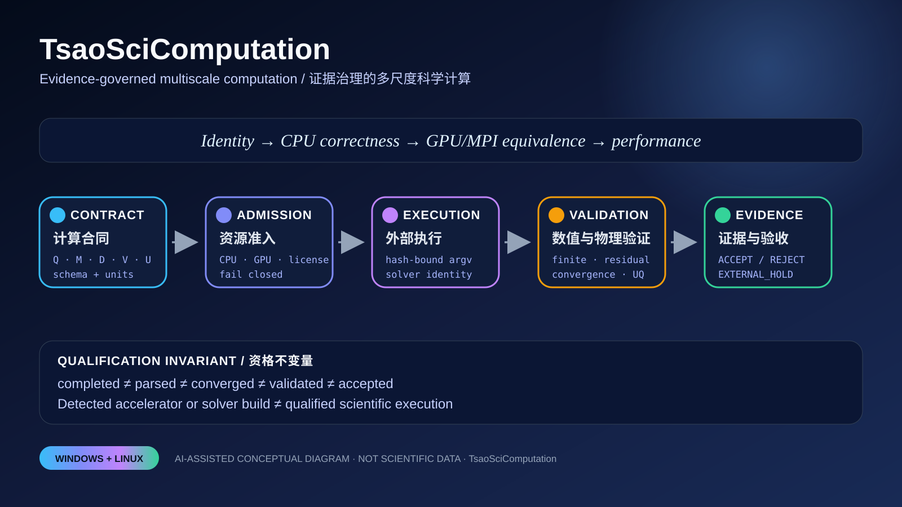

# TsaoSciComputation — Final Acceptance / 最终验收说明

> **Software boundary / 软件边界：** this repository is a scientific-computation control plane. It qualifies contracts, routing, resource admission, execution identity, validation, uncertainty and reproducible delivery. It does not claim a real DFT/MD/CFD/FEM/process calculation unless an external executable, license, fixed input, accepted reference and run evidence are supplied. External status remains `EXTERNAL_HOLD`.



## 中文：最终交付定位

TsaoSciComputation 把科研问题转换为受约束的计算程序：

```text
question → calculation contract → method/scale route → preflight
         → resource admission → authorized execution → parse/convergence
         → numerical and physical validation → uncertainty/applicability
         → ACCEPT / REJECT / EXTERNAL_HOLD
```

Python 负责控制、证据和验收；外部专业求解器负责其自身的数值内核。仓库不重复实现 VASP、Quantum ESPRESSO、Gaussian、GROMACS、OpenFOAM 或 Aspen 的主体求解器。

### 1. 计算合同

一个受治理的计算状态表示为

\[
\mathcal C=(Q,M,D,R,E,V,U,A),
\]

其中 \(Q\) 为科学问题，\(M\) 为方法，\(D\) 为输入数据，\(R\) 为资源请求，\(E\) 为执行证据，\(V\) 为验证合同，\(U\) 为不确定度，\(A\) 为验收权限。

路由准入采用合取逻辑：

\[
\operatorname{admit}(\mathcal C)=
\mathbf 1_{schema}\mathbf 1_{identity}\mathbf 1_{inputs}
\mathbf 1_{resources}\mathbf 1_{policy}.
\]

任何强制谓词为零，执行即保持关闭；缺失证据不能自动解释为成功。

### 2. 不可变执行身份

执行计划、程序、输入、环境和参考证据形成规范化哈希：

\[
H_{bundle}=\operatorname{SHA256}(
B_{solver}\Vert B_{inputs}\Vert B_{env}\Vert
B_{contract}\Vert B_{reference}).
\]

授权只适用于同一个哈希绑定计划。程序字节、输入文件、工作目录、环境或适配器身份改变后必须重新授权。

### 3. 收敛、有限值和物理验证

迭代算法的通用停止条件为

\[
\lVert x_{k+1}-x_k\rVert
\le \varepsilon_{abs}+\varepsilon_{rel}\lVert x_k\rVert.
\]

仓库固定区分：

```text
process completed ≠ output parsed ≠ numerically converged
                  ≠ physically validated ≠ scientifically accepted
```

候选后端与可信参考的相对误差为

\[
\delta_j=\frac{|y_j^{candidate}-y_j^{reference}|}
{\max(|y_j^{reference}|,\epsilon)},
\qquad \max_j\delta_j\le\tau_{eq}.
\]

守恒残差示例：

\[
R_{cons}=\left|\sum_iF_i^{in}-\sum_jF_j^{out}+S\right|,
\qquad R_{cons}\le\tau_{cons}.
\]

### 4. 资源与并发

主机容量向量记为

\[
c=(c_{CPU},c_{GPU},c_{license}),
\]

并发计划集合可行当且仅当

\[
\sum_{p\in\mathcal P_{active}}r_p\preceq c.
\]

GPU 索引为独占资源；商业许可证采用具名 token；CPU 线程必须同时约束 `OMP_NUM_THREADS`、`MKL_NUM_THREADS`、`OPENBLAS_NUM_THREADS`、`NUMEXPR_NUM_THREADS` 等环境，避免外层并发与求解器内部并行叠加造成 oversubscription。

推荐执行次序：

\[
\text{Identity}\rightarrow\text{CPU correctness}\rightarrow
\text{GPU/MPI equivalence}\rightarrow\text{performance qualification}.
\]

检测到 GPU、CUDA Runtime 或 Python 模块只表示 `detected`，不表示 `qualified`。

### 5. 不确定度和适用域

独立输入的一阶传播为

\[
u_y^2\approx\sum_i\left(\frac{\partial f}{\partial x_i}\right)^2u_{x_i}^2.
\]

决策观测量还必须包含数值、采样、模型形式和尺度迁移项：

\[
\Sigma_y\approx J\Sigma_\theta J^\mathsf T+
\Sigma_{num}+\Sigma_{sample}+\Sigma_{model}+\Sigma_{transfer}.
\]

适用域谓词为

\[
A_{domain}=\mathbf 1(x\in\Omega_{validated})
\mathbf 1(\text{assumptions hold}).
\]

不确定度小但处于域外，不构成可接受结果。

### 6. 性能工程策略

优化必须先回答“热点是否在控制面”。控制面通常由 JSON、Schema、路由、文件扫描、哈希和进程编排组成；这些路径优先采用缓存、增量清单、流式 I/O、减少目录遍历和有界任务并发。只有 profiling 证明的窄数值热点才进入 C++20/OpenMP、Kokkos、CUDA/HIP/SYCL 候选。

稳健加速比：

\[
S=\frac{\operatorname{median}(t_{reference})}
{\operatorname{median}(t_{candidate})},
\qquad n_{repeat}\ge3.
\]

必须同时报告端到端时间、启动、数据传输、峰值内存、硬件/驱动、精度、重复次数和离散度；不得只发布最快一次。

### 7. 使用策略

```bash
python -m pip install -e '.[validation,quality,security]'
python scripts/final_acceptance_preflight.py --root . --json
python scripts/verify_all.py --profile all
python scripts/verify_native_core.py

python -m tsao_computation route \
  "Plan a DFT-to-MD interface study with explicit uncertainty gates"

python -m tsao_computation validate-contract \
  templates/calculation-contract.json --strict

python -m tsao_computation probe-solver gromacs \
  --output .tsao-computation/gromacs-capability-evidence.json

python -m tsao_computation plan-acceleration gromacs \
  --solver-evidence .tsao-computation/gromacs-capability-evidence.json \
  --require-solver-evidence
```

外部命令必须通过哈希绑定的 `authorize_plan`/`run_plan` 路径执行；直接 `safe_run` 保持拒绝。

### 8. 验收状态

- `PASS`：仓库的软件合同、测试、构建、包和证据面通过。
- `BLOCK`：Schema、有限值、身份、资源、文件或文档合同存在阻断。
- `EXTERNAL_HOLD`：真实外部求解器、许可证、固定问题、参考结果、容差或目标硬件证据不足。

---

## English: acceptance and operating contract

TsaoSciComputation is an evidence-bound control plane around professional scientific engines. Windows and Linux are the qualified delivery platforms. The control plane may plan, authorize, launch and validate an external command only when its immutable identity and resources are bound; it never promotes process completion to scientific acceptance.

### Acceptance invariant

\[
\mathcal A=C_{schema}\land C_{identity}\land C_{finite}
\land C_{convergence}\land C_{physics}\land C_{evidence}.
\]

The weakest mandatory gate controls the result. Backend detection is not numerical qualification, and numerical equivalence is required before performance qualification.

### Recommended workflow

1. Define decision-critical observables, units and tolerances.
2. Freeze the calculation contract and input identity.
3. Probe the exact solver executable and record its SHA-256 and version evidence.
4. Establish a deterministic CPU or analytical reference.
5. Bind CPU/GPU/license claims and thread environments.
6. Execute only an explicitly authorized plan.
7. Parse finite observables and convergence evidence.
8. Apply numerical, conservation, applicability and uncertainty gates.
9. Benchmark only the accepted identical problem.
10. Publish source, environment, result and authority hashes together.

## AI visual declaration / AI 图像声明

`docs/assets/acceptance/final-acceptance-map.svg` is an AI-assisted conceptual information design derived from the repository architecture. It is not solver output, measured scientific data, a performance result or proof that an external calculation ran.
