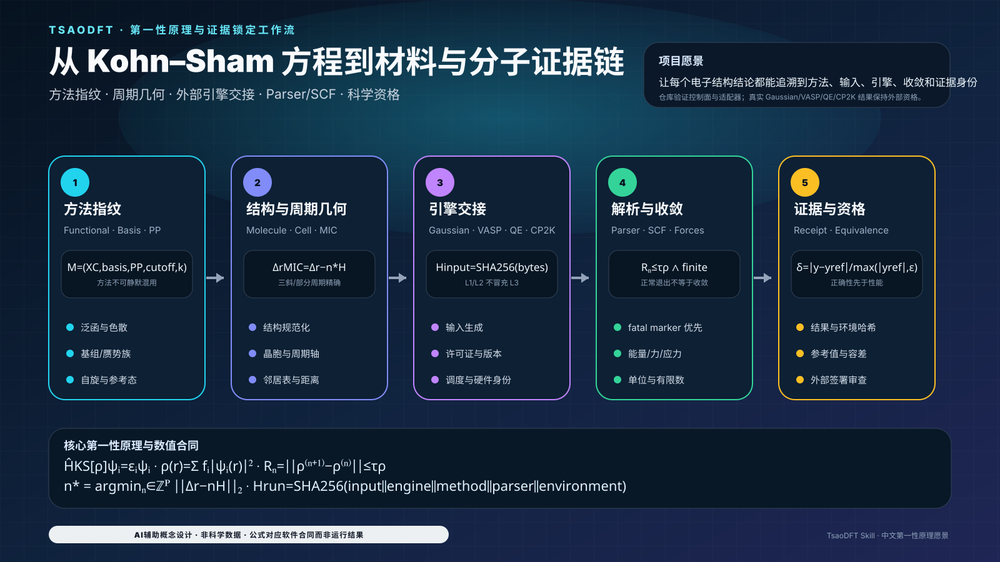

# TsaoDFT Skill

<p align="center">
  <strong>面向分子与周期体系的 DFT-first、数学化、证据锁定、可审计科研操作系统</strong><br>
  Python 科学控制面 + 可验证数值内核 + 外部专业引擎 + 机器可读资格边界
</p>

<p align="center">
  <a href="README.md">中文</a> · <a href="README_EN.md">English</a>
</p>

<p align="center">
  <a href="https://github.com/SUNHAOJUN22/TsaoDFT_skill/actions/workflows/ci.yml"></a>
  
  
  
  
  
  
</p>

> **AI图像声明｜AI-GENERATED CONCEPTUAL ILLUSTRATION：** 唯一 AI 封面与 AI-assisted SVG 只表达系统结构、数理合同和使用策略。分子、晶格、轨道、能带、势能面、服务器与界面都不是 Gaussian、VASP、Quantum ESPRESSO、CP2K、Multiwfn、VMD 或实验产生的数据。所有技术图均标注 `SYNTHETIC DEMO · NOT SCIENTIFIC DATA`；定量结论只能来自通过验收的输入、输出、Parser、哈希与机器证据。

<!-- LOCALIZED_VISION_ZH:START -->
## 中文项目愿景图：从 Kohn–Sham 方程到材料与分子证据链

<p align="center">
  
</p>

> 图中公式用于解释代码中的方法身份、周期几何、Parser、SCF 与证据门；图不是电子密度、能带、轨道或真实 DFT 计算结果。

<!-- LOCALIZED_VISION_ZH:END -->

<p align="center">
  
</p>

## 验收状态与修改规范

- 仓库软件、Schema、文档和永久 CI：`SOFTWARE_ACCEPTANCE_READY`；
- Gaussian、VASP、QE、CP2K 的真实正确性与性能：`EXTERNAL_HOLD`；
- 机器验收：`python scripts/build_release_acceptance.py --out release-acceptance.json --json`；
- 本轮自动改造 Prompt：[`docs/ACCEPTANCE_REWRITE_PROMPT.md`](docs/ACCEPTANCE_REWRITE_PROMPT.md)；
- 加速最高原则：[`docs/ACCELERATION_ENGINEERING_DOCTRINE.md`](docs/ACCELERATION_ENGINEERING_DOCTRINE.md)。

```bash
python scripts/capture_compute_contract_evidence.py --out compute-contract-evidence.json --json
python scripts/build_release_acceptance.py --out release-acceptance.json --json
python scripts/quality_gate.py
```

## 最高工程原则

1. **Python 是科学控制面。** 它负责工作流、Schema、方法指纹、调度、Parser、证据与报告，不应被整体 C++ 重写。
2. **专业 DFT 核心保持外部边界。** FFT、对角化、积分、SCF、MPI/OpenMP/GPU 内核由版本化的 Gaussian/VASP/QE/CP2K 构建承担。
3. **只迁移被 profiling 证明的窄热点。** CPU reference → NumPy/算法 → 可选 C++/OpenMP → 可选 CUDA/HIP/SYCL。
4. **任何新后端必须保留确定性参考、严格有限数值、失败回退和等价门。**
5. **技术感知不等于真实执行。** CUDA-X aware、GPU detected、job generated 都不是 speedup evidence。
6. **正确性资格先于性能资格。** 没有固定输入、真实引擎、许可证、build/site/run/hardware、科学容差与重复运行，就不得发布性能比。

<p align="center">
  
</p>

## 能力等级不是宣传标签

公开能力使用四级证据合同：

- `L0_REFERENCE`：参考资料、模板或方法说明；不宣称存在可执行适配器。
- `L1_HANDOFF`：生成结构化交接物，但执行与科学验收仍由下游工具完成。
- `L2_VALIDATED_ADAPTER`：适配器、Schema、严格输入边界和回归测试已经验证；它不等于已在真实授权专业软件、许可证和目标硬件上完成执行。
- `L3_EXECUTION_TESTED`：必须绑定真实 `engine/version/site/run_id` 与不可变 artifact SHA-256。HPC 或加速 L3 还必须绑定 build/hardware identity、CPU reference、至少三次重复、数值等价、Parser 验收、性能政策、内容寻址 evidence root 和独立签名审查。

当前仓库的 neighbor-list、mmap Parser、合同 validator 和 release acceptance 是永久门验证过的软件工件；它们不会自动把外部 Gaussian、VASP、QE 或 CP2K 提升为 `L3_EXECUTION_TESTED`。

## 数理核心：公式如何映射到代码合同

这些公式用于解释工作流、校验项和证据边界；它们不是仓库已经执行出的科学结果。

### 1. Kohn–Sham 方程与电子密度

$$
\hat H_{\mathrm{KS}}[\rho]\,\psi_i(\mathbf r)=\varepsilon_i\psi_i(\mathbf r),
\qquad
\rho(\mathbf r)=\sum_i f_i\lvert\psi_i(\mathbf r)\rvert^2.
$$

仓库对应策略：

- `method_fingerprint_id` 固定泛函、基组/赝势、色散、相对论、截断能与收敛参数；
- `observable_set` 明确能量、力、应力和附加性质；
- 不同引擎、不同赝势族或不同标准态不得静默合并。

### 2. 总能量泛函与自洽场固定点

$$
E[\rho]=T_s[\rho]+\int v_{\mathrm{ext}}(\mathbf r)\rho(\mathbf r)\,d\mathbf r
+E_H[\rho]+E_{\mathrm{xc}}[\rho]+E_{\mathrm{II}},
$$

$$
\rho^{(n+1)}=\mathcal F[\rho^{(n)}],
\qquad
R_n=\left\|\rho^{(n+1)}-\rho^{(n)}\right\|,
\qquad
R_n\le \tau_\rho.
$$

代码合同要求 `parser_accepted=true`、正常退出、收敛标志成立且所有数值有限；仅出现“正常结束字符串”不能覆盖后出现的 fatal marker。

### 3. 力、应力与几何验收

$$
\mathbf F_I=-\frac{\partial E}{\partial \mathbf R_I},
\qquad
\sigma_{\alpha\beta}=\frac{1}{\Omega}\frac{\partial E}{\partial\epsilon_{\alpha\beta}}.
$$

使用策略：优化任务必须同时检查梯度、位移、频率或约束条件；过渡态不能仅凭优化收敛，必须结合一个虚频、IRC 或等价反应路径证据。

### 4. 周期体系、平面波与 Brillouin 区积分

$$
A=\frac{1}{\Omega_{\mathrm{BZ}}}\int_{\mathrm{BZ}}A(\mathbf k)\,d\mathbf k
\approx \sum_{\mathbf k}w_{\mathbf k}A(\mathbf k),
$$

$$
\frac{\lvert\mathbf k+\mathbf G\rvert^2}{2}\le E_{\mathrm{cut}}.
$$

策略上必须保持 k 点、截断能、smearing、赝势、磁性与超胞身份可追踪；能带/DOS 与总能量收敛应分别验收。

### 5. 周期 minimum-image 与 cell-list

代码采用 NumPy **行向量**约定：晶格基矢是 $\mathbf H$ 的行，笛卡尔位移满足 $\Delta\mathbf r=\Delta\mathbf s\mathbf H$。对任意三斜胞，逐分量 `round()` 只在正交盒等特殊情形保证最近周期像；通用定义必须在启用周期轴集合 $\mathcal P$ 上求最近格点：

$$
\mathbf n^\star=
\operatorname*{arg\,min}_{\mathbf n\in\mathbb Z_{\mathcal P}}
\left\|\Delta\mathbf r-\mathbf n\mathbf H\right\|_2,
\qquad
\Delta\mathbf r_{\mathrm{MIC}}
=\Delta\mathbf r-\mathbf n^\star\mathbf H.
$$

对于正交盒，上式退化为快速路径：

$$
\Delta\mathbf s_{\mathrm{MIC}}
=\Delta\mathbf s-\operatorname{round}_{\mathcal P}(\Delta\mathbf s),
\qquad
\Delta\mathbf r_{\mathrm{MIC}}
=\Delta\mathbf s_{\mathrm{MIC}}\mathbf H,
\qquad
d_{ij}=\lVert\Delta\mathbf r_{\mathrm{MIC}}\rVert_2.
$$

`neighbor_list.py` 对倾斜晶胞使用有界最近格点枚举，并以 `MAX_MINIMUM_IMAGE_CANDIDATES` 对病态晶胞实施资源上限；超过上限时失败关闭，而不是退回可能错误的逐分量舍入。全对参考复杂度为 $O(N^2)$；有限密度和固定 cutoff 下，cell-list 的平均候选复杂度接近：

$$
O\!\left(N+N\,\bar n_{\mathrm{cell}}\right),
$$

其中 $\bar n_{\mathrm{cell}}$ 是局部相邻网格候选数。`reference`、`numpy`、`cell-list` 必须返回相同、确定性排序的 pair 集合。

### 6. 数值等价、容差与性能资格

$$
\lvert x-x_{\mathrm{ref}}\rvert
\le a_{\mathrm{tol}}+r_{\mathrm{tol}}\lvert x_{\mathrm{ref}}\rvert,
$$

$$
S=\frac{\operatorname{median}(t_{\mathrm{reference}})}
        {\operatorname{median}(t_{\mathrm{candidate}})},
\qquad n_{\mathrm{repeat}}\ge 3.
$$

只有 input/method/build/hardware/site 身份稳定、run_id 唯一、Parser 接受、artifact 全部 `VERIFIED`、科学量等价后，$S$ 才允许进入 scoped review。否则保持 `EXTERNAL_HOLD`。

### 7. 反应动力学与详细平衡

$$
k(T)=\kappa\frac{k_{\mathrm B}T}{h}\exp\!\left(-\frac{\Delta G^\ddagger}{RT}\right),
$$

$$
\frac{k_f}{k_r}=\exp\!\left(-\frac{\Delta G_{\mathrm{rxn}}}{RT}\right).
$$

`tsao-dft-kinetics-multiscale` 只消费标准态、热化学和路径身份已通过校验的数据；不同标准态或未校正自由能不得直接拼接。

### 8. ML 不确定度与 OOD 门

对 ensemble 预测 $\{\hat y_m(\mathbf x)\}$：

$$
\bar y(\mathbf x)=\frac1M\sum_{m=1}^M\hat y_m(\mathbf x),
\qquad
u^2(\mathbf x)=\frac1{M-1}\sum_{m=1}^M\left(\hat y_m-\bar y\right)^2.
$$

当 $u(\mathbf x)>u_{\max}$ 或 OOD score 超阈值时，必须回退到远程真实 DFT，而不是继续输出高置信度伪结果。

<p align="center">
  
</p>

<p align="center">
  
</p>

## 八个 Skills，一条证据链

| Skill | 主要职责 | 验收边界 |
|---|---|---|
| [`tsao-dft-suite`](skills/tsao-dft-suite/) | DFT-first 总入口、DAG、审批和跨 Skill 路由 | 只协调，不替代引擎科学判断 |
| [`tsao-structure-prep`](skills/tsao-structure-prep/) | 分子、晶体、表面、缺陷、吸附、原子映射、邻居搜索 | 不静默决定电荷、自旋、氧化态、终止面或质子化 |
| [`tsao-dft-researcher`](skills/tsao-dft-researcher/) | Gaussian DFT/TDDFT、Opt/Freq、TS/IRC、热化学、NMR、Multiwfn、VMD | 用户提供真实程序、许可证和执行环境 |
| [`tsao-periodic-dft-materials`](skills/tsao-periodic-dft-materials/) | VASP、QE、CP2K、表面/缺陷、能带/DOS、NEB、收敛 | 不混用不兼容能量和赝势身份 |
| [`tsao-dft-ml-active-learning`](skills/tsao-dft-ml-active-learning/) | 标签审计、数据泄漏、适用域、不确定度、主动学习 | 高分数不等于机理或因果证据 |
| [`tsao-dft-kinetics-multiscale`](skills/tsao-dft-kinetics-multiscale/) | Eyring/TST、反应网络、详细平衡、误差传播 | 只消费验收过的标准态与热化学数据 |
| [`tsao-dft-hpc-provenance`](skills/tsao-dft-hpc-provenance/) | Windows/POSIX、Slurm/PBS、硬件盘点、Parser、benchmark、签名证据 | GPU 分配或最快单次不是真实 speedup |
| [`tsao-dft-catalysis-profile`](skills/tsao-dft-catalysis-profile/) | 催化与聚合物专用 Profile | 不自动外推到无关体系 |

## 可执行使用策略

### 策略 A：结构准备与邻居搜索

```bash
python skills/tsao-structure-prep/scripts/inspect_xyz.py structure.xyz \
  --backend reference --json
python skills/tsao-structure-prep/scripts/inspect_xyz.py structure.xyz \
  --backend numpy --json
python skills/tsao-structure-prep/scripts/inspect_xyz.py periodic.xyz \
  --backend cell-list --periodic xyz \
  --box 10 0 0 0 10 0 0 0 10 --json
```

先用 `reference` 建立小体系真值，再用 `numpy`/`cell-list` 做等价和候选缩减；`evaluated_pair_count` 不是 DFT speedup。

### 策略 B：统一 Parser 与工件哈希

```bash
python skills/tsao-dft-hpc-provenance/scripts/engine_parser_contract.py \
  --engine gaussian --input job.log --json
python skills/tsao-dft-hpc-provenance/scripts/engine_parser_contract.py \
  --engine vasp --input OUTCAR --json
```

Parser 使用只读 mmap、bounded scan 和映射工件 SHA-256；fatal marker 优先级高于较早的成功标记。

### 策略 C：Gaussian 分子工作流

1. 锁定电荷、多重度、溶剂、泛函、基组、色散与积分网格；
2. Preflight 后再执行 Opt/Freq；
3. 极小值要求无虚频，TS 通常要求一个目标虚频并由 IRC/路径证据支持；
4. 波函数/ESP/Multiwfn/VMD 图件必须保留源工件哈希。

### 策略 D：VASP / QE / CP2K 周期工作流

1. 先做 cutoff、k 点、smearing、磁性、超胞和赝势收敛；
2. 再执行结构、能带/DOS、缺陷、表面、NEB 或声子；
3. GPU 路线只接受对应版本的官方 GPU 构建与完整 build/hardware/site/run identity；
4. 不同 engine/build/site 不得合并成一个 speedup campaign。

### 策略 E：HPC 与 Windows/Linux

```bash
python skills/tsao-dft-hpc-provenance/scripts/generate_job_script.py \
  --shell bash --scheduler slurm --json
pwsh -NoProfile -File .\scripts\quality_gate.ps1
```

外部程序一律通过 structured argv、版本化 JSON、输入/输出文件、return code 和 content hash 交接，不拼接不受控 shell 字符串。

### 策略 F：资格证据

```bash
python scripts/validate_benchmark_contract.py --json
python scripts/validate_compute_qualification.py --json
python scripts/capture_compute_contract_evidence.py --out compute-contract-evidence.json --json
python scripts/build_release_acceptance.py --out release-acceptance.json --json
```

<p align="center">
  
</p>

<p align="center">
  
</p>

## 已实现的软件加速层

| 层 | 状态 | 实现 | 非主张 |
|---|---|---|---|
| Python 科学控制面 | 已实现 | Schema、DAG、argv、Parser、evidence | 不是电子结构数值核 |
| CPU reference | 已实现 | 标量、NumPy、BLAS/LAPACK | 不自动等于最优性能 |
| neighbor-list | 已实现 | reference / NumPy / cell-list | 不构成外部 DFT speedup |
| mmap Parser | 已实现 | read-only mmap、bytes regex、SHA-256 | 不加速 SCF/FFT/对角化 |
| C++/OpenMP sidecar | 未建立 | profile-gated | 不得写成已完成 |
| CUDA/HIP/SYCL | 未建立 | optional device plugins | 不得因 GPU 存在自动启用 |
| 外部引擎性能 | `EXTERNAL_HOLD` | 官方 engine GPU/MPI build | 未发布加速比 |

<p align="center">
  
</p>

<table>
<tr>
<td width="50%"></td>
<td width="50%"></td>
</tr>
<tr>
<td></td>
<td></td>
</tr>
</table>

## Windows、Linux 与外部引擎边界

- VASP：只认可对应版本的官方 OpenACC/GPU 构建、CUDA-aware MPI、GPU/rank 绑定与 build fingerprint；
- Quantum ESPRESSO：记录版本、编译器、GPU 支持、MPI、pool/task-group 与对角化路径；
- CP2K：记录官方 CUDA/HIP/OpenCL 构建能力和真实执行身份；
- Gaussian：仓库负责预检、Parser、批处理与证据，除非产品明确支持，否则不声称电子结构核心加速。

<p align="center">
  
</p>

## ML、动力学与边缘闭环

```text
结构与条件
→ 已验收 surrogate
→ uncertainty / OOD gate
→ 安全域内推理
→ 域外远程真实 DFT
→ 结果回流受治理数据集
```

<table>
<tr>
<td width="50%"></td>
<td width="50%"></td>
</tr>
<tr>
<td></td>
<td></td>
</tr>
</table>

## 科研图件治理

下列图件均为合成示意，不是生产计算结果：

<table>
<tr>
<td width="50%"></td>
<td width="50%"></td>
</tr>
</table>

视觉规范见 [`docs/README_VISUAL_DESIGN_SYSTEM.md`](docs/README_VISUAL_DESIGN_SYSTEM.md)，AI 图治理见 [`docs/AI_IMAGE_GOVERNANCE.md`](docs/AI_IMAGE_GOVERNANCE.md)。

## 安装、验证与验收

```bash
python scripts/install.py --agent codex --scope project --skill all --dry-run --validate
python scripts/validate_readme_math.py --json
python scripts/quality_gate.py
```

PowerShell：

```powershell
pwsh -NoProfile -File .\scripts\quality_gate.ps1
```

永久 CI 必须通过：Python 3.10、3.12、3.13、Windows PowerShell、dependency audit + CycloneDX SBOM、CodeQL、29/29 repository quality stages、630 tests / 9 suites。

当前软件基线证明仓库工件通过测试；它不证明外部 DFT 引擎已经运行或获得加速。外部资格继续为 `EXTERNAL_HOLD`。

---

**TsaoDFT 的目标不是让每个文件看起来更底层，而是让每个公式、参数、计算、图件、性能结论和工程迁移都有可复核的证据边界。**

<!-- CURRENT_MAIN_ACCEPTANCE_V2:START -->
## 当前 `main`：代码—数学—证据闭环

<p align="center"></p>

> 该图由当前代码合同生成，是概念设计，不是电子结构运行数据。

### 核心数理合同

$$
[-½∇² + V_eff[n]] ψᵢ = εᵢ ψᵢ
$$

$$
n* = argminₙ ‖A(s − n)‖₂
$$

$$
|ΔE| ≤ τ_E ∧ maxᵢ ‖ΔFᵢ‖₂ ≤ τ_F
$$

### 使用策略

1. 先冻结结构、晶胞、周期性和单位，再生成引擎输入。
2. SCF、能量、力和应力只有在有限、收敛且方法身份完整时才可验收。
3. 探测、模板与解析器结果不得升级为真实 DFT 计算证据。
4. 任何新提交都会使旧 SHA 的六小时软件证据失效。

> **责任边界：** 软件门禁只验证控制面、参考数值与证据合同；Gaussian、VASP、QE、CP2K 等外部引擎未在此自动执行，保持 EXTERNAL_HOLD。

执行提示词: [SIX_REPOSITORY_PARALLEL_6H_ACCEPTANCE_PROMPT_V2.md](docs/SIX_REPOSITORY_PARALLEL_6H_ACCEPTANCE_PROMPT_V2.md)
<!-- CURRENT_MAIN_ACCEPTANCE_V2:END -->
