# TsaoDFT Skill

<p align="center">
  <strong>A DFT-first, mathematical, evidence-locked and auditable research operating system for molecular and periodic systems</strong><br>
  Python scientific control plane + verifiable numerical cores + professional external engines + machine-readable qualification boundaries
</p>

<p align="center">
  <a href="README.md">中文</a> · <a href="README_EN.md">English</a>
</p>

<p align="center">
  <a href="https://github.com/SUNHAOJUN22/TsaoDFT_skill/actions/workflows/ci.yml"></a>
  
  
  
  
  
  
</p>

> **AI image declaration | AI-GENERATED CONCEPTUAL ILLUSTRATION:** The governed AI cover and AI-assisted SVGs communicate system architecture, mathematical contracts and usage strategy only. Molecules, lattices, orbitals, bands, energy surfaces, servers and interfaces are not data produced by Gaussian, VASP, Quantum ESPRESSO, CP2K, Multiwfn, VMD or experiments. Every technical figure is labelled `SYNTHETIC DEMO · NOT SCIENTIFIC DATA`; quantitative claims must come from accepted inputs, outputs, parsers, hashes and machine evidence.

<!-- LOCALIZED_VISION_EN:START -->
## Project vision: from Kohn–Sham equations to molecular and materials evidence

<p align="center">
  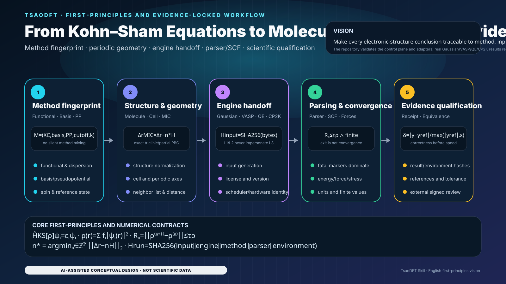
</p>

> The equations explain method identity, periodic geometry, parsing, SCF and evidence gates in the code. The figure is not electron density, a band structure, an orbital or a real DFT result.

<!-- LOCALIZED_VISION_EN:END -->

<p align="center">
  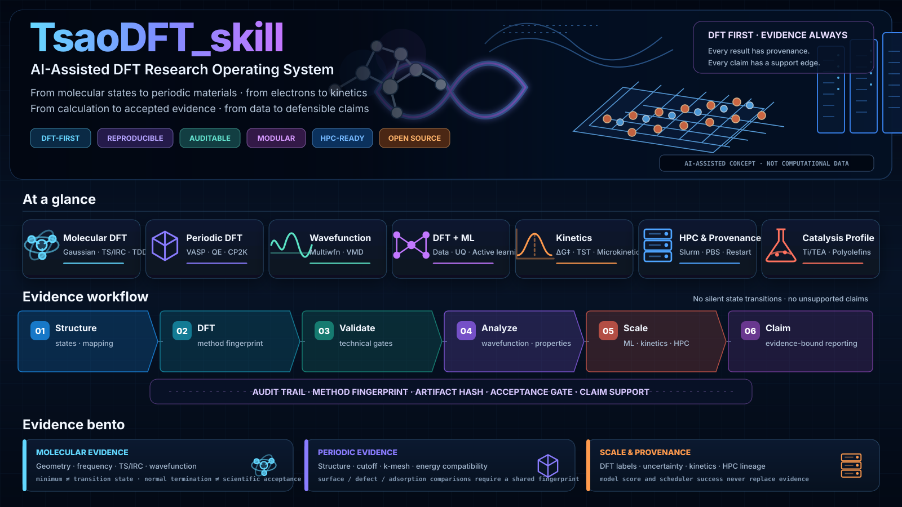
</p>

## Acceptance state and modification specification

- Repository software, Schemas, documentation and permanent CI: `SOFTWARE_ACCEPTANCE_READY`;
- Real Gaussian/VASP/QE/CP2K correctness and performance: `EXTERNAL_HOLD`;
- Machine acceptance: `python scripts/build_release_acceptance.py --out release-acceptance.json --json`;
- Reusable modification prompt: [`docs/ACCEPTANCE_REWRITE_PROMPT.md`](docs/ACCEPTANCE_REWRITE_PROMPT.md);
- Governing doctrine: [`docs/ACCELERATION_ENGINEERING_DOCTRINE.md`](docs/ACCELERATION_ENGINEERING_DOCTRINE.md).

```bash
python scripts/capture_compute_contract_evidence.py --out compute-contract-evidence.json --json
python scripts/build_release_acceptance.py --out release-acceptance.json --json
python scripts/quality_gate.py
```

## Governing engineering doctrine

1. **Python is the scientific control plane.** It owns workflow, Schemas, method identity, scheduling, parsing, evidence and reporting; it is not a defect requiring a wholesale C++ rewrite.
2. **Professional DFT kernels remain external.** FFTs, eigensolvers, integrals, SCF and MPI/OpenMP/GPU kernels belong to versioned Gaussian/VASP/QE/CP2K builds.
3. **Only profiled narrow hotspots may migrate.** CPU reference → NumPy/algorithm → optional C++/OpenMP → optional CUDA/HIP/SYCL.
4. **Every backend retains a deterministic reference, finite-number boundary, safe fallback and equivalence gate.**
5. **Technology awareness is not execution evidence.** CUDA-X awareness, a detected GPU or a generated job is not speedup evidence.
6. **Correctness qualification precedes performance qualification.** No speed ratio is published without a fixed input, real engine, license, stable build/site/run/hardware identity, scientific tolerances and repeated runs.

<p align="center">
  
</p>

## Capability levels are evidence contracts

Public capability statements use four evidence levels:

- `L0_REFERENCE`: reference material, templates or method guidance; no executable-adapter claim.
- `L1_HANDOFF`: produces a structured handoff while execution and scientific acceptance remain downstream responsibilities.
- `L2_VALIDATED_ADAPTER`: the adapter, Schema, strict input boundary and regression suite are validated; this is not proof of execution on a real licensed professional engine or target device.
- `L3_EXECUTION_TESTED`: must bind real `engine/version/site/run_id` and immutable artifact SHA-256. HPC or acceleration L3 additionally binds build/hardware identity, a CPU reference, at least three repeats, numerical equivalence, parser acceptance, performance policy, a content-addressed evidence root and independent signed review.

The repository neighbor-list, mmap parser, contract validators and release-acceptance builder are permanently tested software artifacts. They do not automatically promote external Gaussian, VASP, QE or CP2K capability to `L3_EXECUTION_TESTED`.

## Mathematical core: mapping equations to software contracts

The equations below explain workflow and validation contracts. They are not scientific outputs already computed by this repository.

### 1. Kohn–Sham equation and electron density

$$
\hat H_{\mathrm{KS}}[\rho]\,\psi_i(\mathbf r)=\varepsilon_i\psi_i(\mathbf r),
\qquad
\rho(\mathbf r)=\sum_i f_i\lvert\psi_i(\mathbf r)\rvert^2.
$$

Repository strategy:

- `method_fingerprint_id` freezes functional, basis/pseudopotential, dispersion, relativity, cutoffs and convergence settings;
- `observable_set` declares energies, forces, stresses and additional properties;
- results from different engines, pseudopotential families or standard states are never silently merged.

### 2. Total-energy functional and SCF fixed point

$$
E[\rho]=T_s[\rho]+\int v_{\mathrm{ext}}(\mathbf r)\rho(\mathbf r)\,d\mathbf r
+E_H[\rho]+E_{\mathrm{xc}}[\rho]+E_{\mathrm{II}},
$$

$$
\rho^{(n+1)}=\mathcal F[\rho^{(n)}],
\qquad
R_n=\left\|\rho^{(n+1)}-\rho^{(n)}\right\|,
\qquad
R_n\le \tau_\rho.
$$

The evidence contract requires parser acceptance, zero exit status, convergence and finite values. An earlier success marker cannot override a later fatal marker.

### 3. Forces, stress and geometry acceptance

$$
\mathbf F_I=-\frac{\partial E}{\partial \mathbf R_I},
\qquad
\sigma_{\alpha\beta}=\frac{1}{\Omega}\frac{\partial E}{\partial\epsilon_{\alpha\beta}}.
$$

Geometry optimization must be accepted together with gradients, displacements, frequencies or constraints. A transition state is not accepted from optimization convergence alone; it normally requires one targeted imaginary mode and IRC or equivalent path evidence.

### 4. Periodic systems, plane waves and Brillouin-zone integration

$$
A=\frac{1}{\Omega_{\mathrm{BZ}}}\int_{\mathrm{BZ}}A(\mathbf k)\,d\mathbf k
\approx \sum_{\mathbf k}w_{\mathbf k}A(\mathbf k),
$$

$$
\frac{\lvert\mathbf k+\mathbf G\rvert^2}{2}\le E_{\mathrm{cut}}.
$$

k-point meshes, cutoff energy, smearing, pseudopotentials, magnetism and supercell identity remain explicit. Band/DOS convergence and total-energy convergence are accepted separately.

### 5. Periodic minimum image and cell lists

The implementation uses NumPy **row-vector** convention: lattice vectors are rows of $\mathbf H$, so Cartesian displacements satisfy $\Delta\mathbf r=\Delta\mathbf s\mathbf H$. For a general triclinic cell, component-wise `round()` is guaranteed to select the closest periodic image only in special cases such as orthogonal boxes. The general definition is a closest-lattice-point problem over the enabled periodic axes $\mathcal P$:

$$
\mathbf n^\star=
\operatorname*{arg\,min}_{\mathbf n\in\mathbb Z_{\mathcal P}}
\left\|\Delta\mathbf r-\mathbf n\mathbf H\right\|_2,
\qquad
\Delta\mathbf r_{\mathrm{MIC}}
=\Delta\mathbf r-\mathbf n^\star\mathbf H.
$$

For orthogonal boxes, that reduces to the fast path

$$
\Delta\mathbf s_{\mathrm{MIC}}
=\Delta\mathbf s-\operatorname{round}_{\mathcal P}(\Delta\mathbf s),
\qquad
\Delta\mathbf r_{\mathrm{MIC}}
=\Delta\mathbf s_{\mathrm{MIC}}\mathbf H,
\qquad
d_{ij}=\lVert\Delta\mathbf r_{\mathrm{MIC}}\rVert_2.
$$

`neighbor_list.py` uses a bounded closest-lattice enumeration for skewed cells and enforces `MAX_MINIMUM_IMAGE_CANDIDATES` as a resource ceiling; pathological cells fail closed instead of falling back to an incorrect component-wise rounding approximation. The all-pairs reference is $O(N^2)$. At finite density and fixed cutoff, the average cell-list candidate cost approaches

$$
O\!\left(N+N\,\bar n_{\mathrm{cell}}\right).
$$

The `reference`, `numpy` and `cell-list` backends must return the same deterministically ordered pair set.

### 6. Numerical equivalence, tolerances and performance qualification

$$
\lvert x-x_{\mathrm{ref}}\rvert
\le a_{\mathrm{tol}}+r_{\mathrm{tol}}\lvert x_{\mathrm{ref}}\rvert,
$$

$$
S=\frac{\operatorname{median}(t_{\mathrm{reference}})}
        {\operatorname{median}(t_{\mathrm{candidate}})},
\qquad n_{\mathrm{repeat}}\ge 3.
$$

$S$ is reviewable only after stable input/method/build/hardware/site identity, unique run IDs, accepted parsers, `VERIFIED` artifacts and scientific equivalence. Otherwise the state remains `EXTERNAL_HOLD`.

### 7. Kinetics and detailed balance

$$
k(T)=\kappa\frac{k_{\mathrm B}T}{h}\exp\!\left(-\frac{\Delta G^\ddagger}{RT}\right),
$$

$$
\frac{k_f}{k_r}=\exp\!\left(-\frac{\Delta G_{\mathrm{rxn}}}{RT}\right).
$$

`tsao-dft-kinetics-multiscale` consumes only accepted standard-state and thermochemical evidence. Incompatible standard states or uncorrected free energies are not concatenated.

### 8. ML uncertainty and OOD gating

For ensemble predictions $\{\hat y_m(\mathbf x)\}$:

$$
\bar y(\mathbf x)=\frac1M\sum_{m=1}^M\hat y_m(\mathbf x),
\qquad
u^2(\mathbf x)=\frac1{M-1}\sum_{m=1}^M\left(\hat y_m-\bar y\right)^2.
$$

If $u(\mathbf x)>u_{\max}$ or the OOD score exceeds its threshold, execution falls back to remote real DFT instead of emitting a high-confidence fabricated result.

<p align="center">
  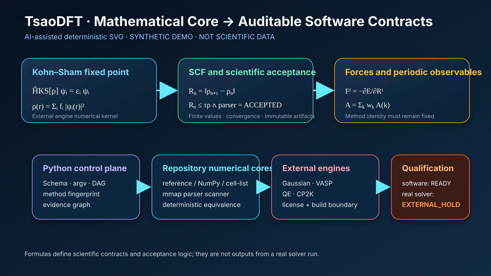
</p>

<p align="center">
  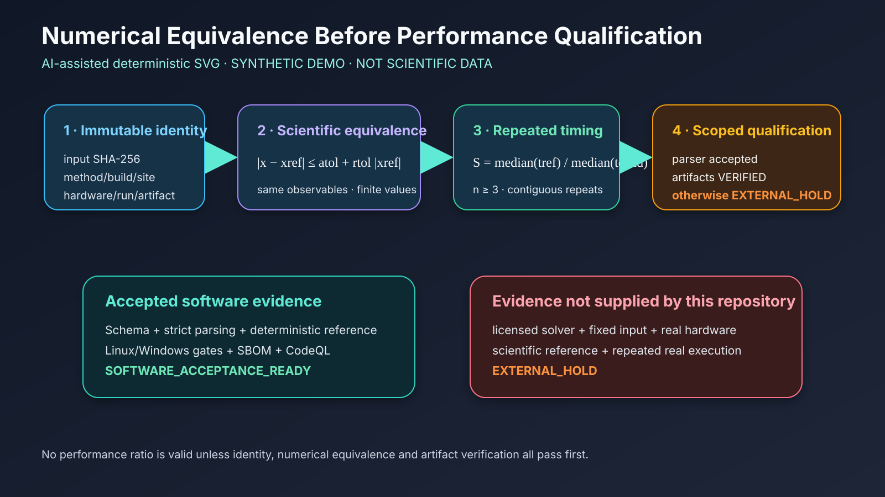
</p>

## Eight Skills, one evidence chain

| Skill | Primary responsibility | Acceptance boundary |
|---|---|---|
| [`tsao-dft-suite`](skills/tsao-dft-suite/) | DFT-first entry point, DAGs, approvals and cross-Skill routing | Coordinates work; does not replace engine science |
| [`tsao-structure-prep`](skills/tsao-structure-prep/) | Molecules, crystals, surfaces, defects, adsorption, atom mapping and neighbor search | Does not silently choose charge, spin, oxidation state, termination or protonation |
| [`tsao-dft-researcher`](skills/tsao-dft-researcher/) | Gaussian DFT/TDDFT, Opt/Freq, TS/IRC, thermochemistry, NMR, Multiwfn and VMD | The user supplies real programs, licenses and execution environments |
| [`tsao-periodic-dft-materials`](skills/tsao-periodic-dft-materials/) | VASP, QE, CP2K, surfaces/defects, bands/DOS, NEB and convergence | Does not mix incompatible energies or pseudopotential identities |
| [`tsao-dft-ml-active-learning`](skills/tsao-dft-ml-active-learning/) | Label audit, leakage control, applicability domain, uncertainty and active learning | High scores are not mechanisms or causal evidence |
| [`tsao-dft-kinetics-multiscale`](skills/tsao-dft-kinetics-multiscale/) | Eyring/TST, reaction networks, detailed balance and uncertainty propagation | Consumes only accepted standard-state and thermochemical data |
| [`tsao-dft-hpc-provenance`](skills/tsao-dft-hpc-provenance/) | Windows/POSIX, Slurm/PBS, hardware inventory, parsers, benchmarks and signatures | GPU allocation or one fastest run is not real speedup |
| [`tsao-dft-catalysis-profile`](skills/tsao-dft-catalysis-profile/) | Catalysis and polymer profiles | Does not automatically generalize to unrelated systems |

## Executable usage strategies

### Strategy A: structure preparation and neighbor search

```bash
python skills/tsao-structure-prep/scripts/inspect_xyz.py structure.xyz \
  --backend reference --json
python skills/tsao-structure-prep/scripts/inspect_xyz.py structure.xyz \
  --backend numpy --json
python skills/tsao-structure-prep/scripts/inspect_xyz.py periodic.xyz \
  --backend cell-list --periodic xyz \
  --box 10 0 0 0 10 0 0 0 10 --json
```

Use `reference` to establish small-system truth, then check `numpy` and `cell-list` equivalence. `evaluated_pair_count` is not DFT speedup evidence.

### Strategy B: unified parsers and artifact hashes

```bash
python skills/tsao-dft-hpc-provenance/scripts/engine_parser_contract.py \
  --engine gaussian --input job.log --json
python skills/tsao-dft-hpc-provenance/scripts/engine_parser_contract.py \
  --engine vasp --input OUTCAR --json
```

The parser uses read-only mmap, bounded scans and mapped-artifact SHA-256. Fatal markers outrank earlier success markers.

### Strategy C: Gaussian molecular workflow

1. Freeze charge, multiplicity, solvent, functional, basis, dispersion and integration grid;
2. Run preflight before Opt/Freq;
3. A minimum requires no imaginary frequency; a TS normally requires one targeted imaginary mode plus IRC/path evidence;
4. Wavefunction/ESP/Multiwfn/VMD figures retain source-artifact hashes.

### Strategy D: VASP / QE / CP2K periodic workflow

1. Converge cutoff, k points, smearing, magnetism, supercell and pseudopotential identity;
2. Then execute geometry, bands/DOS, defects, surfaces, NEB or phonons;
3. GPU routes require official version-matched builds and complete build/hardware/site/run identity;
4. Different engines, builds or sites never share one speedup campaign.

### Strategy E: HPC and Windows/Linux

```bash
python skills/tsao-dft-hpc-provenance/scripts/generate_job_script.py \
  --shell bash --scheduler slurm --json
pwsh -NoProfile -File .\scripts\quality_gate.ps1
```

External programs cross structured argv, versioned JSON, files, return codes and content hashes; untrusted shell concatenation is not allowed.

### Strategy F: qualification evidence

```bash
python scripts/validate_benchmark_contract.py --json
python scripts/validate_compute_qualification.py --json
python scripts/capture_compute_contract_evidence.py --out compute-contract-evidence.json --json
python scripts/build_release_acceptance.py --out release-acceptance.json --json
```

<p align="center">
  
</p>

<p align="center">
  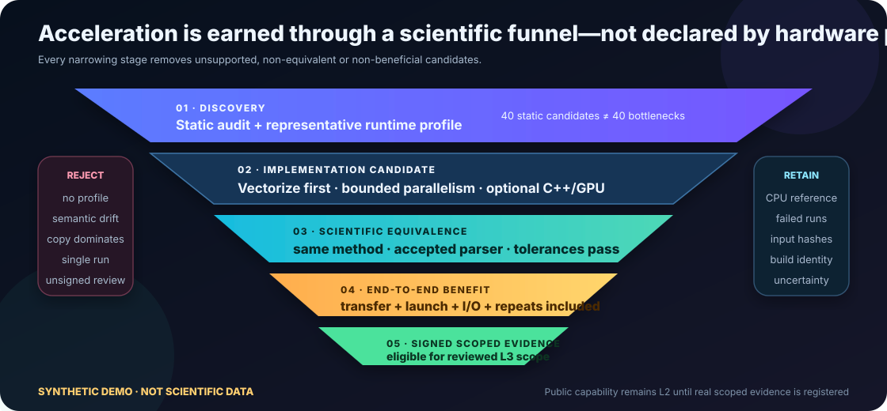
</p>

## Implemented software acceleration layers

| Layer | State | Implementation | Non-claim |
|---|---|---|---|
| Python scientific control plane | Implemented | Schemas, DAG, argv, parsers, evidence | Not an electronic-structure kernel |
| CPU reference | Implemented | Scalar, NumPy, BLAS/LAPACK | Not automatically optimal performance |
| neighbor list | Implemented | reference / NumPy / cell-list | Not external DFT speedup |
| mmap parser | Implemented | read-only mmap, byte regex, SHA-256 | Does not accelerate SCF/FFT/eigensolvers |
| C++/OpenMP sidecar | Not established | profile-gated | Must not be documented as complete |
| CUDA/HIP/SYCL | Not established | optional device plugins | GPU presence does not enable it |
| external-engine performance | `EXTERNAL_HOLD` | official engine GPU/MPI builds | no speed ratio published |

<p align="center">
  
</p>

<table>
<tr>
<td width="50%"></td>
<td width="50%">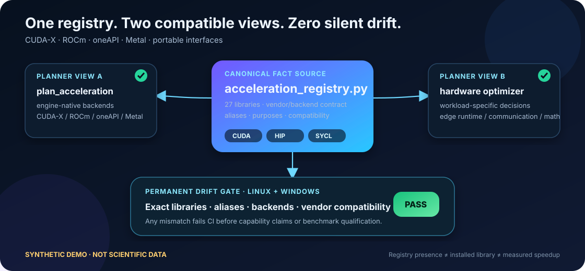</td>
</tr>
<tr>
<td>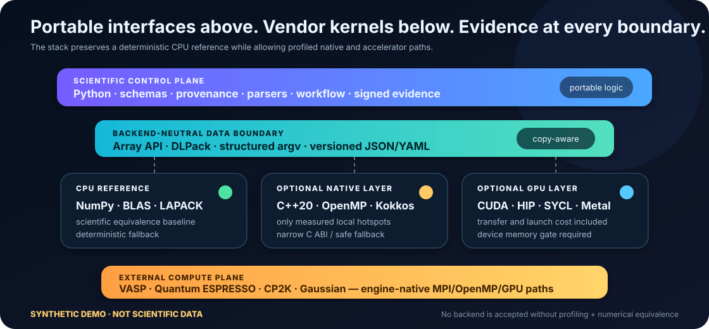</td>
<td>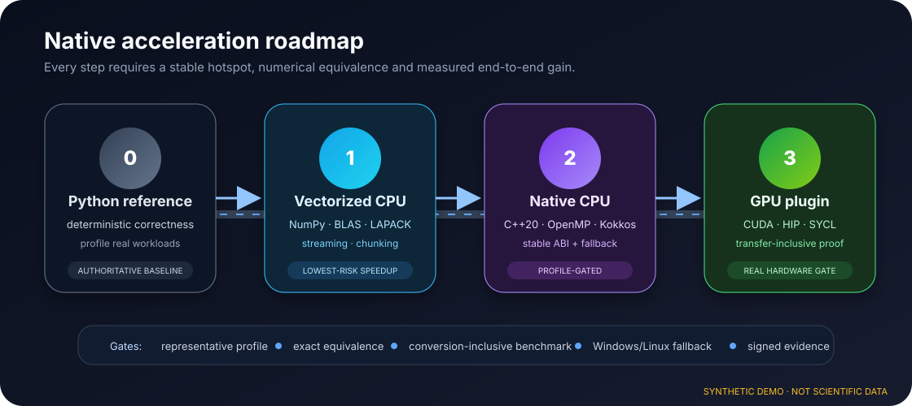</td>
</tr>
</table>

## Windows, Linux and external-engine boundary

- VASP: only version-matched official OpenACC/GPU builds, CUDA-aware MPI, GPU/rank binding and build fingerprints are eligible;
- Quantum ESPRESSO: records version, compiler, GPU support, MPI, pool/task-group and diagonalization path;
- CP2K: records official CUDA/HIP/OpenCL build capability and real execution identity;
- Gaussian: the repository owns preflight, parsing, batching and evidence, not an unproven electronic-structure acceleration claim.

<p align="center">
  
</p>

## ML, kinetics and edge loop

```text
structure and conditions
→ accepted surrogate
→ uncertainty / OOD gate
→ safe-domain inference
→ remote real-DFT fallback outside the domain
→ accepted results returned to the governed dataset
```

<table>
<tr>
<td width="50%">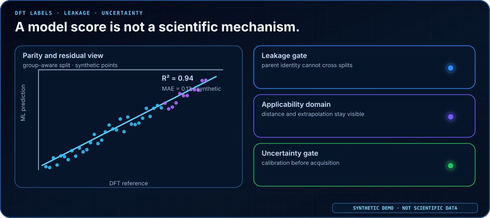</td>
<td width="50%"></td>
</tr>
<tr>
<td></td>
<td>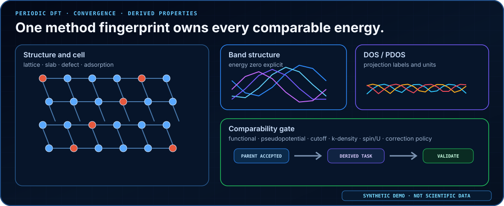</td>
</tr>
</table>

## Scientific-figure governance

The following figures are synthetic demonstrations, not production computational results:

<table>
<tr>
<td width="50%">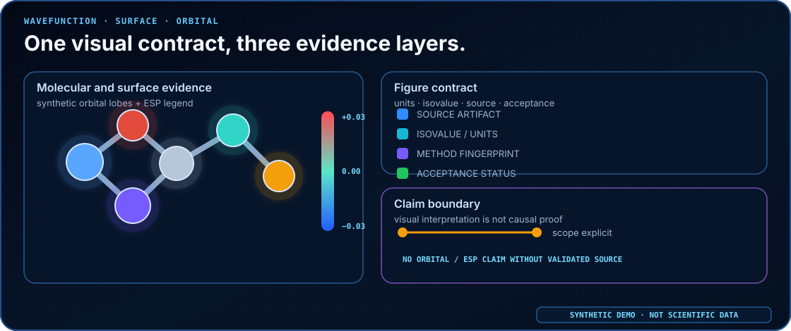</td>
<td width="50%"></td>
</tr>
</table>

See [`docs/README_VISUAL_DESIGN_SYSTEM.md`](docs/README_VISUAL_DESIGN_SYSTEM.md) and [`docs/AI_IMAGE_GOVERNANCE.md`](docs/AI_IMAGE_GOVERNANCE.md).

## Install, validate and accept

```bash
python scripts/install.py --agent codex --scope project --skill all --dry-run --validate
python scripts/validate_readme_math.py --json
python scripts/quality_gate.py
```

PowerShell:

```powershell
pwsh -NoProfile -File .\scripts\quality_gate.ps1
```

Permanent CI must pass Python 3.10/3.12/3.13, Windows PowerShell, dependency audit + CycloneDX SBOM, CodeQL, 29/29 repository quality stages and 630 tests / 9 suites.

The software baseline proves repository artifacts passed validation. It does not prove that an external DFT engine was executed or accelerated. External qualification remains `EXTERNAL_HOLD`.

---

**TsaoDFT is not designed to make every file look lower-level. It is designed to make every equation, parameter, computation, figure, performance claim and engineering migration auditable.**

<!-- CURRENT_MAIN_ACCEPTANCE_V2:START -->
## Current `main`: code–mathematics–evidence loop

<p align="center"></p>

> This figure is generated from current code contracts and is conceptual documentation, not electronic-structure run data.

### Core mathematical contracts

$$
[-½∇² + V_eff[n]] ψᵢ = εᵢ ψᵢ
$$

$$
n* = argminₙ ‖A(s − n)‖₂
$$

$$
|ΔE| ≤ τ_E ∧ maxᵢ ‖ΔFᵢ‖₂ ≤ τ_F
$$

### Usage strategy

1. Freeze structure, cell, periodicity and units before generating engine input.
2. Accept SCF, energy, forces and stress only when finite, converged and method identity is complete.
3. Discovery, templates and parser outputs must not be promoted to real DFT execution evidence.
4. Any new commit invalidates six-hour software evidence bound to an older SHA.

> **Responsibility boundary：** Software gates validate the control plane, reference numerics and evidence contracts only; external engines such as Gaussian, VASP, QE and CP2K are not executed here and remain EXTERNAL_HOLD.

Execution prompt: [SIX_REPOSITORY_PARALLEL_6H_ACCEPTANCE_PROMPT_V2.md](docs/SIX_REPOSITORY_PARALLEL_6H_ACCEPTANCE_PROMPT_V2.md)
<!-- CURRENT_MAIN_ACCEPTANCE_V2:END -->
