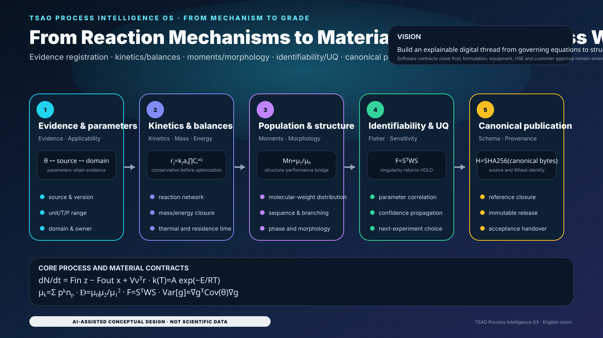

# TSAO Process Intelligence OS

[简体中文](README.zh-CN.md) · [Architecture](ARCHITECTURE.md) · [Capability matrix](docs/CAPABILITY_MATRIX.md) · [Visual system](docs/README_VISUAL_SYSTEM.md)


<!-- CLOSURE_STATUS_START -->
## Current qualification and distribution boundary

- The canonical `ci.yml` qualifies the source checkout, numerical kernels, tests, coverage, CLI and performance paths across Windows/Linux and Python 3.11–3.14.
- Public wheel and public source-snapshot creation are intentionally expected to fail while the tracked registry remains `CONTROLLED`. CI treats the verified fail-closed block as a successful containment result and emits no public artifact.
- `artifact_software_qualification=PASS` does not reclassify source metadata and does not imply scientific, engineering, HSE, customer or industrial approval.
- Public distribution stays `BLOCKED_CONTROLLED_METADATA_CLASSIFICATION` until an authorized owner/legal/IP/security decision changes the evidence basis.
<!-- CLOSURE_STATUS_END -->

**Fail-closed software delivery for chemical-process Skills, governed mathematics, evidence, provenance and acceptance.**

<!-- LOCALIZED_VISION_EN:START -->
## Project vision: from reaction mechanisms to grades and process windows

<p align="center">
  
</p>

> The formulas map to the implemented process, EPDM, POE and polymer-general Skill contracts. This is not plant calibration, customer-grade certification or an HSE decision.

<!-- LOCALIZED_VISION_EN:END -->

## Delivered system

TSAO installs four Skills: `process-general`, `epdm`, `poe`, and `polymer-general`. The governed source checkout exposes the modules, schemas, reports, CLI, tests and **32 deterministic SVG diagrams**. A future distributable Wheel must preserve that inventory, but the current public Wheel is intentionally blocked by controlled historical metadata. `PASS` qualifies software behavior only; scientific, engineering, HSE, customer and industrial approvals remain `NOT_EVALUATED`.

## Acceptance commands

```bash
python -m pip install -e .[dev]
python -m tsao.cli doctor --root . --profile core
python -m tsao.cli delivery-report --root .
python -m tsao.skillpacks --root .
python -m tsao.cli init --brief examples/generic-process/brief.yaml --out work/demo
python -m tsao.cli audit project --root work/demo
python -m tsao.cli epdm validate-v2 --file skills/epdm/fixtures/v2_phase_a2_reference_project.json
python -m tsao.cli epdm canonicalize --file skills/epdm/fixtures/v2_phase_a2_reference_project.json --out work/canonical.json
python -m tsao.cli epdm qualify-acceptance --project skills/epdm/fixtures/v2_phase_a1_reference_project.json --output reports/runtime/EPDM_SOFTWARE_ACCEPTANCE.json --load-samples 7
```

Source identity is bound by `SHA256` over canonical bytes. The EPDM V2 path is transactional: strict JSON → explicit version → Schema → frozen dataclasses → temporary `ContractRegistry` → cross-reference closure → immutable publication. Duplicate keys, non-finite values, type confusion, duplicate IDs and unresolved references fail closed.

## Governed mathematical program

The following equations are transparent calculated-reference contracts. They do not replace qualified process engineering or calibrated industrial models.

$$
\frac{d\mathbf{N}}{dt}=F_{in}\mathbf{z}-F_{out}\mathbf{x}+V\boldsymbol{\nu}^{\mathsf T}\mathbf{r}
$$
$$
mC_p\frac{dT}{dt}=\sum F_i h_i-V\sum_j\Delta H_jr_j-UA(T-T_c)
$$
$$
k_j(T)=A_j\exp\!\left(-\frac{E_j}{RT}\right),\qquad r_j=k_j(T)a_s\prod_i C_i^{\alpha_{ij}}
$$
$$
f_m=\frac{r_m}{\sum_n r_n},\qquad \sum_m f_m=1
$$
$$
\mu_k=\sum_{p=0}^{\infty}p^kn_p,\quad M_n\propto\frac{\mu_1}{\mu_0},\quad M_w\propto\frac{\mu_2}{\mu_1},\quad Đ=\frac{\mu_0\mu_2}{\mu_1^2}
$$
$$
\frac{\Delta G_{mix}}{RT}=\frac{\phi_1}{N_1}\ln\phi_1+\frac{\phi_2}{N_2}\ln\phi_2+\chi\phi_1\phi_2
$$
$$
\mathrm{Da}_v=k_v\tau,\qquad \dot S_{gen}=\dot Q\left(\frac1{T_c}-\frac1{T_h}\right)\ge0
$$
$$
e_i=\frac{y_i^{(5)}-y_i^{(4)}}{\mathrm{atol}_i+\mathrm{rtol}_i\max(|y_i|,|y_i^{(5)}|)},\qquad \|\mathbf e\|_2\le1
$$
$$
J(\boldsymbol\theta)=\sum_iw_i[y_i-\hat y_i(\boldsymbol\theta)]^2,\qquad \mathbf{F}=\mathbf{S}^\mathsf{T}\mathbf{W}\mathbf{S}
$$
$$
\operatorname{Cov}(\hat{\boldsymbol\theta})\approx\sigma^2\mathbf F^{-1},\qquad \operatorname{Var}[g]\approx\nabla g^\mathsf T\operatorname{Cov}(\boldsymbol\theta)\nabla g
$$

DOPRI5(4) accepts a step only when the scaled error, conservation, finiteness and monotonic-time Gates pass. Singular Fisher information, unresolved evidence or out-of-domain prediction returns `HOLD`, not false confidence.

## Accepted performance evidence

<!-- PERFORMANCE_RESULTS_START -->
| Workload | Baseline median | Optimized median | Ratio | Peak memory | Parity |
|---|---:|---:|---:|---:|---|
| EPDM three-level model, 64 site families | 129.96 µs | 131.24 µs | 0.99× | 37.23 KiB | exact |
| EPDM three-level model, 512 site families | 937.65 µs | 946.63 µs | 0.99× | 276.29 KiB | exact |
| EPDM semibatch material-energy step | 13.24 µs | 14.34 µs | 0.92× | 3.12 KiB | exact |
| EPDM semibatch trajectory, 10,000 public steps | 129.11 ms | 142.58 ms | 0.91× | 4.35 MiB | exact |
| EPDM screening, 1,000 scalar scenarios | 13.50 ms | 13.61 ms | 0.99× | 566.29 KiB | exact |
| POE RK4, 400 steps | 13.93 ms | 6.64 ms | 2.10× | 303.02 KiB | exact |
| POE RK4, 10,000 steps | 345.90 ms | 165.92 ms | 2.08× | 7.26 MiB | exact |
| POE finite-difference Jacobian, 8 × 200 | 503.52 µs | 493.41 µs | 1.02× | 33.92 KiB | exact |
| POE one-parameter fit, 401 points | 1.00 ms | 1.01 ms | 0.99× | 31.07 KiB | exact |
| POE dynamic response, 10,000 points | 241.69 µs | 241.34 µs | 1.00× | 569.67 KiB | exact |
| Universal process package, 500 equipment items | 4.43 ms | 4.38 ms | 1.01× | 179.53 KiB | exact |
| Universal process package, 5,000 equipment items | 44.28 ms | 44.12 ms | 1.00× | 1.95 MiB | exact |
| Source identity, 300 files build + verify | 25.91 ms | 24.80 ms | 1.04× | 424.10 KiB | exact |
| Source identity, 3,000 files build + verify | 228.88 ms | 229.13 ms | 1.00× | 1.68 MiB | exact |
| Repository Doctor, core profile | 126.28 ms | 129.83 ms | 0.97× | 1.29 MiB | tolerance / semantic |
| Four-Skill inventory | 5.95 ms | 6.35 ms | 0.94× | 137.26 KiB | tolerance / semantic |
| Wheel content verification | 2.93 ms | 3.13 ms | 0.94× | 593.27 KiB | tolerance / semantic |
| EPDM screening, 1,000 broadcast scenarios | 13.50 ms | 1.41 ms | 9.56× | 613.93 KiB | tolerance / semantic |
| EPDM semibatch trajectory, once-validated 10,000 steps | 129.11 ms | 47.21 ms | 2.73× | 4.35 MiB | exact |
| POE RK4 terminal-only, 10,000 steps | 345.90 ms | 143.77 ms | 2.41× | 5.59 KiB | tolerance / semantic |

| Scale pair | Normalized time ratio | Limit | Gate |
|---|---:|---:|---|
| EPDM three-level model, 64 site families → EPDM three-level model, 512 site families | 0.902 | 1.25 | PASS |
| Universal process package, 500 equipment items → Universal process package, 5,000 equipment items | 1.006 | 1.25 | PASS |
| Source identity, 300 files build + verify → Source identity, 3,000 files build + verify | 0.924 | 1.25 | PASS |
<!-- PERFORMANCE_RESULTS_END -->

## Use strategy

1. Route the brief to the narrowest Skill.
2. Register evidence and applicability before parameters.
3. Close material and energy balances before optimization.
4. Publish canonical contracts before A2/A3/A4 execution.
5. Separate parameter fitting from scientific qualification.
6. Use uncertainty and identifiability to select the next experiment.
7. Keep public Wheel and source-snapshot creation blocked until classification is authorized; after authorization, build them only from the exact qualified tree.
8. Advance approval states only with named accountable evidence.

## Verification

```bash
python scripts/verify_dependency_lock.py requirements.lock --pyproject pyproject.toml
python scripts/run_ci.py
python skills/epdm/scripts/audit_epdm.py
python skills/poe/scripts/audit_p0.py --root .
python skills/poe/scripts/audit_p1.py --root .
# Current controlled tree: both commands below must fail closed and emit no artifact.
python -m pip wheel --no-deps --no-build-isolation . -w wheelhouse
python scripts/export_source_snapshot.py --root . --out dist/source.zip
# Run wheel/runtime verifiers only after an authorized classification enables a distributable artifact.
```

CI qualifies Windows and Ubuntu with Python 3.11–3.14. Installation is checked through `pip install --target` and a standard virtual environment with no inherited system site packages.

The visual system extends the 21-asset historical core to a governed 32-asset acceptance atlas.

## Governed visual atlas


## Responsibility boundary

`main` is the sole authoritative branch. TSAO does not replace qualified process engineering, laboratory evidence, commercial property packages, equipment or relief design, HAZOP/LOPA/SIL, legal/environmental review, customer trials or operating approval.

<!-- CURRENT_MAIN_ACCEPTANCE_V2:START -->
## Current `main`: code–mathematics–evidence loop

<p align="center"></p>

> The figure is generated from current code contracts and is conceptual documentation, not experimental, plant or industrial-performance data.

### Core mathematical contracts

$$
dN/dt = F_in z − F_out x + V νᵀ r
$$

$$
e = ‖y₅ − y₄‖ / (atol + rtol max(‖yₙ‖, ‖y₅‖))
$$

$$
I(θ) = J(θ)ᵀ W J(θ)
$$

### Usage strategy

1. Start from Schema, units and evidence classes rather than inferring implementation from visuals.
2. Kinetics, chain moments and integrators accept only finite dimensionally compatible inputs.
3. Run canonical publication and full CI before six-hour active testing of an exact SHA.
4. Any new commit invalidates long-duration evidence bound to an older SHA.

> **Responsibility boundary：** The deliverable is a software-reference numerical and process-development framework; scientific, engineering, HSE, customer and industrial-performance approvals remain NOT_EVALUATED.

Execution prompt: [SIX_REPOSITORY_PARALLEL_6H_ACCEPTANCE_PROMPT_V2.md](docs/SIX_REPOSITORY_PARALLEL_6H_ACCEPTANCE_PROMPT_V2.md)
<!-- CURRENT_MAIN_ACCEPTANCE_V2:END -->


## Historical performance qualification boundary

Current blocking performance qualification compares the current source tree with the alpha.14 parent on the same runner and Python interpreter. Numerical parity, same-path timing, optimized-path benefit retention, scale checks, and all unexpected missing workloads remain fail-closed.

The alpha.10 `wheel_content_verification` timing is recorded as `NOT_APPLICABLE` only when that historical workload is absent because public wheel generation is intentionally blocked by `BLOCKED_CONTROLLED_METADATA_CLASSIFICATION`. Source qualification and distribution-containment regressions replace that retired public-artifact workload. This exception does not permit a wheel or source snapshot to be emitted, does not relax any current performance threshold, and does not convert software qualification into scientific, engineering, HSE, customer, or industrial approval.


<!-- closure:qualification-boundary -->
## Qualification and controlled-distribution boundary

The performance gate annotates repository-scale work units through a tested, fail-closed helper before comparing like-for-like runs. Missing, non-finite, zero, or mismatched work-unit metadata is rejected rather than converted into a favorable timing result.

Software qualification is evaluated from the exact source tree. A successful test, doctor, coverage, or performance result does **not** authorize a public wheel, sdist, or source snapshot. While controlled historical metadata remains classified as project-controlled, public artifacts must continue to fail with `BLOCKED_CONTROLLED_METADATA_CLASSIFICATION` and must leave no distributable artifact behind.
