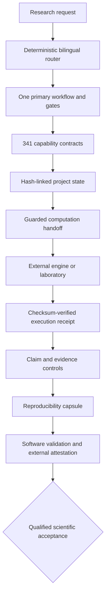

# Architecture

TsaoSciResearcher v0.7.0 separates scientific policy, deterministic runtime services, external execution evidence and final human acceptance.

## Runtime modules

- `router.py` and `capabilities.py`: bounded deterministic routing and capability discovery.
- `state.py`: atomic project lifecycle, registries, approvals and SHA-256 event chain.
- `handoff.py`: contained, checksummed computation preparation; never an execution claim.
- `receipts.py`: external execution provenance with handoff identity, timestamps and output hashes.
- `capsule.py`: deterministic metadata/full ZIPs with per-file and tree integrity.
- `scientific_quality.py`: measurement, structure-property, causal and evidence-traceability guards.
- `version.py`: one version source in a checkout and installed metadata in a distribution.

## Validation and supply chain

Permanent CI is read-only and idempotent. Manual audit and nightly health runs do not mutate the repository. Tag release is the only publication workflow with content write permission besides single-main branch governance. Coverage, order independence, mutation, performance, SBOM, vulnerability audit, docs, source ZIP, wheel and sdist are all gated.

## Truth boundaries

Native software controls verify internal structure and provenance. External calculations and experiments require guarded handoff plus an execution receipt. Scientific acceptance remains a separate qualified decision.
