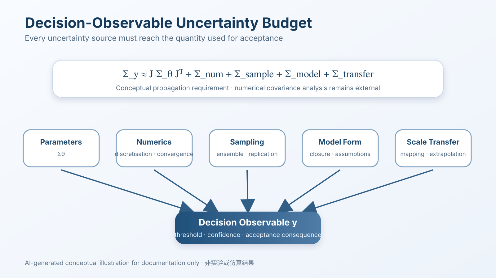

# Mathematical Contracts / 数理合同

> Version 1.0 · Runtime release 0.7.4 · Schema-backed acceptance hardening

This document explains the machine-readable equations returned by `TsaoSciResearcher`. The registry is now governed by a closed Draft 2020-12 JSON Schema so the equations, symbols, language mode, and scientific truth-boundary flags can be validated independently of the CLI implementation.

本文档说明 `TsaoSciResearcher` 返回的机器可读数理合同。当前目录由封闭的 Draft 2020-12 JSON Schema 约束，因此方程、符号、语言模式和科研真实性边界可以独立于 CLI 实现进行校验。

```bash
python -m tsao_researcher math
python -m tsao_researcher math --schema
python -m tsao_researcher math --language zh-CN
python -m tsao_researcher math --contract uncertainty-budget --output contract.json
python scripts/validate_mathematical_contracts.py --check
```

## Boundary / 边界

The registry is advisory. It does not execute a solver, infer parameters from data, validate an experiment, or grant automatic approval.

数理合同目录只提供建议性解释。它不会执行求解器、从数据自动推断参数、验证实验，也不会自动批准科研结论。

Every contract payload contains:

```json
{
  "schema_version": "1.0",
  "schema_id": "https://sunhaojun22.github.io/TsaoSciResearcher/schemas/v2/mathematical-contract-registry.schema.json",
  "advisory_only": true,
  "solver_executed": false,
  "automatic_approval": false
}
```

The canonical Schema is [`schemas/v2/mathematical-contract-registry.schema.json`](https://github.com/SUNHAOJUN22/TsaoSciResearcher/blob/main/schemas/v2/mathematical-contract-registry.schema.json). The installed package carries a byte-identical mirror under `tsao_researcher/data/schemas/` and `scripts/sync_runtime_data.py` checks that the two copies stay synchronized.

规范 Schema 位于 [`schemas/v2/mathematical-contract-registry.schema.json`](https://github.com/SUNHAOJUN22/TsaoSciResearcher/blob/main/schemas/v2/mathematical-contract-registry.schema.json)。安装包在 `tsao_researcher/data/schemas/` 中携带逐字节一致的镜像，并由 `scripts/sync_runtime_data.py` 检查二者是否同步。


## Stable contracts / 稳定合同

| Contract ID | Equation | Decision role / 决策作用 |
|---|---|---|
| `capability-ranking` | \(S(c\mid q,o,e)=w_qR(q,c)+w_oR(o,c)+w_eM(e,c)-w_xC(c)\) | Explain relevance, observability, evidence fit, and exclusions / 解释相关性、可观测性、证据匹配和排除项 |
| `quantity-dimension` | \(x=(v,u,d),\ d_\mathrm{left}=d_\mathrm{right}\) | Guard unit and dimensional consistency / 保护单位与量纲一致性 |
| `applicability-extrapolation` | \(r_\mathrm{extra}=d(x,\mathcal A)/\max(s_\mathcal A,\varepsilon)\) | Require transfer evidence and uncertainty inflation / 要求迁移证据与不确定性膨胀 |
| `evidence-conflict` | \(E=(E_+,E_-,E_0)\) | Preserve support, challenge, and unresolved evidence / 保留支持、挑战和未决证据 |
| `mechanism-identifiability` | \(D_{ij}(O,C)>\tau\) or \(\operatorname{rank}(J_\theta)=p\) | Require discriminating observables / 要求区分性观测量 |
| `uncertainty-budget` | \(\Sigma_y\approx J\Sigma_\theta J^\mathsf T+\Sigma_\mathrm{num}+\Sigma_\mathrm{sample}+\Sigma_\mathrm{model}+\Sigma_\mathrm{transfer}\) | Propagate uncertainty to the decision observable / 将不确定性传播到决策观测量 |
| `multiscale-bridge` | \(U_\mathrm{bridge}^2=U_\mathrm{source}^2+U_\mathrm{mapping}^2+U_\mathrm{closure}^2+U_\mathrm{target}^2\) | Prevent unsupported scale jumps / 防止无依据尺度跳跃 |
| `decision-readiness` | \(G=\min(g_\mathrm{quantity},g_\mathrm{applicability},g_\mathrm{evidence},g_\mathrm{identifiability},g_\mathrm{bridge})\) | Let the weakest mandatory gate control readiness / 由最弱强制门决定就绪度 |

## How to use the equations / 数理程式使用策略

### 1. Capability ranking / 能力排序

\[
S(c\mid q,o,e)=w_qR(q,c)+w_oR(o,c)+w_eM(e,c)-w_xC(c)
\]

Use this as a **decision decomposition**, not a trained numerical predictor. A candidate method should be relevant to the question, able to produce the decision-critical observable, compatible with the available evidence, and free from exclusion semantics.

该式用于**决策分解**，不是已经拟合的数值预测器。候选方法应同时满足问题相关、能够产生关键观测量、与现有证据兼容，并避免命中排除语义。

### 2. Quantity and dimension / 数量与量纲

\[
x=(v,u,d),\qquad d_{\mathrm{left}}=d_{\mathrm{right}}
\]

Before comparing two scientific values, record the numerical value \(v\), unit \(u\), and physical dimension \(d\). A missing unit moves the claim to review; incompatible dimensions block the comparison.

比较两个科学量之前，应明确数值 \(v\)、单位 \(u\) 与物理量纲 \(d\)。缺失单位应进入复核，量纲不相容则阻断比较。

### 3. Applicability and extrapolation / 适用域与外推

\[
r_{\mathrm{extra}}=\frac{d(x,\mathcal A)}{\max(s_\mathcal A,\varepsilon)}
\]

The farther the target condition \(x\) is from declared domain \(\mathcal A\), the stronger the transfer evidence and uncertainty inflation must become. The runtime records this requirement; it does not invent a distance from absent data.

目标条件 \(x\) 离声明适用域 \(\mathcal A\) 越远，需要的迁移证据与不确定性膨胀越强。运行时记录这一要求，但不会在缺失数据时虚构距离。

### 4. Evidence conflict / 证据冲突

\[
E=(E_+,E_-,E_0),\qquad \kappa=\mathbf 1[E_+\neq\varnothing\land E_-\neq\varnothing]
\]

Supporting, challenging, and unresolved evidence remain separate. A positive result never silently erases a contradictory result.

支持、挑战和未决证据保持分离；一个正向结果不会静默抹去相反结果。

### 5. Identifiability / 可辨识性

\[
D_{ij}(O,C)>\tau
\qquad\text{or}\qquad
\operatorname{rank}(J_\theta)=p
\]

Mechanisms require discriminating observables; unique parameter claims require sufficient sensitivity rank. The repository records the need, while actual numerical Jacobians remain external analysis.

机制判别需要区分性观测量；唯一参数结论需要足够的敏感性秩。仓库记录这一要求，真实数值雅可比矩阵仍属于外部分析。

### 6. Decision-observable uncertainty / 决策观测量不确定性

\[
\Sigma_y\approx J\Sigma_\theta J^{\mathsf T}
+\Sigma_\mathrm{num}
+\Sigma_\mathrm{sample}
+\Sigma_\mathrm{model}
+\Sigma_\mathrm{transfer}
\]

Uncertainty must reach the variable used to accept or reject a hypothesis. Parameter, numerical, sampling, model-form, and scale-transfer errors should not be collapsed into a single undocumented confidence word.

不确定性必须传播到真正用于接受或拒绝假设的变量；参数、数值、采样、模型形式和尺度传递误差不能被压成一个没有来源的“置信度”。

### 7. Multiscale bridge budget / 多尺度桥接误差预算

\[
U_\mathrm{bridge}^2=
U_\mathrm{source}^2+U_\mathrm{mapping}^2+U_\mathrm{closure}^2+U_\mathrm{target}^2
\]

A microscopic result cannot jump directly to an engineering conclusion. Every bridge needs measurable variables, mapping assumptions, closure validation, and target-scale evidence.

微观结果不能直接跳到工程结论。每个尺度桥都需要可测变量、映射假设、闭合验证和目标尺度证据。

### 8. Conservative readiness / 保守就绪度

\[
G=\min\left(g_\mathrm{quantity},g_\mathrm{applicability},g_\mathrm{evidence},g_\mathrm{identifiability},g_\mathrm{bridge}\right)
\]

The weakest mandatory gate controls readiness:

```text
BLOCK < REVIEW < PASS
```

A software `PASS` means only that no declared software blocker remains. It is not proof of physical truth and cannot bypass qualified human scientific review.

软件 `PASS` 只表示声明范围内没有剩余软件阻断项，不等于物理真实性证明，也不能绕过合格科研人员的人工评审。

## CLI examples / CLI 示例

```bash
# Full bilingual registry
python -m tsao_researcher math

# Machine-readable Schema
python -m tsao_researcher math --schema

# One English contract
python -m tsao_researcher math --contract decision-readiness --language en

# Persist a validated contract artifact
python -m tsao_researcher math \
  --contract uncertainty-budget \
  --language both \
  --output contract.json

# Verify canonical Schema, package mirror, all languages and canonical example
python scripts/validate_mathematical_contracts.py --check
```

## Interpretation rules / 解释规则

1. **Equation is not execution / 方程不等于执行** — a displayed formula does not prove that numerical values were calculated.
2. **Schema validity is not physical validity / Schema 合法不等于物理有效** — structural validation cannot authenticate user-supplied measurements.
3. **PASS is not proof / 通过不等于证明** — qualified human scientific review remains required.
4. **External numerical work remains external / 外部数值工作仍属于外部执行** — Jacobians, covariance propagation, convergence studies, scale mapping, solver runs, and experiments must be performed by qualified external tools and recorded through handoff/receipt evidence.

## Visual explanation / 图示说明





> AI-generated conceptual illustrations for documentation only. They do not represent experimental or simulation results.  
> AI 生成概念示意图，仅用于文档说明，不代表实验或仿真结果。
