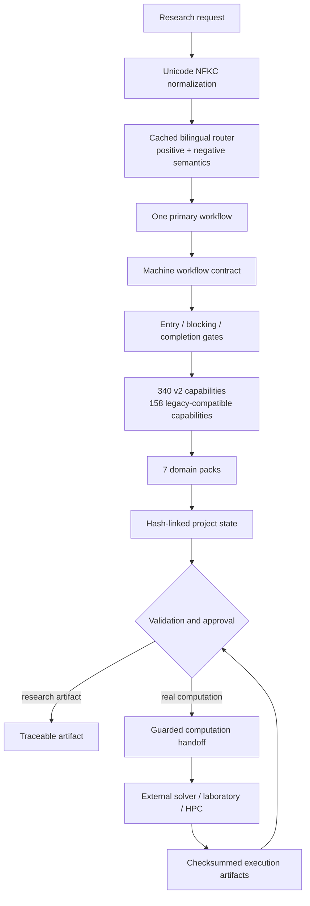

# Architecture

TsaoSciResearcher v0.5.1 separates scientific policy, deterministic runtime services and external execution. The repository is a real source tree: no bootstrap payload or self-modifying workflow is required to install or run it.

## Runtime boundaries

- `tsao_researcher/router.py` — cached deterministic routing, negative-intent handling, bounded input and reproducible tie-breaking.
- `tsao_researcher/capabilities.py` — validated 340-record catalog, normalized search index and defensive cached reads.
- `tsao_researcher/state.py` — managed project lifecycle, atomic writes, bounded locks and SHA-256 event chaining.
- `tsao_researcher/handoff.py` — regular-file inputs, path containment, streaming checksums and explicit verification requirements.
- `tsao_researcher/io.py` — finite JSON, bounded reads, append-only JSONL, atomic replacement and lock recovery.
- `scripts/` — compatibility APIs, evidence/claim validators, installer, repository audit, tests, performance and deterministic release tooling.

## Contract layers

1. Human-readable method policy: `workflows/*/WORKFLOW.md`.
2. Machine workflow contract: `workflows/*/workflow.yaml.json`.
3. Blocking and completion gates: `workflows/*/gates.yaml`.
4. Input/output contracts: `schemas/` and `schemas/v2/`.
5. Capability contracts: `capabilities/v2/capabilities.json`.
6. Domain-specific method and validation guidance: `domain-packs/`.

## Native, orchestrated and external execution

- **Native**: routing, capability discovery, project state, schemas, validators, installation, packaging and audit.
- **Orchestrated**: retrieval, statistical analysis, plotting and document generation through tools available to the active agent.
- **External execution**: DFT, molecular dynamics, FEM, CFD, Aspen/process simulation, laboratory instruments and HPC jobs. These require a guarded handoff and real execution artifacts; an unexecuted plan is never labelled completed.

## Performance model

Rules and catalogs are cached by file identity; regexes and search tokens are built once; JSON and checksum operations are bounded and streamed; project mutations are atomic. CI separates compatibility, full regression, order independence, static/security, mutation and performance/release gates so expensive checks are not duplicated across every operating-system matrix cell.

## Branch governance

`main` is the only durable branch. After a verified merge, `.github/workflows/cleanup-branches.yml` closes obsolete pull requests, deletes every non-`main` branch through the GitHub API and verifies the final branch set.
