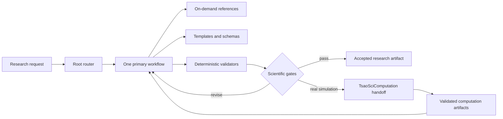

# Architecture

TsaoSciResearcher uses a short registration router and progressive disclosure. The root skill never loads all capabilities. A request is routed to one of 15 workflows; the workflow loads only its references and templates. Deterministic scripts maintain project state, schemas, evidence, claims, figures and handoffs.

## Native, orchestrated and delegated layers

- Native: routing, capability index, project state, schemas, validators, templates and installation.
- Orchestrated: web/database retrieval, statistical execution, plotting and document generation using tools available to the active agent.
- Delegated: real quantum, molecular, continuum and process simulation through TsaoSciComputation.
