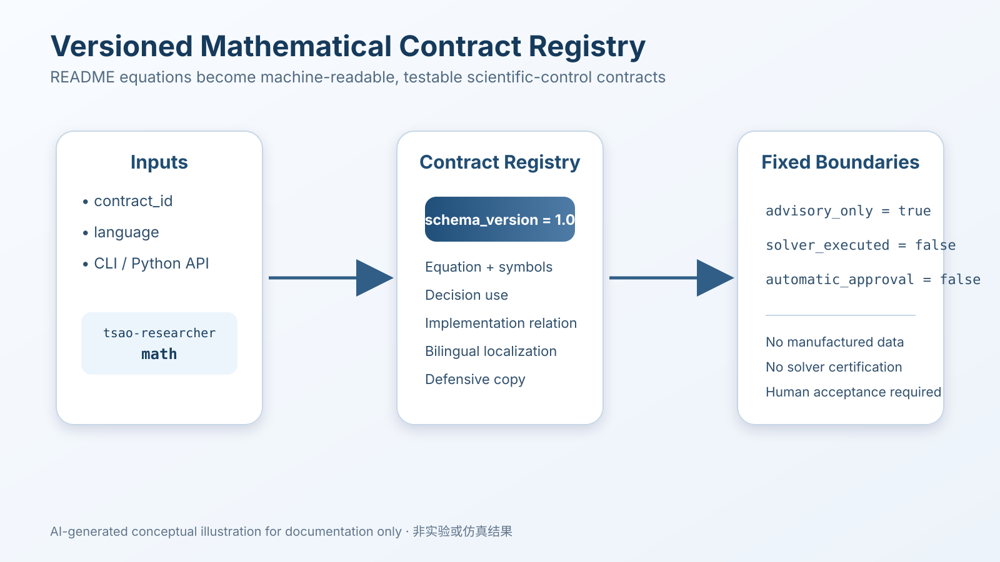
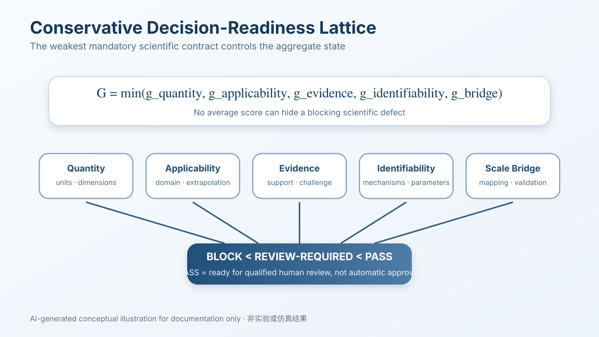
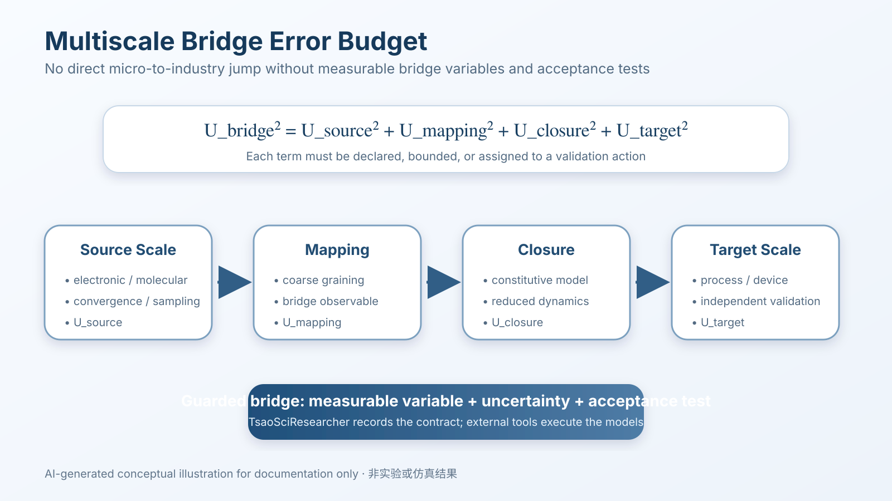

# Mathematical Contracts / 数理合同

> Version 1.0 · Runtime release 0.7.4

This document explains the machine-readable equations returned by:

```bash
python -m tsao_researcher math
```

本文档说明以下命令返回的机器可读方程：

```bash
python -m tsao_researcher math --language zh-CN
```

## Boundary / 边界

The registry is advisory. It does not execute a solver, infer parameters from data, validate an experiment, or grant automatic approval.

数理合同目录只提供建议性解释。它不会执行求解器、从数据自动推断参数、验证实验，也不会自动批准科研结论。

Every response contains:

```json
{
  "schema_version": "1.0",
  "advisory_only": true,
  "solver_executed": false,
  "automatic_approval": false
}
```

## Stable contracts / 稳定合同

| Contract ID | Equation | Decision role / 决策作用 |
|---|---|---|
| `capability-ranking` | \(S(c\mid q,o,e)=w_qR(q,c)+w_oR(o,c)+w_eM(e,c)-w_xC(c)\) | Explain relevance, observability, evidence fit, and exclusions / 解释相关性、可观测性、证据匹配和排除项 |
| `quantity-dimension` | \(x=(v,u,d),\ d_\mathrm{left}=d_\mathrm{right}\) | Guard unit and dimensional consistency / 保护单位与量纲一致性 |
| `applicability-extrapolation` | \(r_\mathrm{extra}=d(x,\mathcal A)/\max(s_\mathcal A,\varepsilon)\) | Require transfer evidence and uncertainty inflation / 要求迁移证据与不确定性膨胀 |
| `evidence-conflict` | \(E=(E_+,E_-,E_0)\) | Preserve support, challenge, and unresolved evidence / 保留支持、挑战和未决证据 |
| `mechanism-identifiability` | \(D_{ij}(O,C)>\tau\) or \(\operatorname{rank}(J_\theta)=p\) | Require discriminating observables / 要求区分性观测量 |
| `uncertainty-budget` | \(\Sigma_y\approx J\Sigma_\theta J^\mathsf T+\Sigma_\mathrm{num}+\Sigma_\mathrm{sample}+\Sigma_\mathrm{model}+\Sigma_\mathrm{transfer}\) | Propagate uncertainty to the decision observable / 将不确定性传播到决策观测量 |
| `multiscale-bridge` | \(U_\mathrm{bridge}^2=U_\mathrm{source}^2+U_\mathrm{mapping}^2+U_\mathrm{closure}^2+U_\mathrm{target}^2\) | Prevent unsupported scale jumps / 防止无依据尺度跳跃 |
| `decision-readiness` | \(G=\min(g_\mathrm{quantity},g_\mathrm{applicability},g_\mathrm{evidence},g_\mathrm{identifiability},g_\mathrm{bridge})\) | Let the weakest mandatory gate control readiness / 由最弱强制门决定就绪度 |

## CLI examples / CLI 示例

List all contracts:

```bash
python -m tsao_researcher math
```

Return one English contract:

```bash
python -m tsao_researcher math \
  --contract decision-readiness \
  --language en
```

Return one Chinese contract:

```bash
python -m tsao_researcher math \
  --contract quantity-dimension \
  --language zh-CN
```

## Interpretation rules / 解释规则

1. **Equation is not execution / 方程不等于执行**  
   A displayed formula does not prove that numerical values were calculated.

2. **Structural guard is not physical validation / 结构化防线不等于物理验证**  
   Unit, extrapolation, evidence, and identifiability checks identify missing or conflicting declarations. They do not independently validate user-supplied data.

3. **PASS is not proof / 通过不等于证明**  
   `PASS` means no declared software blocker remains. Qualified human scientific review is still required.

4. **External numerical work remains external / 外部数值工作仍属于外部执行**  
   Jacobians, covariance propagation, convergence studies, scale mapping, solver runs, and experiments must be performed by qualified external tools and recorded through handoff/receipt evidence.

## Visual explanation / 图示说明








> AI-generated conceptual illustrations for documentation only. They do not represent experimental or simulation results.  
> AI 生成概念示意图，仅用于文档说明，不代表实验或仿真结果。
