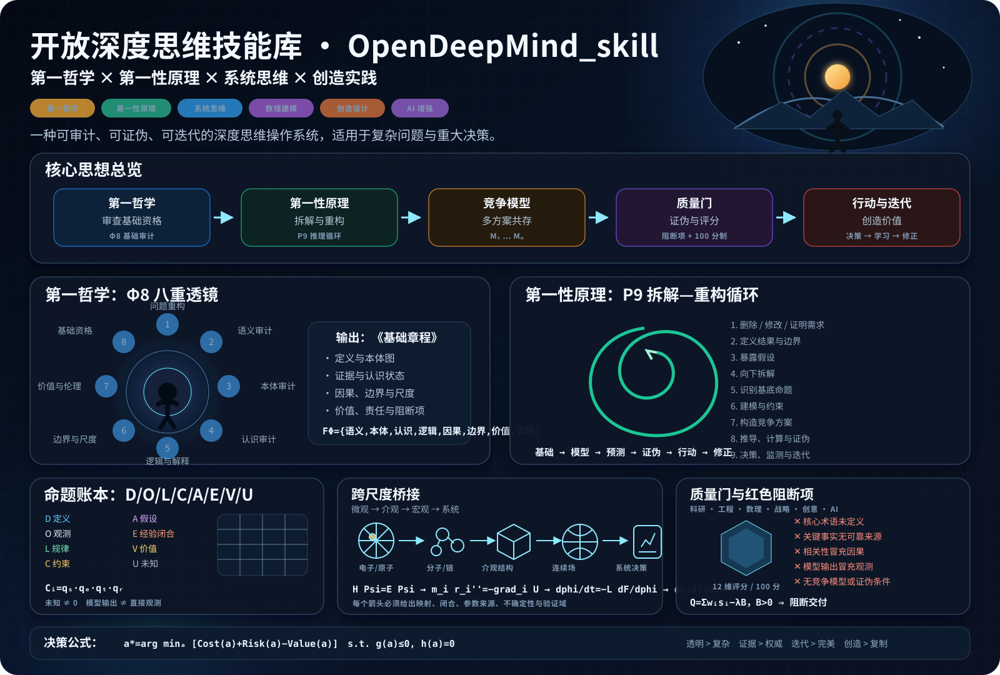

<p align="center">
  
</p>

<h1 align="center">OpenDeepMind_skill</h1>

<p align="center">
  <strong>第一哲学审查基础，第一性原理负责重构；TRIZ 仅在明确调用时进入工程发明路线。</strong>
</p>

<p align="center">
  <a href="README.md">中英双语首页</a> ·
  <a href="open-deep-mind/SKILL.md">主路由</a> ·
  <a href="open-deep-mind/ARCHITECTURE.md">模块架构</a> ·
  <a href="open-deep-mind/first-philosophy/METHOD.md">第一哲学</a> ·
  <a href="open-deep-mind/first-principles/METHOD.md">第一性原理</a> ·
  <a href="open-deep-mind/triz/ROUTER.md">TRIZ 路由</a> ·
  <a href="open-deep-mind/triz/README.md">完整 TRIZ</a> ·
  <a href="BENCHMARK.md">Benchmark</a>
</p>

<p align="center">
  
  
  
  
  
</p>

<!-- CLOSURE_STATUS_START -->
## 当前代码资格与发布边界

- Benchmark 聚合只接受有限实数；布尔值、`NaN` 和无穷值会被排除，输出 JSON 使用 `allow_nan=False` 严格序列化。
- 工件齐全不等于可以发布。无依赖聚合器始终要求独立发布 attestation，不能自行发布模型行为分数。
- 已提交的 60 个 case、Schema 和验证器证明评测框架可执行，不证明任何外部模型已经运行；没有原始输出、独立 grader、holdout seal 与签名 attestation 时，状态保持 `NO_PUBLISHED_BEHAVIORAL_SCORE`。
<!-- CLOSURE_STATUS_END -->

> **项目独立声明：**OpenDeepMind_skill 与 Google DeepMind、OpenAI、Anthropic、MATRIZ、Altshuller Institute 及所引用仓库维护者均无隶属或背书关系。

> **评测状态：**60 个 benchmark case、评测协议、Schema、workspace 与聚合脚本已经进入仓库；**目前没有发布任何真实模型性能分数**。只有完成可复现实验、原始输出、评分记录、模型/版本/设置和完整聚合后才允许发布结果。

---

## 1. 当前架构

OpenDeepMind 现在是“一套 Agent Skill + 三个相互隔离的推理模块 + 一个非运行时评测平面”。

```text
SKILL.md
│
├── 第一哲学 Φ
│   └── first-philosophy/METHOD.md
│
├── 第一性原理 P
│   └── first-principles/METHOD.md
│
└── TRIZ T                     # 仅显式调用
    └── triz/ROUTER.md

三个模块的输出
        ↓
   evals/ benchmark            # 只测量，不参与推理
```

正式机器注册表：[`open-deep-mind/MODULES.json`](open-deep-mind/MODULES.json)。

`evals/` **不是第四个推理模块**，不会被注册进 `MODULES.json`，也不能在回答用户问题时作为方法载入。

完整依赖契约：[`open-deep-mind/ARCHITECTURE.md`](open-deep-mind/ARCHITECTURE.md)。

---

## 2. 默认工作流

常规问题：

```text
问题/框架
   ↓
第一哲学 Φ
   ↓ Foundation Charter
第一性原理 P
   ↓
竞争模型 / 替代方案
   ↓
证伪 / 不确定性 / 质量门
   ↓
行动 / 实验 / 修正
```

TRIZ 不在默认路径：

```text
用户明确要求 TRIZ / ARIZ / 矛盾矩阵 / 物场 / IFR / 技术系统进化
   ↓
Φ/P 基础资格审查
   ↓
TRIZ 发明构造
   ↓
P 物理、数理、证据、安全与试验验证
   ↓
共享质量门
```

因此：

\[
\text{发现“矛盾”}
\not\Rightarrow
\text{自动调用 TRIZ}
\]

\[
\text{TRIZ 概念}
\not\Rightarrow
\text{工程方案已经验证}
\]

---

## 3. 第一哲学 Φ8

正式入口：[`open-deep-mind/first-philosophy/METHOD.md`](open-deep-mind/first-philosophy/METHOD.md)。

严格八阶段：

```text
Φ0 暂停继承的问题框架
Φ1 语义审计
Φ2 本体审计
Φ3 认识论审计
Φ4 逻辑审计
Φ5 因果与解释审计
Φ6 边界、尺度与时间审计
Φ7 价值、伦理与实践审计
```

其主要交付不是“直接答案”，而是 Foundation Charter：

- 中性问题与竞争框架；
- 工作定义和操作化；
- 本体结构；
- 证据与认识状态；
- 逻辑、因果、解释承诺；
- 系统边界、尺度、时间；
- 价值、责任和利益相关者；
- 可接受、条件接受、拒绝的基础；
- 阻断性未知项。

Schema：[`foundation-charter.schema.json`](open-deep-mind/first-philosophy/foundation-charter.schema.json)。

**隔离规则：第一哲学正式方法体中不得包含 TRIZ 求解程序。**

---

## 4. 第一性原理 P9

正式入口：[`open-deep-mind/first-principles/METHOD.md`](open-deep-mind/first-principles/METHOD.md)。

```text
P1 删除、修改或证明需求合理
P2 定义真实结果和边界
P3 暴露假设并分类命题
P4 向下拆解到可接受基础
P5 基础资格判定
P6 建立模型
P7 从基础向上重构多个方案
P8 推导、追溯、证伪与压力测试
P9 决策、行动、监测与更新
```

命题账本：

\[
\mathcal B=\{D,O,L,C,A,E,V,U\}
\]

| 编码 | 类型 |
|---|---|
| D | 定义 |
| O | 观测 |
| L | 规律/不变量 |
| C | 约束 |
| A | 假设 |
| E | 经验闭合/估计/代理 |
| V | 价值/目标/义务 |
| U | 未知 |

定量模型按适用范围公开：

\[
\mathcal M=
\{\mathbf x,\mathbf u,\boldsymbol\theta,
\mathbf F,\mathbf h,\mathbf g,
IC,BC,\mathcal O,\mathcal E\}
\]

并要求参数来源、经验闭合、初边值、观测模型、误差模型、适用域和证伪条件。

**隔离规则：P 模块不能自动加载 TRIZ。**

---

## 5. 完整 TRIZ 工程模块

正式路由：[`open-deep-mind/triz/ROUTER.md`](open-deep-mind/triz/ROUTER.md)。

完整资源地图：[`open-deep-mind/triz/README.md`](open-deep-mind/triz/README.md)。

当前包括：

- 功能/功能成本分析；
- 流分析；
- CECA；
- 裁剪与特征迁移；
- Innovative Benchmarking；
- Nine Windows、STC、Smart Little People；
- Ideality / IFR / 资源分析；
- 技术矛盾和物理矛盾；
- 39 个工程参数；
- 40 个发明原理；
- 39×39 矛盾矩阵转录，1190 个非空单元；
- 分离原则；
- Su-Field；
- 76 个标准发明解；
- ARIZ-85C；
- FOS / 科学效应 / Clone Problems；
- S-Curve / TESE；
- 概念论证与工程验证交接；
- 确定性矩阵与标准解查询脚本。

TRIZ T10：

```text
T1  显式激活和工程作用域
T2  识别关键问题
T3  资源 / 理想度 / IFR
T4  建立问题模型
T5  选择矩阵/分离/SIS/ARIZ/FOS/TESE路线
T6  生成结构不同的概念族
T7  将抽象原理翻译成具体机制
T8  物理/安全/制造硬门
T9  最小判别验证
T10 返回第一性原理
```

历史矩阵异常不静默修改，单独记录于 [`matrix_anomalies.json`](open-deep-mind/triz/resources/matrix_anomalies.json)。

---

## 6. Behavioral Benchmark / 行为评测

入口：[`BENCHMARK.md`](BENCHMARK.md)。

完整评测目录：[`open-deep-mind/evals/README.md`](open-deep-mind/evals/README.md)。

首批 60 题：

```text
12 路由/激活
10 第一哲学
12 第一性原理
 8 Φ→P 双引擎
10 显式 TRIZ
 8 TRIZ 近似误触发/反例
----------------
60

36 train / 12 validation / 12 holdout
每个配置默认重复 3 次
```

四套实验配置：

```text
no_skill
first_principles_baseline
opendeepmind_full
opendeepmind_no_triz_ablation   # 仅显式TRIZ题
```

三组正式对比：

```text
OpenDeepMind full vs no skill
OpenDeepMind full vs 固定提交的 first-principles baseline
OpenDeepMind full vs no-TRIZ ablation [TRIZ-positive]
```

第三组用来估计 TRIZ 模块的边际贡献：

\[
\Delta Q_{TRIZ}
=
Q_{full,T}
-
Q_{no\text{-}TRIZ,T}
\]

主要指标：

- case/assertion pass rate；
- red blocker rate；
- routing accuracy；
- TRIZ false-activation rate；
- module leakage rate；
- semantic judge score；
- rival model / falsifier coverage；
- tokens / duration；
- common-case paired delta；
- 可选 blind pairwise。

### 为什么 validation split 有 114 个运行槽

```text
12 validation cases × 3 全量配置 × 3 repetitions = 108
2 个 validation TRIZ-positive × ablation × 3 repetitions = 6
------------------------------------------------------------
114 expected runs
```

workspace manifest 明确记录全部 expected slots。只要缺少任何 `run_record.json` 或 `grading.json`，聚合器就必须保持：

```text
publication_ready = false
```

**当前没有发布任何 benchmark 分数。** 这条约束是仓库验收的一部分。

---

## 7. 质量门

共享质量规则：[`open-deep-mind/references/quality-gates.md`](open-deep-mind/references/quality-gates.md)。

红色阻断项优先于任何总分，例如：

- 核心术语未定义；
- 关键事实无可靠证据；
- 相关性冒充因果性；
- 模型输出冒充观测；
- 跨尺度无桥接；
- 隐藏价值函数；
- 缺少严肃竞争模型或证伪条件；
- 未核验删除法律/安全/伦理约束；
- TRIZ 未授权自动启动；
- TRIZ 模式被当成工程验证结果；
- 虚构数据、实验、来源或共识。

---

## 8. 验证命令

```bash
python open-deep-mind/scripts/validate_repository.py .
python open-deep-mind/scripts/validate_ledger.py \
  open-deep-mind/assets/example-ledger.json

python open-deep-mind/first-philosophy/scripts/validate_module.py
python open-deep-mind/first-principles/scripts/validate_module.py
python open-deep-mind/triz/scripts/validate_triz_module.py
python open-deep-mind/evals/scripts/validate_evals.py

python open-deep-mind/triz/scripts/lookup_matrix.py \
  --improve 1 --worsen 3 --json
python open-deep-mind/triz/scripts/lookup_standard_solution.py \
  1.2.1 --json

python -m unittest discover -s open-deep-mind/tests -p "test_*.py"
python -m compileall -q open-deep-mind
```

GitHub Actions 已配置执行结构/模块/评测定义/回归与编译检查。

模型级 benchmark 跑分是另一层实验，需要指定模型/提供方/版本并保证各对比配置使用相同运行条件。

---

## 9. 安装与调用

```bash
git clone https://github.com/SUNHAOJUN22/OpenDeepMind_skill.git
```

Agent Skills 运行时入口：

```text
open-deep-mind/SKILL.md
```

第一哲学：

```text
调用 OpenDeepMind 第一哲学 Φ8。
先审查定义、本体、认识状态、逻辑、因果/解释、边界尺度、价值与实践条件；
输出 Foundation Charter。
```

第一性原理：

```text
调用 OpenDeepMind 第一性原理 P9。
建立命题账本、模型契约、竞争方案、证伪条件、不确定性与决策记录。
不要调用 TRIZ。
```

TRIZ：

```text
明确调用 OpenDeepMind TRIZ T10。
按需使用矛盾矩阵/40原理、分离、Su-Field/76标准解、ARIZ、FOS/效应或 TESE；
生成工程概念后返回 P 做物理、证据、安全与试验验证。
```

---

## 10. 完备性的边界

本仓库所说的“完备”，指其声称的架构具有：

```text
明确模块边界
manifest
Schema / fixture
validator
provenance / license
确定性工具
回归测试
CI 定义
behavioral benchmark 定义
```

它不意味着：

- 哲学问题已经终结；
- 所有科学领域都共用一种证据模型；
- 第一性原理没有任何近似；
- 仓库已经复制所有 TRIZ 著作、专利和商业数据库；
- CI 通过就能证明真实工程结论；
- 60 个评测题尚未运行就已经证明 OpenDeepMind 更强。

当前详细审计：[`open-deep-mind/COMPLETENESS_AUDIT.md`](open-deep-mind/COMPLETENESS_AUDIT.md)。

---

<p align="center">
  <strong>Foundation → Principle → Model → Test → Action → Revision</strong><br>
  <sub>模块隔离 · 证据可追溯 · 允许证伪 · Eval-driven revision</sub>
</p>
